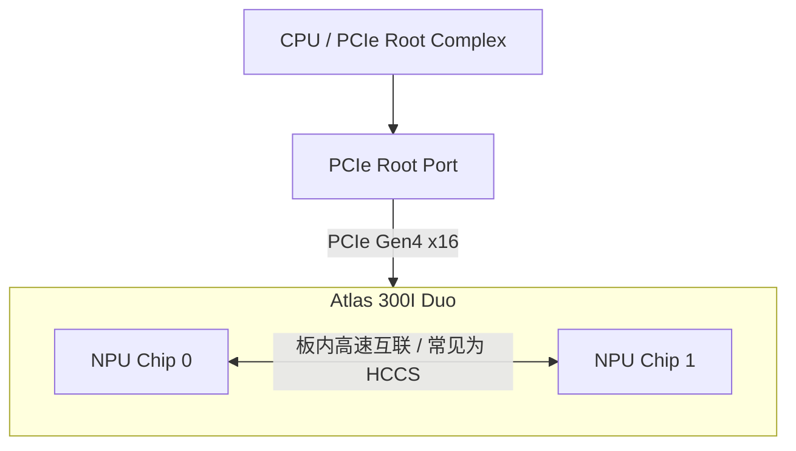
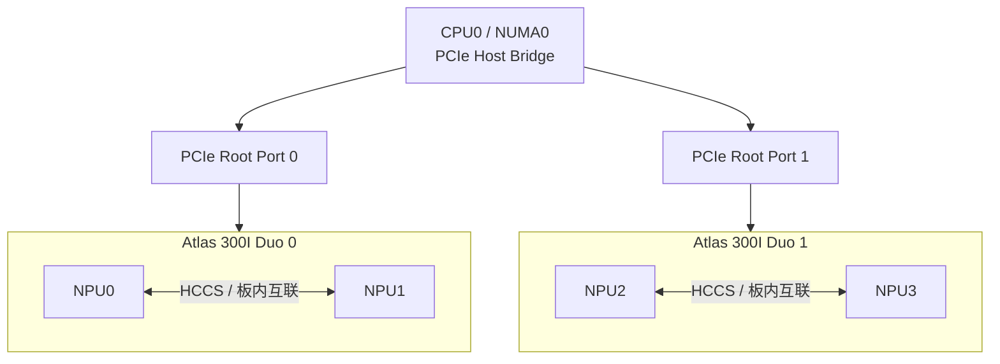
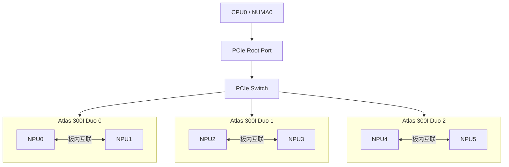
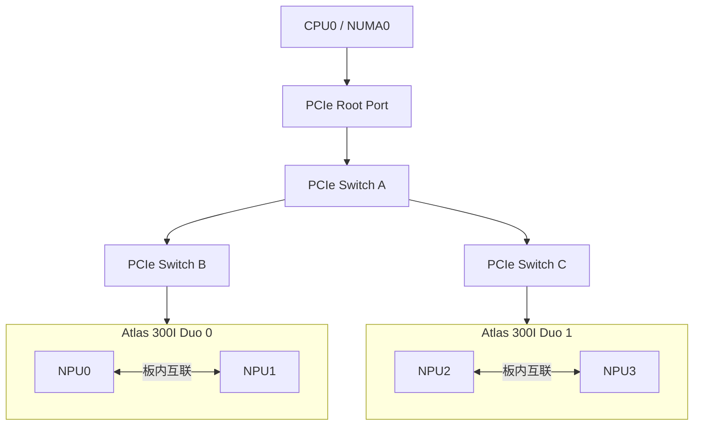
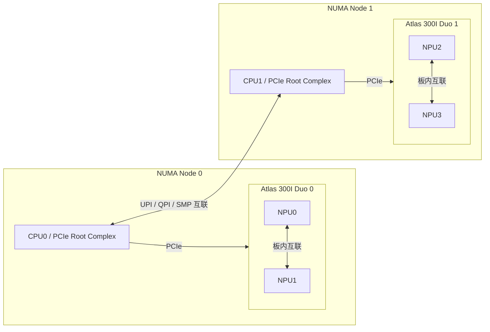
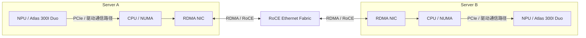
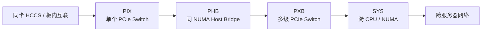
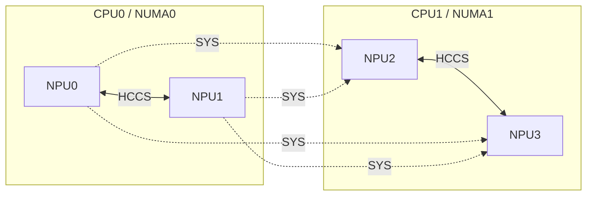

# Atlas 300I Duo 常见拓扑结构

本文整理 Atlas 300I Duo 推理卡在服务器中的常见互联拓扑，以及 `npu-smi info -t topo` 中常见拓扑标识的含义。

> [!NOTE]
> Atlas 300I Duo 的最终拓扑由服务器 CPU/NUMA 架构、PCIe Root Port、Riser、PCIe Switch 和插槽布线共同决定。本文中的图是常见部署示意，不代表所有服务器的固定硬件连接。实际结果应以目标机器上的 `npu-smi`、`lspci` 和 NUMA 信息为准。

## 1. 拓扑标识速查

| 标识 | 含义 | 常见路径 |
| --- | --- | --- |
| `X` | 当前 NPU 自身 | 无跨设备通信 |
| `HCCS` | 两个 NPU 通过 HCCS 连接 | 板内或设备内高速互联 |
| `PIX` | 路径经过单个 PCIe Switch | NPU → PCIe Switch → NPU |
| `PXB` | 路径经过多个 PCIe Switch | NPU → 多级 PCIe Switch → NPU |
| `PHB` | 路径经过 CPU PCIe Host Bridge | NPU → PCIe Host Bridge → NPU |
| `SYS` | 路径跨 PCIe 和 NUMA 节点 | NPU → CPU0 → CPU 间互联 → CPU1 → NPU |
| `NA` | 未知或无法识别的拓扑关系 | 需要结合硬件和驱动进一步排查 |

拓扑标识描述的是两颗 NPU 之间的硬件路径距离，**不等价于对应路径一定支持用户态 P2P、Peer Memory Mapping 或设备内存 RDMA 注册**。这些能力还会受到固件、驱动、IOMMU、ACS、PCIe Switch 配置和运行时版本影响。

## 2. 单张 Atlas 300I Duo：板内双 NPU

Atlas 300I Duo 对外使用 PCIe Gen4 x16 接口，本文按卡内两个 NPU 逻辑设备进行说明。同卡内 NPU 通信通常优先使用板内互联；在支持的硬件和软件版本中，拓扑可能显示为 `HCCS`。具体标识以实际 `npu-smi info -t topo` 输出为准。



特点：

- 同卡两个 NPU 的物理距离通常最短。
- 设备内存相互独立，不应理解为单个统一、透明共享的 Device Memory 地址空间。
- 对高频通信的张量并行任务，通常优先将同卡两个 NPU 放在同一个通信组中。

## 3. 多张卡直连同一 CPU：PHB

多张 Atlas 300I Duo 分别连接到同一颗 CPU 的不同 PCIe Root Port，卡间路径需要经过 CPU 的 PCIe Host Bridge，拓扑通常显示为 `PHB`。



典型卡间路径：

```text
NPU → PCIe → CPU PCIe Host Bridge → PCIe → NPU
```

特点：

- 两张卡位于同一个 NUMA 节点。
- 延迟通常高于同卡板内互联。
- 是否支持 PCIe P2P 仍需检查 ACS、IOMMU、驱动和服务器 BIOS 配置。

## 4. 多张卡连接同一个 PCIe Switch：PIX

高密度服务器可能通过 PCIe Switch 扩展插槽。当两个 NPU 之间的路径仅经过一个 PCIe Switch 时，拓扑通常显示为 `PIX`。



特点：

- 卡间流量可以在 PCIe Switch 内部转发，不一定进入 CPU 内部互联。
- 多张卡会共享 PCIe Switch 上行带宽。
- 即使每个下行插槽为 x16，上行链路也可能超配，导致并发通信吞吐下降。
- `PIX` 表示路径较近，但不自动保证 P2P 可用。

## 5. 多级 PCIe Switch：PXB

部分 4U/8U 高密度服务器使用级联 PCIe Switch。两个 NPU 的路径经过多个 PCIe Switch 时，拓扑通常显示为 `PXB`。



特点：

- 路径延迟通常高于 `PIX`。
- 多级上行汇聚更容易形成带宽瓶颈。
- PCIe Switch 的 ACS 路由策略会显著影响跨卡 P2P。

## 6. 双路 CPU、跨 NUMA：SYS

当两张卡分别连接到不同 CPU/NUMA 节点时，NPU 间路径需要跨越 CPU 间互联，拓扑通常显示为 `SYS`。



典型跨卡路径：

```text
NPU0
  → PCIe
  → CPU0 Root Complex
  → CPU 间互联
  → CPU1 Root Complex
  → PCIe
  → NPU2
```

特点：

- 通常是单机内距离最远的拓扑之一。
- 会消耗 CPU 间互联带宽。
- Host 内存分配在错误 NUMA 节点时，可能进一步增加延迟和带宽竞争。
- 高频 TP 通信应尽量避免跨 `SYS` 分组。

## 7. 跨服务器：RoCE/RDMA 网络拓扑

跨服务器通信除了本机 NPU/PCIe 拓扑，还取决于 Host RDMA 网卡、NUMA 亲和性、交换网络以及通信软件的传输选择。



需要注意：

- HCCL 或其他通信框架能够使用 Host RDMA 网卡，不等价于第三方网卡可以直接注册并访问 NPU Device Memory。
- 是否存在 Host Staging、设备内存直通或特定 Peer Memory 机制，应以 CANN/驱动版本和网卡兼容矩阵为准。
- RDMA NIC 应尽量与目标 NPU 位于同一个 NUMA 节点，减少 `SYS` 路径和跨 NUMA Host Memory 访问。

## 8. 一般性的拓扑距离排序

在其他条件近似相同的情况下，可以将常见拓扑距离粗略理解为：



该顺序只用于帮助理解一般性的拓扑距离和延迟趋势，不是严格性能排名。实际吞吐还取决于：

- PCIe 代际和协商宽度；
- PCIe Switch 上行带宽及超配比例；
- P2P、IOMMU 和 ACS 配置；
- 数据搬运引擎及通信协议；
- 消息大小、并发数和通信模式；
- NUMA 绑核、Host Memory 绑定和 RDMA NIC 亲和性。

## 9. 典型双卡 Duo 拓扑矩阵

两张 Atlas 300I Duo 分别位于两个 CPU 下时，输出可能类似：

```text
          NPU0  NPU1  NPU2  NPU3   CPU Affinity
NPU0        X   HCCS   SYS   SYS      0-31
NPU1      HCCS    X    SYS   SYS      0-31
NPU2       SYS   SYS    X   HCCS     32-63
NPU3       SYS   SYS  HCCS    X      32-63
```

对应关系：



对于 `TP=2`，通常优先：

```text
[NPU0, NPU1]
[NPU2, NPU3]
```

尽量避免把高频通信组配置成：

```text
[NPU0, NPU2]
[NPU1, NPU3]
```

## 10. 查看实际拓扑

```bash
npu-smi info
npu-smi info -m
npu-smi info -t topo

lspci -tv
lspci -nn | grep -i huawei

numactl -H
lscpu -e=CPU,NODE,SOCKET
```

建议结合以下信息判断链路是否满足预期：

1. `npu-smi info -t topo`：确认 NPU 间的 `HCCS/PIX/PXB/PHB/SYS` 关系和 CPU Affinity。
2. `lspci -tv`：确认设备是否位于同一个 Root Port 或 PCIe Switch 下。
3. `numactl -H`：确认 CPU、内存、NPU 和 RDMA NIC 的 NUMA 位置。
4. PCIe link status：确认链路是否以预期的 Gen4 和宽度运行。
5. P2P 实测：拓扑标识只能表示路径，最终能力和性能应通过运行时接口及带宽/延迟测试确认。

## 参考资料

- [华为 Atlas 300I Duo 推理卡产品页面](https://e.huawei.com/cn/products/computing/ascend/atlas-300i-duo)
- [华为 npu-smi：查询多 NPU 的拓扑结构](https://support.huawei.com/enterprise/zh/doc/EDOC1100493497/3fef770c)
