# MSCCL++ 架构概览及主要功能介绍

## 01. LLM 推理把通信推向低延迟问题

**Prompt processing 与 Token sampling 的消息形态不同。**

- Prompt processing：大 batch、大消息，吞吐和带宽更重要。
- Token sampling：小 batch、小消息、高频调用，固定开销更重要。
- 小消息场景中，微秒级 launch、同步、协议开销会被放大。
- MSCCL++ 的 GPU-driven、Packets、0-copy 主要为低延迟路径打开优化空间。

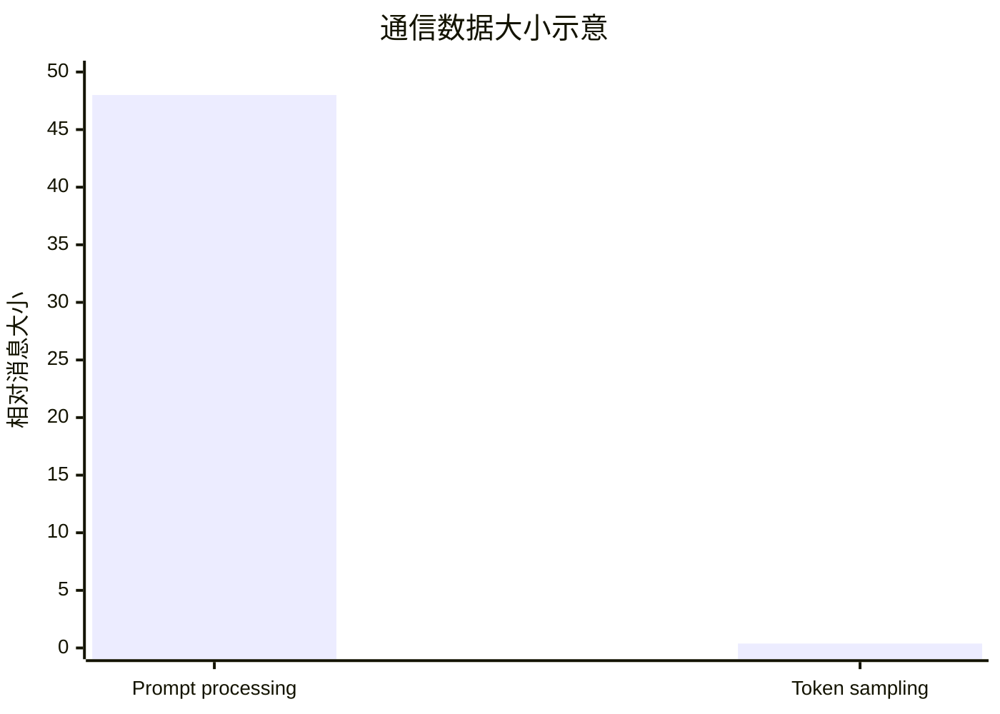

---

## 02. 集合通信基础

**集合通信是多个通信节点共同参与、遵循统一规则、实现数据协同的通信模式。**

| 原语 | 语义 | AI 场景 |
|---|---|---|
| Broadcast | 一 rank 向所有 rank 发送相同数据 | 参数初始化、配置同步 |
| Scatter | 一 rank 切分数据发给各 rank | 数据分片、任务分发 |
| Gather | 各 rank 数据收集到一个 rank | 日志/结果汇总 |
| AllGather | 各 rank 数据被所有 rank 收集 | 模型并行、张量拼接 |
| Reduce | 全员归约但结果只到一个 rank | 单点统计、fallback 支持 |
| AllReduce | 全员归约且所有 rank 拿到结果 | 梯度同步、TP 层间通信 |
| ReduceScatter | 归约后按 rank 切分 | 流水线并行、分片归约 |
| All-to-All | 各 rank 给其他 rank 发送不同数据 | MoE / 专家并行、路由 |


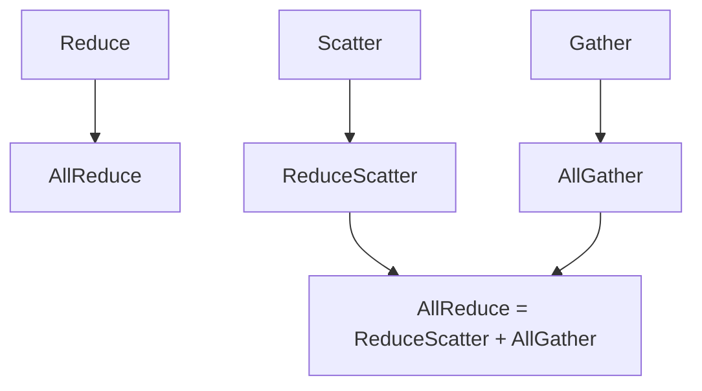

---

## 03. MSCCL++ 的核心定位

**MSCCL++ 不是又一个 AllReduce 实现，而是把 GPU 通信拆成可组合的分层抽象。**

- Core：连接、内存注册、同步对象和控制面元数据交换。
- Primitive：GPU kernel 内可调用的 put / get / signal / wait / flush。
- DSL：用 Python 描述 collective 算法，编译为 JSON 执行计划。
- NCCL API：兼容现有 PyTorch 和 LLM serving 生态，支持渐进替换。

一句话：MSCCL++ 让通信路径随模型结构、消息大小和硬件拓扑一起被设计。

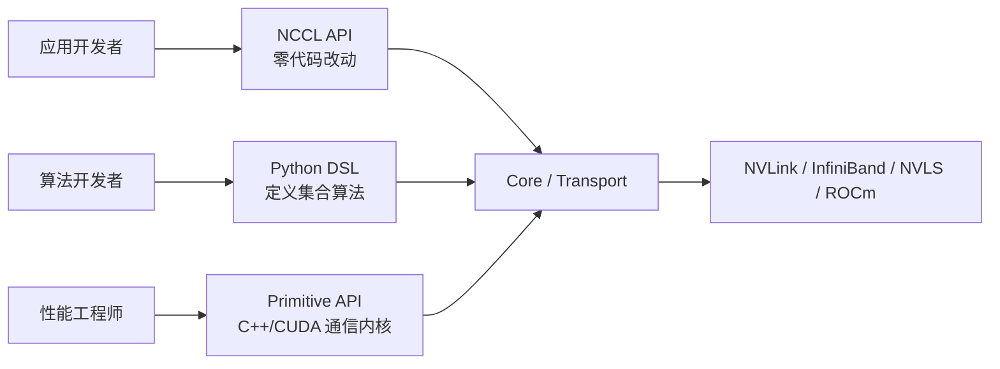

---

## 04. NCCL、MSCCL、MSCCL++ 的差异

**差异不只是性能，而是抽象边界不同。**

| 方案    | 定位                     | 限制或突破                                 |
| ------- | ------------------------ | ------------------------------------------ |
| NCCL    | 稳定、通用、生产级通信库 | 高层 API 黑盒，算法和底层原语难定制        |
| MSCCL   | 在 NCCL 上扩展 DSL       | 可描述算法，但底层仍继承 NCCL 通信框架     |
| MSCCL++ | 重新设计通信栈           | 打开 Core、Primitive、DSL、NCCL API 兼容层 |

MSCCL 是在 NCCL 上加算法描述；MSCCL++ 是把算法描述、底层原语和兼容入口纳入同一套通信栈。

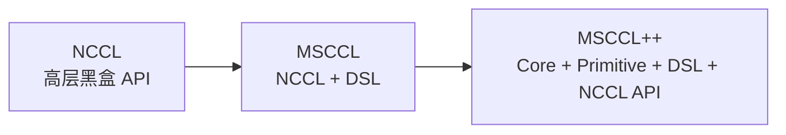

---

## 06. MSCCL++ 全栈架构

横切能力：

- NPKIT 性能剖析。
- 算法选择与缓存。
- 内存注册与同步语义。
- 硬件能力探测与路径选择。

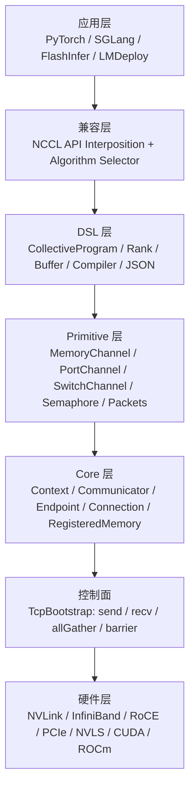

---

## 07. Core 层：通信前的搭桥流程

**没有 Core 对象，GPU kernel 里的 put/get 无法安全访问远端。**

| 对象 | 作用 |
|---|---|
| Context | 管理底层通信资源与连接上下文 |
| Communicator | 编排 connect / sendMemory / recvMemory |
| Endpoint | 可序列化的通信端点描述 |
| Connection | 具体 transport 上的连接 |
| RegisteredMemory | 可被远端访问的内存描述符 |
| Semaphore | 跨 rank / 跨设备同步对象 |

源码索引：[include/mscclpp/core.hpp]、[src/core/communicator.cc]、[src/core/registered_memory.cc]

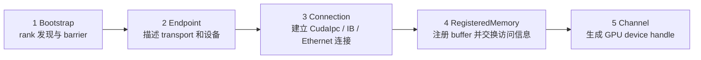

---

## 08. 一次集合通信的三条路径

**三条路径不是互斥产品，而是同一通信栈面向不同开发者的入口。**

| 入口 | 适合用户 | 特点 |
|---|---|---|
| Primitive | 性能工程师 | 控制力最强，开发成本最高 |
| DSL | 算法开发者 | 快速试验 collective 算法 |
| NCCL API | 应用开发者 | 低侵入、可渐进替换 |

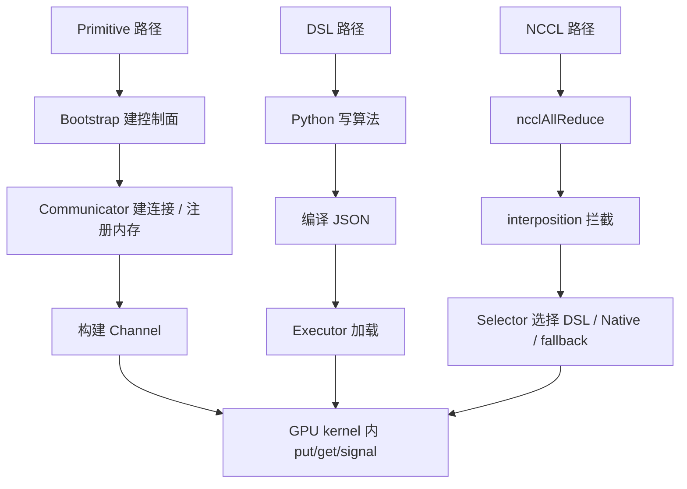

---

## 09. Primitive 设计：把通信控制权交还给 GPU 线程

**传统 NCCL 由 CPU 发起通信，数据经内部 buffer 中转；Primitive 让 GPU 线程在 kernel 内直接发起 1-sided 远端访问，0-copy 直达，通信与计算同 kernel 重叠。**

| 设计原则 | 传统 NCCL | MSCCL++ Primitive |
|---|---|---|
| 驱动模型 | CPU 发起，GPU 被动执行 | GPU 线程主动表达通信动作 |
| 通信模型 | 2-sided send/recv 配对 | 1-sided put/get 远端访问 |
| 数据路径 | 用户 buffer → NCCL 内部 buffer → 网络 → 内部 buffer → 用户 buffer | 用户 buffer → 注册内存直达远端 |
| 重叠方式 | 依赖 stream / event / host 调度跨 kernel 重叠 | 同一 kernel 内安排通信与计算指令 |
| 小消息优化 | 协议固定，用户难介入 | Packets / fused op / Selector 可组合 |

源码索引：[include/mscclpp/memory_channel_device.hpp]、[include/mscclpp/port_channel_device.hpp]、[include/mscclpp/switch_channel_device.hpp]

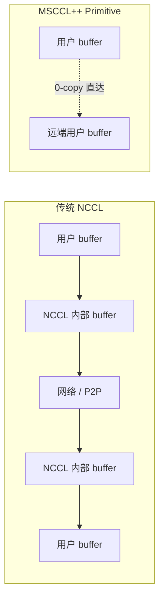

---

## 10. 三种 Channel 的统一抽象

**MemoryChannel、PortChannel、SwitchChannel 是统一 API 下的不同硬件路径。**

| Channel | 机制 | 适用场景 |
|---|---|---|
| MemoryChannel | 内存映射，GPU 线程直接读写远端显存 | 节点内低延迟 |
| PortChannel | GPU 写 trigger，Host Proxy 执行 transport | 跨节点、大消息 |
| SwitchChannel | multimem reduce / broadcast | NVLS 硬件归约 |

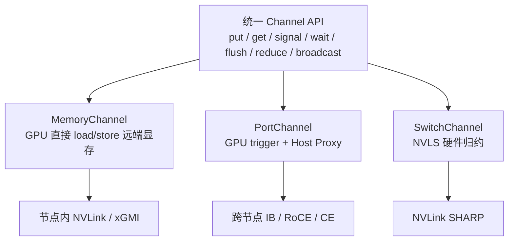

---

## 11. MemoryChannel：节点内低延迟路径

**GPU 线程直接 load/store 远端显存，不经 CPU、不经中转 buffer、零拷贝。**

| 接口 | 机制 | 说明 |
|---|---|---|
| put | 多线程协同 copy local→remote（对齐 4/8/16B） | 直接写远端映射内存 |
| get | 多线程协同 copy remote→local | 直接读远端映射内存 |
| read / write | 单元素 load/store 到远端 | 粒度最细，按 index 寻址 |
| putPackets / unpackPackets | LL16Packet / LL8Packet，data + flag 交织 | 小消息免显式 signal/wait |

 **put 的数据路径**

假设 Kernel 在 GPU 0 上执行，`src_` 是 GPU 0 本地内存，`dst_` 是 GPU 1 的远端映射内存：

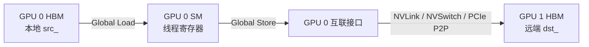

**get 的数据路径**

仍假设 Kernel 在 GPU 0 上执行：

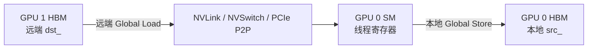

**putPacket/unpacket的数据路径**

LL16Packet 总大小 16B，但有效 Payload 是 8B：

```text
[data1][flag1][data2][flag2]
```

接收方只有在 `flag1` 和 `flag2` 都等于预期轮次 Flag 时，才接受 Payload。重复 Flag 用于帮助识别部分更新或撕裂状态。

LL8Packet 总大小 8B，有效 Payload 是 4B：

```text
[data][flag]
```

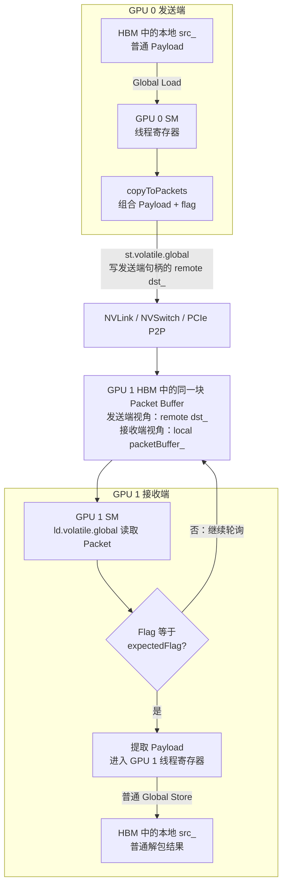


**GPU编程模式**

```c++
template <typename T>
XCCLPP_DEVICE_INLINE void copy(T* dst, T* src, uint64_t numElems, uint32_t threadId, uint32_t numThreads) {
  T reg;
  for (size_t i = threadId; i < numElems; i += numThreads) {
    reg = src[i];
    dst[i] = reg;
  }
}
```

**NPU编程模式**

```c++
// GM->UBIN
auto inLocal = dataInQueue_.AllocTensor<int8_t>();
AscendC::DataCopy(inLocal, srcGm[srcOff], curCount);
dataInQueue_.EnQue(inLocal);  
// UBIN -> UBout
auto inLocal2 = dataInQueue_.DeQue<int8_t>();
auto outLocal = dataOutQueue_.AllocTensor<int8_t>();
AscendC::DataCopy(outLocal, inLocal2, curCount);
dataOutQueue_.EnQue(outLocal);
dataInQueue_.FreeTensor(inLocal2);
// UBout -> GM
auto outLocal2 = dataOutQueue_.DeQue<int8_t>();
AscendC::DataCopy(dstGm[dstOff], outLocal2, curCount);
dataOutQueue_.FreeTensor(outLocal2);
```


若直接照搬GPU代码，从C++ 表面看，两边都可能写成“读一个值，再写一个值”，但编译后的执行组织不同：

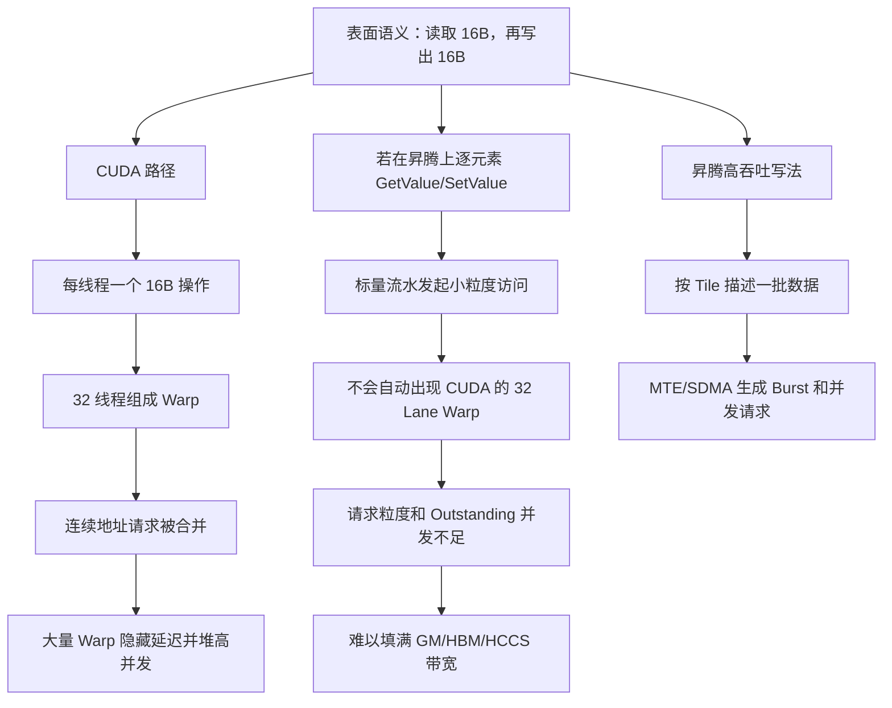


**同步信号：**

跨进程

| 操作 | GPU 侧指令 | 语义 |
|---|---|---|
| signal() | `red.release.sys.global.add.u64` | 原子递增对端 inboundToken，release 保证此前写可见 |
| relaxedSignal() | `red.relaxed.sys.global.add.u64` | 仅通知执行，不保证数据可见，需自行 fence |
| wait() | 自旋 load inboundToken（`acquire` + `scopeSystem`） | 读到 token 递增后通过，保证数据可见再读 |
| relaxedWait() | relaxed load | 仅同步执行序，不保证数据可见 |

**同步语义**：

| 内存顺序 | 含义 | MemoryChannel中的使用 |
|---------|------|----------------------|
| **Release** | 所有之前的内存写入必须在原子操作之前完成 | signal()使用Release语义，确保put写入完成后才递增token |
| **Acquire** | 所有之后的内存读取必须在原子操作之后开始 | wait()使用Acquire语义，确保token递增后才读取对方数据 |
| **Relaxed** | 仅保证原子操作本身有序，不保证其他内存操作顺序 | relaxedSignal用于执行控制，不保证数据写入顺序 |

**同步屏障形成原理**：

```
GPU0执行流程：
┌─────────────────────────────────────────────────────────────┐
│ put写入dst_ ─────→ signal()递增GPU1的token ─────→ Release  │
│ (数据写入)          (原子Add.release)           (屏障1)    │
└─────────────────────────────────────────────────────────────┘

                              ↓ 跨设备Token传递

┌─────────────────────────────────────────────────────────────┐
│ wait()检测token ─────→ 读取dst_内存 ─────→ Acquire        │
│ (原子Load.acquire)     (获取对方数据)      (屏障2)        │
└─────────────────────────────────────────────────────────────┘

屏障1 + 屏障2 = 完整的跨设备数据同步屏障
确保：GPU0写入 → GPU1看到写入
```

源码索引：[include/mscclpp/memory_channel_device.hpp]、[examples/tutorials/03-memory-channel/bidir_memory_channel.cu]、[include/mscclpp/semaphore_device.hpp]

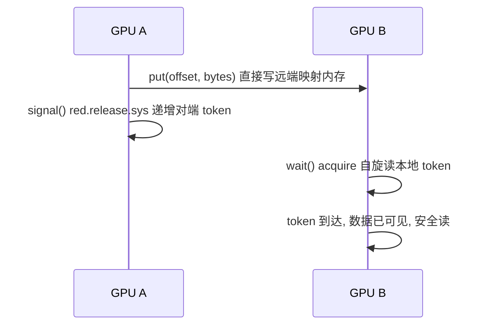


进程内同步

`DeviceSyncer` 是同一个 Kernel 内的 Device-wide Barrier，用于多个 Block 的阶段同步。

`__syncthreads()` 只能同步同一个 Block，不能同步不同 Block。

实现步骤：

1. Block 内执行 `__syncthreads()`；
2. 每个 Block 的 `threadIdx.x == 0` 作为代表；
3. 代表线程对全局计数器执行 Atomic Fetch Add；
4. 代表线程轮询直到计数等于参与 Block 数；
5. 使用 Acquire/Release 建立跨 Block 可见性；
6. 再执行一次 Block 内 `__syncthreads()`，放行本 Block 其他线程。

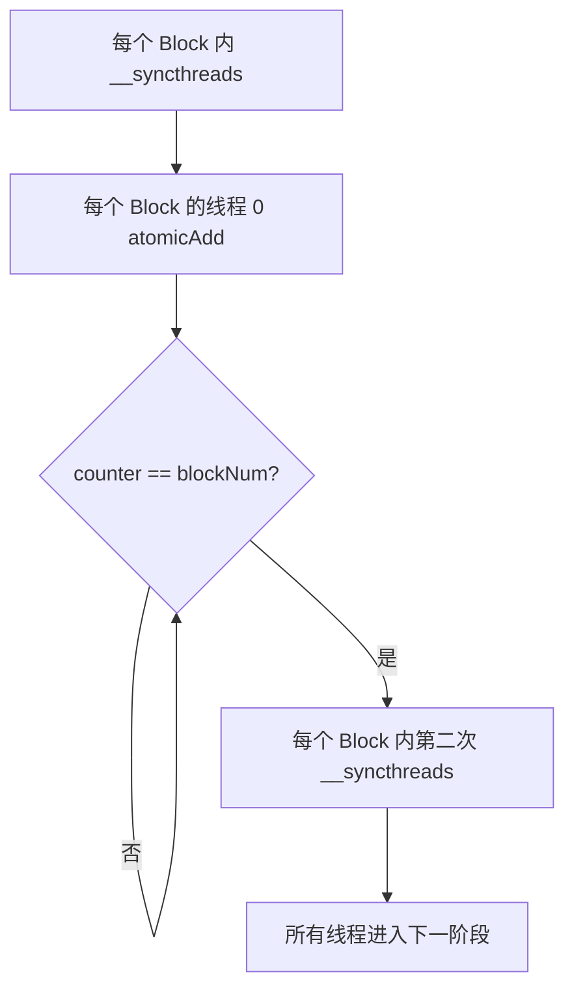

源码使用三个计数器轮转，避免不同 Barrier 代际互相污染，并支持同步 Block 数变化的场景。


**典型流程：**

```text
线程 0 relaxedSignal与远端完成握手
        ↓
DeviceSyncer.sync()
        ↓
所有线程共同 put/get
        ↓
DeviceSyncer.sync()
        ↓
线程 0 Signal 通知远端完成
```

第一个 Sync 保证其他线程和 Block 不会在握手完成前开始搬运；第二个 Sync 保证线程 0 发 Signal 前，所有参与线程都已经完成自己的数据部分。


---

## 12. PortChannel：GPU 出意图，CPU 出控制，RDMA 出搬运

**三层分工：GPU 只写 128-bit trigger 不碰数据，CPU 解析 trigger 下发 RDMA，NIC 独立搬运。**

| 接口 | GPU 侧动作 | ProxyService 侧动作 |
|---|---|---|
| put | push TriggerData（offset + size） | conn.write() 下发 RDMA 写 |
| putWithSignal | push Data \| Flag | RDMA 写 + signal 通知对端 |
| putWithSignalAndFlush | push Data \| Flag \| Sync + 自旋等 FIFO | RDMA 写 + signal + flush |
| flush / wait | push TriggerSync + 自旋 / 等 semaphore | conn.flush() 保证可见性 |

同步信号两条路径：

| 路径 | 机制 | 作用 |
|---|---|---|
| Signal / Wait | ProxyService 调 `semaphore.signal()` → RDMA 写 token 到对端 `inboundToken` → 对端 GPU `wait()` acquire 自旋 | 跨节点通知，保证数据可见后再读 |
| Flush | GPU push TriggerSync + `fifo_.sync()` 等 FIFO 排空 → ProxyService 调 `conn.flush()` | 本地 GPU↔ProxyService 同步，清空 RDMA 队列 |

源码索引：[port_channel_device.hpp]、[fifo_device.hpp]、[src/core/proxy.cc]、[src/core/port_channel.cc:89 handleTrigger]、[include/mscclpp/semaphore_device.hpp]

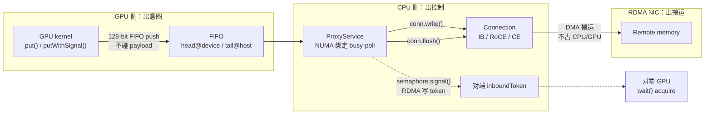

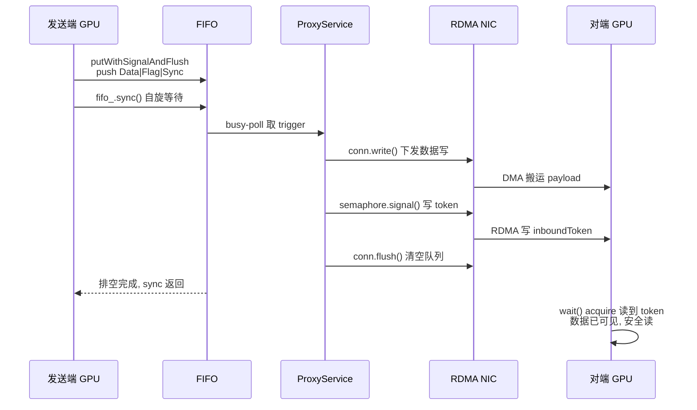

---

## 13. SwitchChannel：NVLS 硬件归约

**GPU 线程发一条 `multimem` 指令，NVLS 交换结构硬件同步归约所有 GPU 的数据，不需要多轮通信。**

| 接口 | 底层 PTX 指令 | 说明 |
|---|---|---|
| reduce(index) | `multimem.ld_reduce.relaxed.sys.global.add.<T>` | 一条指令 load 并跨 GPU 归约 |
| broadcast(index, val) | `multimem.st.relaxed.sys.global.<T>` | 一条指令 store 到所有 GPU |
| multimemStoreReduce | `multimem.red.relaxed.sys.global.add.<T>` | 归约后写回所有 GPU |

支持数据类型：f32 / f16 / bf16 / fp8(e4m3, e5m2) / i32 / u32 / f64，向量化到 x1/x2/x4/x8/x16。

内存要求：

| 指针 | 含义 |
|---|---|
| mcPtr | multimem-addressable 内存，所有 GPU 共享同一对称地址 |
| devicePtr | 本地 buffer，用于 reduce 结果写出 |

约束：依赖 NVLS / NVLink SHARP 硬件 + 对称或特殊分配内存；`relaxed.sys` 不保证顺序，需自行 fence；无 NVLS 时降级到 MemoryChannel / PortChannel / NCCL fallback。

源码索引：[switch_channel_device.hpp]、[allreduce_nvls_zero_copy.cu]

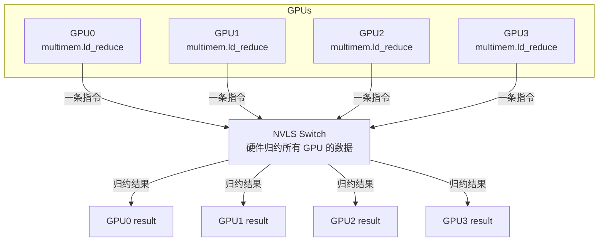

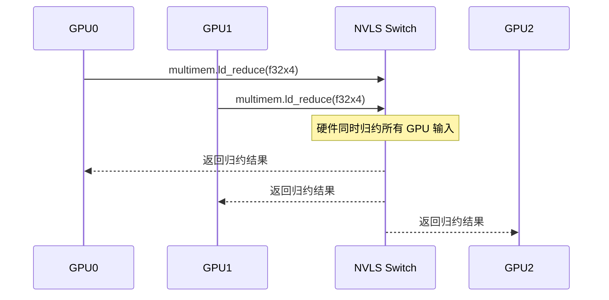
---

## 15. RegisteredMemory 与对称 offset

**zero-copy 的收益通常以更严格的内存布局为前提。**

RegisteredMemory 的含义：

- 不只是指针，还包含 transport 需要的远端访问 metadata。
- CudaIpc 需要跨进程 handle。
- IB 需要 memory region / key。
- NVLS 可能需要 multimem-addressable memory。

结论：zero-copy 往往把运行时拷贝开销转化为内存布局约束。

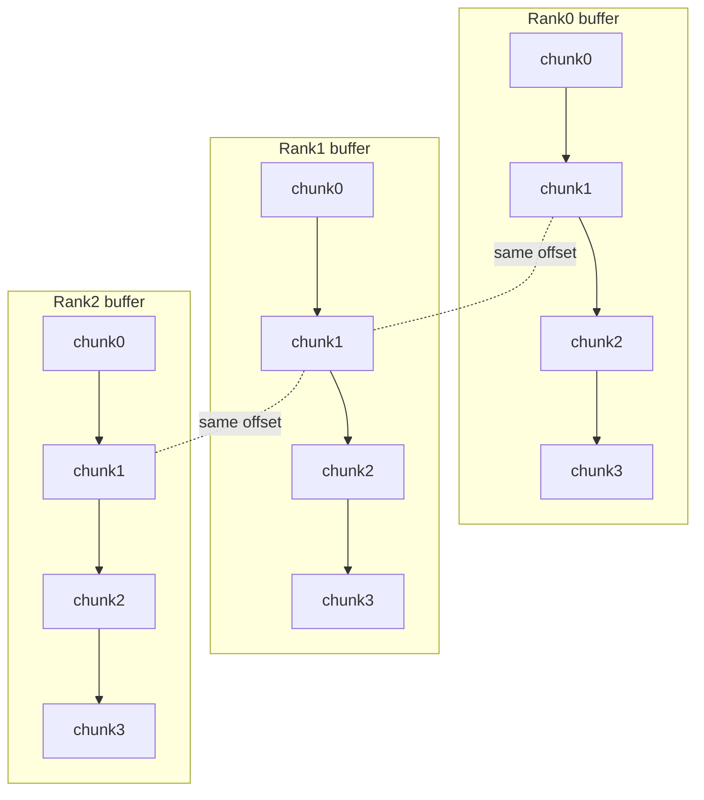

---

## 16. DSL 核心对象关系

**DSL 不是运行时 Python 调度，而是算法描述语言。**

| 对象 | 作用 |
|---|---|
| CollectiveProgram | 定义 collective、rank 数、instances、protocol |
| Rank | 逻辑 GPU 参与方 |
| Buffer | input / output / scratch 数据容器 |
| Chunk | 操作的基本数据单位 |
| Channel | rank 间通信路径 |
| tb / ThreadBlockGroup | 绑定 GPU 执行资源 |

```mermaid
flowchart TB
  CP[CollectiveProgram<br/>算法上下文]
  CP --> R0[Rank0]
  CP --> R1[Rank1]
  CP --> R2[Rank2]
  R0 --> B0[Buffer] --> C0[Chunk]
  R1 --> B1[Buffer] --> C1[Chunk]
  R2 --> B2[Buffer] --> C2[Chunk]
  C0 -- Channel + Operation + tb --> C1
  C1 -- Channel + Operation + tb --> C2
```

---

## 17. AllGather DSL 示例

**用 Rank / Chunk / Channel 描述数据流。**

示例逻辑：

1. 遍历 src_rank，找到源 chunk。
2. 遍历 dst_rank，构造 MemoryChannel。
3. 用 relaxed signal/wait 做就绪同步。
4. put 数据。
5. 用强 signal/wait 确认完成。

读代码抓三件事：数据位置、跨 rank 路径、同步与传输顺序。

```mermaid
flowchart TB
  S[Rank src<br/>output[src_rank]] --> C[MemoryChannel]
  C --> D0[Rank0 output[src_rank]]
  C --> D1[Rank1 output[src_rank]]
  C --> D2[Rank2 output[src_rank]]
  C --> D3[Rank3 output[src_rank]]
```

---

## 18. DSL 编译器优化

**让好写尽量接近好跑。**

| 优化 | 目标 |
|---|---|
| 操作融合 | 减少中间读写和指令开销 |
| 依赖分析 | 保证正确性，同时移除冗余 barrier |
| 实例复制 | 提升大消息并行度 |
| Pipeline | 让多个 chunk 在不同 stage 重叠推进 |

```mermaid
flowchart TB
  subgraph F[操作融合]
    A[reduce] --> B[put]
    B --> C[reduce+put fused]
  end
  subgraph D[依赖分析]
    W[last writer] --> Barrier[nop / barrier]
    Barrier --> R[active reader]
  end
  subgraph I[实例复制]
    I0[Instance0 chunk0]
    I1[Instance1 chunk1]
    I2[Instance2 chunk2]
  end
  subgraph P[Pipeline]
    P1[stage1 copy] --> P2[stage2 send]
    P3[stage1 copy next] --> P4[stage2 send next]
  end
```

---

## 19. DSL 到 Executor 的执行路径

**Python 只负责描述，C++/CUDA 负责执行。**

JSON 计划通常表达：

- buffer、chunk、offset、size。
- channel 类型与 peer 映射。
- copy、put、get、reduce、signal、wait、flush、nop。
- pipeline loop、thread block、instances。

重点：性能来自 C++ Executor + CUDA kernel + Primitive。

```mermaid
flowchart LR
  DSL[Python DSL<br/>算法描述]
  COMP[Compiler<br/>依赖分析 + 融合]
  JSON[JSON Execution Plan<br/>buffers / channels / ops / sync / loops]
  EXE[C++ Executor<br/>load plan / prepare args]
  K[CUDA execution kernel]
  PRI[Primitive device functions]
  DSL --> COMP --> JSON --> EXE --> K --> PRI
```

---

## 20. NCCL API 兼容层

**通过 interposition 接管 ncclAllReduce 等调用，再由 Selector 选择路径。**

Selector 判断条件：

- collective 类型：AllReduce / AllGather / ReduceScatter。
- 消息规模：小消息优先 packet / fused path。
- 硬件能力：NVLS 可选 SwitchChannel。
- 注册状态：是否存在 DSL JSON plan。
- 安全策略：调试期可按算子强制 fallback。

源码索引：[src/ext/nccl/nccl.cc]、[algorithm_selector.hpp]

```mermaid
flowchart LR
  APP[应用调用<br/>ncclAllReduce / ncclAllGather]
  INT[Interposition<br/>LD_PRELOAD / audit shim]
  SEL[Algorithm Selector]
  DSL[DSL Plan<br/>JSON 执行计划]
  NAT[Native Kernel<br/>C++/CUDA 算法]
  FB[NCCL fallback]
  APP --> INT --> SEL
  SEL --> DSL
  SEL --> NAT
  SEL --> FB
```

---

## 21. Algorithm Collection 与 Selector

**一个 collective 对应多个算法族。**

为什么需要 collection：

- 不同消息大小适合不同协议。
- 不同拓扑适合不同通信模式。
- 不同硬件能力决定是否可用 NVLS。
- 生产系统需要缓存和复用 context key。

源码索引：[src/ext/collectives/allreduce]、[algorithm_collection_builder.hpp]

```mermaid
flowchart LR
  subgraph Algorithms[AllReduce Algorithm Collection]
    A1[packet<br/>small msg]
    A2[fullmesh<br/>single node]
    A3[rsag<br/>reduce-scatter + all-gather]
    A4[rsag_pipeline<br/>pipeline]
    A5[nvls_zero_copy<br/>NVLS]
    A6[nvls_packet<br/>NVLS + packet]
  end
  Algorithms --> SEL[Selector]
  SEL --> K[selected kernel]
```

---

## 22. PyTorch 集成路线

**通信优化必须能进入训练和推理框架。**

| 路线 | 适用场景 | 风险控制 |
|---|---|---|
| Default | 标准 collective，低接入成本 | 与 NCCL baseline 校验 |
| DSL | 快速试验定制算法 | 检查 JSON plan 与结果正确性 |
| Native | 极致性能优化 | 更高开发成本，需要充分测试 |

建议：先优化最痛路径，例如 token sampling 小消息 AllReduce，再逐步扩大范围。

```mermaid
flowchart TB
  T[PyTorch Tensor]
  T --> D0[Default 内置算法]
  T --> D1[DSL 自定义]
  T --> D2[Native C++/CUDA]
  D0 --> K[GPU kernel]
  D1 --> J[JSON Plan] --> E[Executor] --> K
  D2 --> AB[AlgorithmBuilder] --> K
  K --> R[Tensor result]
```

---

## 24. 源码阅读地图

**从功能入口反查实现位置。**

| 模块 | 关键路径 | 读代码时关注 |
|---|---|---|
| Core | include/mscclpp/core.hpp；src/core/communicator.cc | 连接、内存注册、对象序列化 |
| Primitive | memory_channel_device.hpp；port_channel_device.hpp；switch_channel_device.hpp | GPU 侧通信原语 |
| Sync & Packet | semaphore_device.hpp；packet_device.hpp；fifo_device.hpp | 强/弱同步、Data+flag、FIFO trigger |
| DSL | program.py；channel.py；loop.py；optimizer.py | Program/Rank/Chunk/Channel、pipeline、fusion |
| Executor | executor.hpp；execution_kernel.cu | JSON plan 加载与 kernel 执行 |
| NCCL & Algo | src/ext/nccl；src/ext/collectives | interposition、selector、内置算法族 |

---

## 25. 最终结论

**通信库正在从黑盒算子走向可编排系统能力。**

当 AI 应用的通信模式越来越碎片化，通信库不能只提供固定 collective API。它需要提供可编排、可验证、可落地的底层抽象，让开发者按模型结构、消息大小、硬件拓扑重写通信路径。

一句话记忆：MSCCL++ = Core 搭桥 + Primitive 打开硬件 + DSL 提升算法生产力 + NCCL API 带回现有生态。

```mermaid
flowchart LR
  M[模型结构] --> C[通信路径设计]
  S[消息大小] --> C
  H[硬件拓扑] --> C
  F[框架生态] --> C
  C --> PP[MSCCL++<br/>Core + Primitive + DSL + NCCL API]
```
