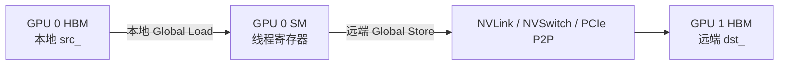
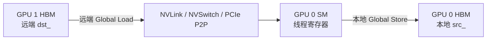
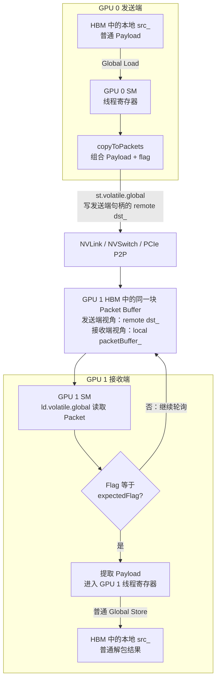
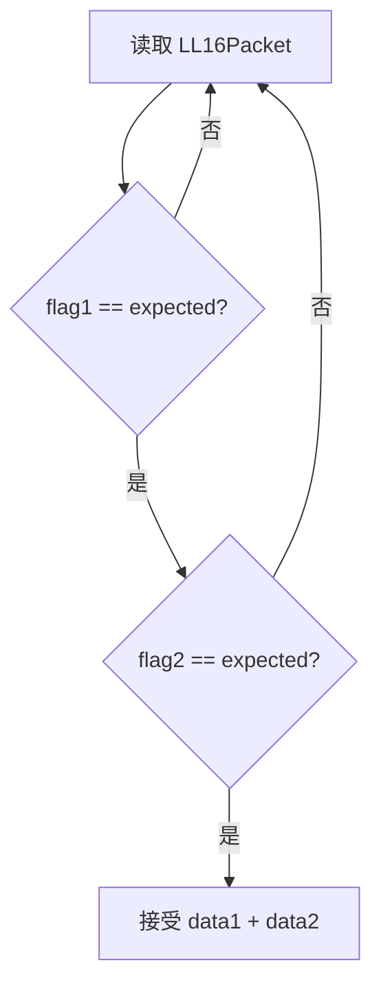
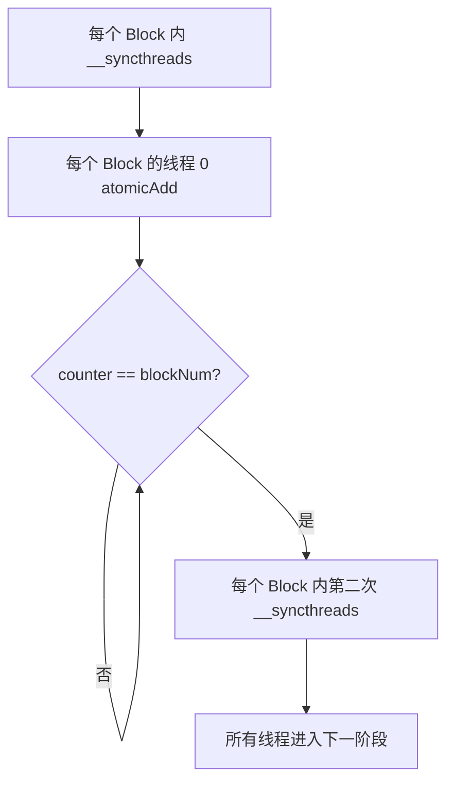
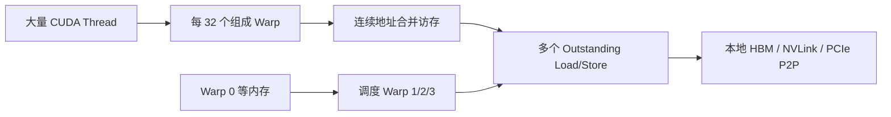
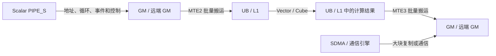
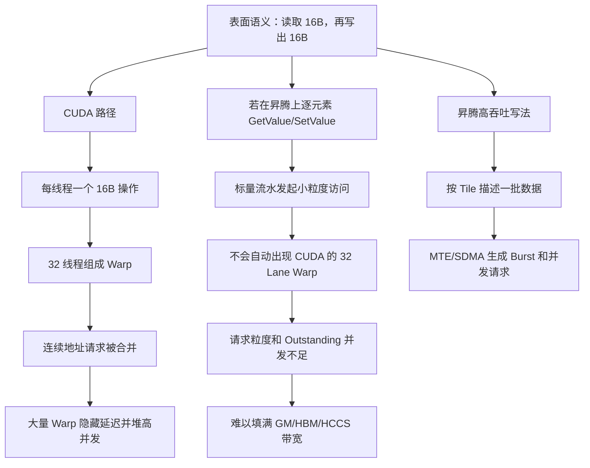
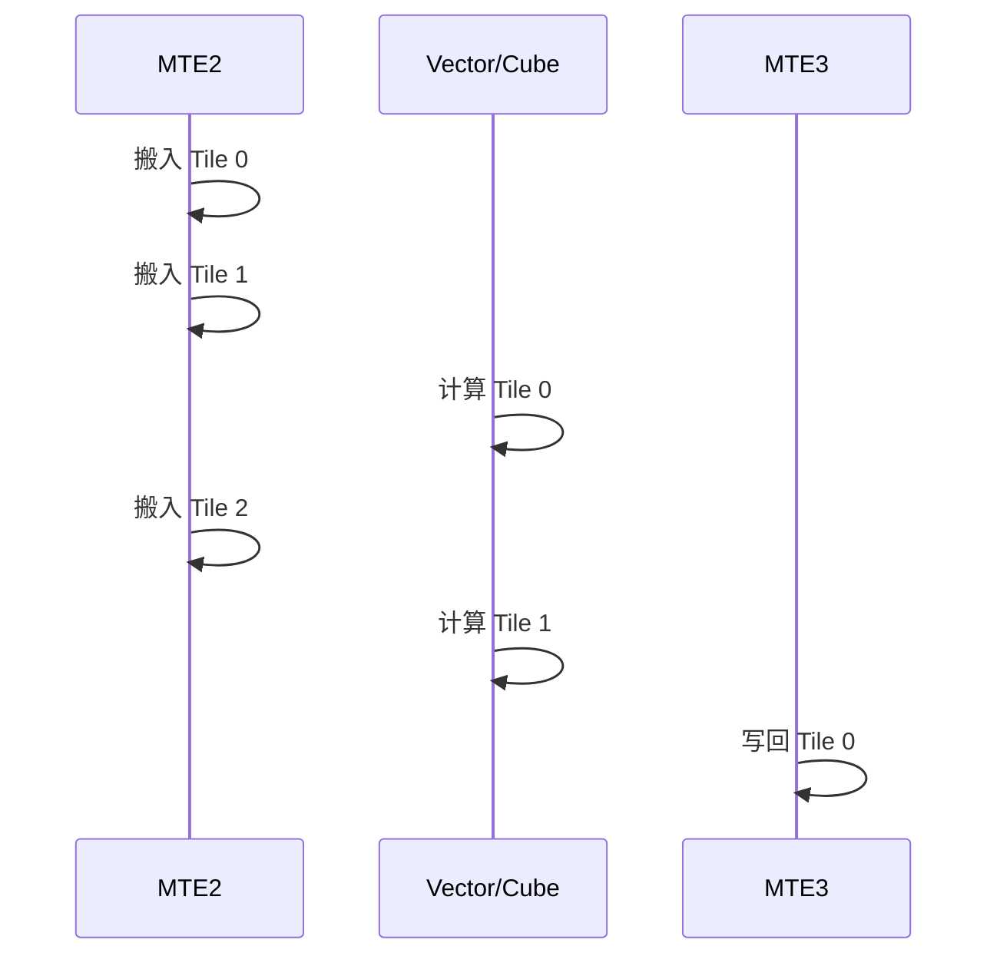

# MemoryChannelDeviceHandle 数据搬运分析

> 面向第一次接触 GPU 通信、CUDA 内存模型、MSCCL++ 和昇腾 Ascend C 的读者。
>
> 本文尽量同时做到两点：
>
> 1. 保持技术描述准确，便于继续阅读源码和分析性能；
> 2. 使用通俗类比、流程图和对照表解释 SM、Warp、寄存器、Global Load/Store、Packet、远端显存、MTE/SDMA 和同步。

---

## 目录

- [1. 先给出整体结论](#1-先给出整体结论)
- [2. MemoryChannelDeviceHandle 是什么](#2-memorychanneldevicehandle-是什么)
- [3. 三个核心地址：dst_、src_、packetBuffer_](#3-三个核心地址dst_src_packetbuffer)
- [4. read、write、put、get、putPackets、getPackets 的区别](#4-readwriteputgetputpacketsgetpackets-的区别)
- [5. put 和 get 的底层 copy 原理](#5-put-和-get-的底层-copy-原理)
- [6. 什么是 SM、Warp 和 GPU 线程](#6-什么是-smwarp-和-gpu-线程)
- [7. 为什么一个 Warp 是 32 个线程](#7-为什么一个-warp-是-32-个线程)
- [8. 什么是 GPU 寄存器](#8-什么是-gpu-寄存器)
- [9. 什么是 Global Load 和 Global Store](#9-什么是-global-load-和-global-store)
- [10. put 的真实数据路径](#10-put-的真实数据路径)
- [11. get 的真实数据路径](#11-get-的真实数据路径)
- [12. longlong2 搬运为什么可能很快](#12-longlong2-搬运为什么可能很快)
- [13. 这种写法是不是最快](#13-这种写法是不是最快)
- [14. Packet 搬运机制与完整数据路径](#14-packet-搬运机制与完整数据路径)
- [15. DeviceSyncer 的作用和原理](#15-devicesyncer-的作用和原理)
- [16. 为什么 DeviceSyncer 不能随便省略](#16-为什么-devicesyncer-不能随便省略)
- [17. 与昇腾 NPU 的图文对比](#17-与昇腾-npu-的图文对比)
- [18. 常见误区](#18-常见误区)
- [19. 性能分析建议](#19-性能分析建议)
- [20. 最终总结](#20-最终总结)

---

# 1. 先给出整体结论

`MemoryChannelDeviceHandle` 可以理解成：

> GPU Kernel 内部使用的一张“通信操作卡”，其中保存了本地内存、远端内存和同步信号的地址。

它支持两大类操作：

1. **普通内存访问**
   - `read<T>()`
   - `write<T>()`
   - `put()`
   - `get()`
2. **带 Packet 标志的数据访问**
   - `putPackets()`
   - `unpackPacket()`
   - `unpackPackets()`
   - 已废弃的 `getPackets()`

最重要的结论：

- `read/write` 是单个线程直接访问一个值；
- `put/get` 是多个 GPU 线程协同搬运一整段数据；
- `put` 是本地数据写向远端，相当于 **push**；
- `get` 是从远端读取数据到本地，相当于 **pull**；
- 当前 `put/get` 实现本质是 GPU SM 执行 Global Load/Store；
- 它不是代码中显式调用的 `cudaMemcpy`，也不是显式调用的 DMA/Copy Engine；
- 数据会短暂经过当前执行线程的寄存器；
- 寄存器永远属于当前执行 Kernel 的 GPU，不会位于远端 GPU；
- Packet 路径会把 Payload 和代表轮次的 Flag 一起写入接收端 Packet Buffer；
- `getPackets()` 不是“从远端拉 Packet”，它只是已废弃的本地 Packet 解包接口别名；
- `DeviceSyncer` 用于同一 Kernel 内多个 Block 的阶段同步；
- NVIDIA GPU 和昇腾 NPU 的高吞吐请求生成器不同，因此代码不能只做语法翻译。

相关源码：

- [`include/mscclpp/memory_channel_device.hpp`](include/mscclpp/memory_channel_device.hpp)
- [`include/mscclpp/copy_device.hpp`](include/mscclpp/copy_device.hpp)
- [`include/mscclpp/packet_device.hpp`](include/mscclpp/packet_device.hpp)
- [`include/mscclpp/concurrency_device.hpp`](include/mscclpp/concurrency_device.hpp)
- [`include/mscclpp/semaphore_device.hpp`](include/mscclpp/semaphore_device.hpp)

---

# 2. MemoryChannelDeviceHandle 是什么

源码结构可以简化为：

```cpp
struct MemoryChannelDeviceHandle : public BaseMemoryChannelDeviceHandle {
  void* dst_;
  void* src_;
  void* packetBuffer_;
};
```

这里的 `DeviceHandle` 表示它是给 GPU Device 端代码，也就是 CUDA Kernel 使用的轻量句柄。

Host 侧负责：

- 创建和注册内存；
- 建立 CUDA IPC 或其他可访问映射；
- 创建 Semaphore；
- 把最终可供 GPU 使用的地址封装进 DeviceHandle。

Kernel 拿到句柄后，可以直接操作其中的地址。

通俗类比：

```text
MemoryChannelDeviceHandle
├── dst_          对方仓库地址
├── src_          本地普通数据仓库地址
├── packetBuffer_ 本地 Packet 收件区
└── semaphore_    双方约定的门铃/通知器
```

---

# 3. 三个核心地址：dst_、src_、packetBuffer_

## 3.1 `dst_`

`dst_` 通常表示远端目标内存映射到当前 GPU 地址空间后的地址。

> 它在当前进程里表现为普通 Device Pointer，但背后的物理内存可能位于另一张 GPU 的 HBM。

因此：

```cpp
*(reinterpret_cast<T*>(dst_) + index)
```

从 C++ 语法看只是普通指针访问，硬件实际可能通过 NVLink、NVSwitch 或 PCIe P2P 访问另一张 GPU 的显存。

## 3.2 `src_`

`src_` 通常是当前 GPU 本地的普通数据地址：

- `put()` 从 `src_` 读取，再写入 `dst_`；
- `get()` 从 `dst_` 读取，再写入 `src_`；
- `putPackets()` 从 `src_` 读取 Payload，再编码成 Packet；
- `unpackPackets()` 从 `packetBuffer_` 解包，再写入 `src_`。

## 3.3 `packetBuffer_`

`packetBuffer_` 是当前 GPU 本地的 Packet 接收缓冲区。

远端 GPU 通过 `putPackets()` 把带 Flag 的 Packet 写进这块内存后，当前 GPU 使用：

- `unpackPacket()`：读取并验证一个 Packet；
- `unpackPackets()`：由多个线程协作读取并验证多个 Packet；
- `getPackets()`：已废弃，内部仍然调用 `unpackPackets()`。

最容易混淆的是：

> 对发送端来说，接收端的 Packet Buffer 表现为发送端句柄里的远端 `dst_`；对接收端自己来说，同一块物理内存表现为本地 `packetBuffer_`。

后文第 14 节会把发送端和接收端连在一张图中说明。

---

# 4. read、write、put、get、putPackets、getPackets 的区别

| 接口 | 数据方向 | 调用粒度 | 多线程协作 | Packet Flag | 典型用途 |
|---|---|---:|---:|---:|---|
| `read<T>` | 远端 → 当前线程寄存器 | 一个 `T` | 否 | 否 | 状态、控制字段 |
| `write<T>` | 当前线程寄存器 → 远端 | 一个 `T` | 否 | 否 | 状态、控制字段 |
| `put` | 本地 `src_` → 远端 `dst_` | 一段数据 | 是 | 否 | 大块 Push |
| `get` | 远端 `dst_` → 本地 `src_` | 一段数据 | 是 | 否 | 大块 Pull |
| `putPackets` | 本地 `src_` → 远端 Packet Buffer | 一段 Payload | 是 | 写入 | 小消息、低延迟协议 |
| `unpackPacket` | 本地 Packet Buffer → 返回值 | 一个 Packet | 否 | 检查 | 读取一个 Packet |
| `unpackPackets` | 本地 Packet Buffer → 本地 `src_` | 多个 Packet | 是 | 检查 | 批量解包 |
| `getPackets` | 本地 Packet Buffer → 本地 `src_` | 多个 Packet | 是 | 检查 | 已废弃别名 |

## 4.1 `read<T>()`

```cpp
template <typename T>
T read(uint64_t index) {
  return *(reinterpret_cast<T*>(dst_) + index);
}
```

当前 GPU 的一个线程发起读取，数据返回当前线程的寄存器。它适合少量数据，不适合让单个线程循环搬运大块数据。

## 4.2 `write<T>()`

```cpp
template <typename T>
void write(uint64_t index, const T& v) {
  *(reinterpret_cast<T*>(dst_) + index) = v;
}
```

它是普通内存写，不自动等价于原子操作，也不天然提供完整的跨线程同步语义。

## 4.3 `put()` 与 `get()`

```text
put：本地 src_ → 远端 dst_
get：远端 dst_ → 本地 src_
```

它们调用同一个 `copy()`，只是源和目的方向相反。

## 4.4 `putPackets()` 与 `unpackPackets()`

```text
发送端 putPackets：
本地 src_ → 编码为 Payload + Flag → 远端 Packet Buffer

接收端 unpackPackets：
本地 packetBuffer_ → 检查 Flag → 提取 Payload → 本地 src_
```

## 4.5 `getPackets()`

源码中它直接调用 `unpackPackets()`，所以：

> `getPackets()` 不是远端版 `get()`，而是历史命名留下的本地 Packet 解包接口。

---

# 5. put 和 get 的底层 copy 原理

核心代码：

```cpp
template <typename T>
void copy(T* dst, T* src,
          uint64_t numElems,
          uint32_t threadId,
          uint32_t numThreads) {
  T reg;
  for (size_t i = threadId; i < numElems; i += numThreads) {
    reg = src[i];
    dst[i] = reg;
  }
}
```

可以把它理解成一群搬运工共同搬仓库：

```text
线程 0：搬 0、N、2N、3N ...
线程 1：搬 1、N+1、2N+1 ...
线程 2：搬 2、N+2、2N+2 ...
...
```

每个线程执行：

```text
Global Load → 本线程寄存器 → Global Store
```

`Alignment=16` 时使用 `longlong2`，每个线程每次处理 16 字节；头尾不满足 16 字节主体对齐时，辅助逻辑会使用更小粒度处理。

---

# 6. 什么是 SM、Warp 和 GPU 线程

## 6.1 SM

SM（Streaming Multiprocessor）是 NVIDIA GPU 执行 Kernel 的主要计算单元，内部包含：

- Warp Scheduler；
- CUDA Core / ALU；
- Load/Store Unit；
- Register File；
- Shared Memory / L1；
- 其他专用执行单元。

## 6.2 Warp

Warp 是 NVIDIA GPU 的基本线程调度和执行组，通常由连续的 32 个 CUDA 线程组成：

```text
Warp 0：thread 0  ～ thread 31
Warp 1：thread 32 ～ thread 63
...
```

一个 Warp 中的每个线程也称为一个 Lane。

## 6.3 SIMT

CUDA 对程序员表现为多个独立线程，但硬件把 32 个线程组合成 Warp 执行同一条或同一路径上的指令。这称为 SIMT：Single Instruction, Multiple Threads。

---

# 7. 为什么一个 Warp 是 32 个线程

32 不是数学定理，而是 NVIDIA 的架构选择，是以下因素的工程折中：

- 指令获取和调度开销；
- 执行吞吐；
- 内存访问合并；
- 分支发散代价；
- 寄存器和其他资源占用；
- 延迟隐藏能力。

Warp 太小，调度开销相对变大；Warp 太大，分支发散和资源占用会更严重。NVIDIA 长期选择 32 Lane 作为平衡点。

如果 Block 有 256 个线程，则逻辑上包含：

```text
256 / 32 = 8 个 Warp
```

Block 大小不是 32 的倍数时，最后一个 Warp 会有部分 Lane 不工作。

---

# 8. 什么是 GPU 寄存器

从编程模型看，每个 CUDA 线程拥有自己的逻辑寄存器；从物理位置看，寄存器资源位于当前 GPU 的 SM Register File。

```text
当前 GPU
└── SM
    └── Register File
        ├── Thread 0 的逻辑寄存器
        ├── Thread 1 的逻辑寄存器
        └── ...
```

关键结论：

> Kernel 在 GPU 0 上执行，`reg` 就属于 GPU 0 的 SM；即使 `src` 或 `dst` 指向 GPU 1，寄存器也不会跑到 GPU 1。

如果寄存器压力过高，编译器可能发生 Register Spill。CUDA 的 `local memory` 虽然逻辑上线程私有，但通常由当前 GPU 的 Global Memory/HBM 承载，并不等于 SM 内部寄存器。

---

# 9. 什么是 Global Load 和 Global Store

CUDA 中：

```cpp
value = ptr[index];
ptr[index] = value;
```

通常会形成概念上的：

```text
ld.global
st.global
```

`global` 表示 GPU 的 Global Address Space，不直接说明物理内存一定在本地。

同一条 Global Load/Store 可能访问：

- 当前 GPU 的本地 HBM；
- 通过 CUDA IPC 或 VMM 映射的 Peer GPU HBM；
- 映射后的 Host Memory；
- 其他 GPU 可访问地址。

因此判断数据路径时，不能只看指令名字，还必须判断指针最终映射到哪块物理内存。

---

# 10. put 的真实数据路径

假设 Kernel 在 GPU 0 上执行，`src_` 在 GPU 0，`dst_` 映射到 GPU 1：



即：

```text
GPU 0 HBM
→ GPU 0 SM 寄存器
→ GPU 互联
→ GPU 1 HBM
```

这是由 GPU 0 的 SM 主动 Push 数据。

---

# 11. get 的真实数据路径

仍假设 Kernel 在 GPU 0 上执行：



即：

```text
GPU 1 HBM
→ GPU 互联
→ GPU 0 SM 寄存器
→ GPU 0 HBM
```

`get` 的远端读取包含请求和返回，对远端访问延迟及 Outstanding Read 数量通常更加敏感。

---

# 12. longlong2 搬运为什么可能很快

代码：

```cpp
longlong2 reg;
reg = src[i];
dst[i] = reg;
```

`longlong2` 是 16 字节。单个线程每次只处理 16B，但 GPU 不能只看单线程：

```text
1 个线程：16B
1 个 Warp：32 × 16B = 512B 逻辑数据
多个 Warp：持续产生请求
多个 SM：进一步并发
```

同一 Warp 的线程访问连续地址时，硬件可以把它们组织为较少的内存 Transaction，而不是把 32 个线程完全当作互不相关的小请求。

真正使它变快的是：

- 连续地址；
- 合适对齐；
- Warp 级合并访存；
- 足够多的活跃 Warp；
- 足够多的 Outstanding 请求；
- 多个 SM 并行；
- 本地 HBM、远端 HBM 和互联带宽能够被填满。

> 不是因为 `longlong2` 这个类型本身“自带高带宽”。

---

# 13. 这种写法是不是最快

不一定。

## 13.1 纯大块复制

对于纯粹的大块连续数据复制，应当对比：

- `put/get` 的 SM Copy；
- `cudaMemcpyPeerAsync()`；
- 通信库或硬件专用复制路径。

专用复制路径可能减少 SM 占用，并与计算并发。

## 13.2 SM Copy 的价值

SM Copy 的优势常常不是单独 memcpy 峰值，而是：

- Kernel 内自主通信；
- Persistent Kernel；
- 低延迟小消息；
- 不规则 Scatter/Gather；
- 边通信边计算；
- Packet 协议；
- 避免返回 Host 再启动复制。

因此应比较端到端目标，而不是只比较一段 memcpy 的孤立带宽。

---

# 14. Packet 搬运机制与完整数据路径

Packet 路径是本章最容易产生误解的部分。

普通 `put()` 只搬数据；Packet 路径则把：

```text
Payload + Flag
```

一起写入接收端缓冲区。接收端通过检查 Flag 判断：

> 当前读到的 Payload 是否已经属于自己等待的这一轮，而不是旧数据或尚未完整到达的数据。

## 14.1 为什么要使用 Packet

普通数据传输经常需要两条逻辑路径：

```text
数据路径：写 Payload
控制路径：Signal / Wait 通知数据已经完成
```

Packet 协议把小粒度的“数据”和“到达标志”放在同一个 Packet 中：

```text
[data][flag]
```

因此接收端可以直接轮询 Packet 自身，而不必为每一个很小的数据片段单独维护一个 Semaphore。

通俗类比：

- 普通 `put()`：先送包裹，再单独打电话说“包裹到了”；
- `putPackets()`：每个包裹上都贴有本轮批次号，收件人看到正确批次号才拆包。

## 14.2 发送端和接收端连在一起的完整主图

假设 GPU 0 向 GPU 1 发送 Packet。下面这张图把发送端、互联、接收端、轮询和最终解包目标按照从上到下的顺序连成一条完整链路：



这张图必须从上到下连起来理解：

```text
GPU 0 本地 src_
↓
GPU 0 SM 读取 Payload
↓
加入 Flag，形成 Packet
↓
对远端 dst_ 发出 Volatile Global Store
↓
NVLink / NVSwitch / PCIe P2P
↓
GPU 1 HBM 中的 Packet Buffer
↓
GPU 1 SM 反复 Volatile Load 并检查 Flag
↓
Flag 匹配后提取 Payload
↓
写入 GPU 1 本地 src_
```

最关键的地址关系是：

```text
发送端看到：remote dst_
接收端看到：local packetBuffer_
物理位置：GPU 1 HBM 中的同一块 Packet Buffer
```

> `remote dst_` 和 `local packetBuffer_` 不是两块内存，也不是还需要额外复制一次；它们是同一块接收端物理缓冲区在两张 GPU 地址空间中的不同视图。

## 14.3 端到端时序图

主图描述空间上的数据路径，下面的时序图描述时间上的先后关系：

```mermaid
sequenceDiagram
    participant SData as GPU 0 本地 src_
    participant SSM as GPU 0 SM
    participant Link as NVLink / PCIe P2P
    participant PBuf as GPU 1 Packet Buffer
    participant RSM as GPU 1 SM
    participant RData as GPU 1 本地 src_

    RSM->>PBuf: ld.volatile.global 读取 Packet
    PBuf-->>RSM: 返回旧 Flag / 未完成状态
    RSM->>PBuf: 继续轮询

    SSM->>SData: Global Load 读取 Payload
    SData-->>SSM: Payload 进入寄存器
    SSM->>SSM: 组合 Payload + 当前 flag
    SSM->>Link: st.volatile.global 写远端 Packet
    Link->>PBuf: Packet 到达 GPU 1 HBM

    RSM->>PBuf: 再次读取 Packet
    PBuf-->>RSM: Payload + 匹配的 Flag
    RSM->>RData: Global Store 写入解包 Payload
```

这里允许接收端先开始轮询。它不需要知道远端写请求在哪一个周期到达，只需要等待 Flag 变成目标值。

## 14.4 LL16Packet 的布局

源码中的 `LL16Packet` 总大小为 16B：

```cpp
struct {
  uint32_t data1;
  uint32_t flag1;
  uint32_t data2;
  uint32_t flag2;
};
```

图示：

```text
字节偏移      0        4        8        12       16
             ┌────────┬────────┬────────┬────────┐
LL16Packet   │ data1  │ flag1  │ data2  │ flag2  │
             └────────┴────────┴────────┴────────┘
有效 Payload     4B                4B
元数据                    4B                4B
```

因此：

```text
Packet 总大小：16B
有效 Payload：8B
Flag 元数据：8B
Payload 效率：50%
```

可以把一个 LL16Packet 看成两个 8B 小单元：

```text
[data1, flag1] + [data2, flag2]
```

源码注释假设底层至少提供 8B 写入原子性。两个 Flag 的目的，是帮助接收端识别 16B Packet 是否只更新了一半。

## 14.5 LL8Packet 的布局

`LL8Packet` 总大小为 8B：

```cpp
struct {
  uint32_t data;
  uint32_t flag;
};
```

```text
字节偏移      0        4        8
             ┌────────┬────────┐
LL8Packet    │ data   │ flag   │
             └────────┴────────┘
有效 Payload    4B
元数据                   4B
```

LL8 的有效 Payload 同样只有总字节数的 50%。

## 14.6 发送端 `putPackets()` 做了什么

接口内部方向可以简化为：

```cpp
copyToPackets(
    dst_ + targetOffset,   // GPU 1 的远程 Packet Buffer
    src_ + originOffset,  // GPU 0 的本地普通数据
    originBytes,
    threadId,
    numThreads,
    flag);
```

发送端逐步执行：

1. GPU 0 的线程从本地 `src_` 读取 Payload；
2. Payload 进入 GPU 0 当前线程寄存器；
3. 线程把 Payload 和调用者给出的 `flag` 组合成 LL16 或 LL8 Packet；
4. GPU 0 的 SM 对远端 `dst_` 发出 Volatile Global Store；
5. 写请求经过 NVLink、NVSwitch 或 PCIe P2P；
6. Packet 最终落入 GPU 1 HBM 中的 Packet Buffer。

注意：

> `putPackets()` 并不是先在发送端生成一份完整 Packet 临时数组，再调用 DMA；它由参与线程逐个读取 Payload，并直接向远端 Packet 地址写入编码结果。

## 14.7 接收端 `unpackPackets()` 做了什么

内部方向可以简化为：

```cpp
copyFromPackets(
    src_ + originOffset,             // GPU 1 本地普通数据目标
    packetBuffer_ + targetOffset,    // GPU 1 本地 Packet Buffer
    originBytes,
    threadId,
    numThreads,
    expectedFlag);
```

接收端逐步执行：

1. GPU 1 的线程从本地 `packetBuffer_` 读取 Packet；
2. 使用显式 Volatile Global Load，使轮询持续读取目标地址；
3. 检查 Packet 中的 Flag；
4. 如果 Flag 不是期待的本轮值，就继续读取同一个 Packet；
5. Flag 匹配后，Payload 被取到 GPU 1 当前线程寄存器；
6. 当前线程把 Payload 写入 GPU 1 本地普通数据区 `src_`。

因此 `unpackPackets()` 同时完成：

```text
等待当前 Packet 到达
+
把 Packet 格式转换回普通数据格式
```

## 14.8 多线程如何分工

LL16 每个 Packet 承载 8B Payload：

```cpp
size_t nElem = originBytes / sizeof(uint64_t);
for (size_t i = threadId; i < nElem; i += numThreads) {
  pkt[i].write(data1, data2, flag);
}
```

例如：

```text
originBytes = 32B
numThreads = 2
```

则共有 4 个 LL16Packet：

```text
线程 0：Packet 0、Packet 2
线程 1：Packet 1、Packet 3
```

物理 Packet Buffer 占用：

```text
4 × 16B = 64B
```

也就是 32B Payload 需要 64B Packet Buffer。

## 14.9 Flag 如何表示“数据属于本轮”

假设每轮通信使用不同 Flag：

```text
第 1 轮：flag = 1
第 2 轮：flag = 2
第 3 轮：flag = 3
```

接收端第 2 轮只接受：

```text
packet.flag == 2
```

即使 Packet Buffer 中仍保存着第 1 轮旧 Payload，只要 Flag 不匹配，接收端就不会误用。

通俗类比：

```text
Payload = 包裹内容
Flag    = 批次号
```

工程上还要考虑 Flag 回绕、Buffer 复用以及最慢参与者是否已经退出旧轮次。

## 14.10 LL16 为什么需要两个 Flag

接收端只有在：

```text
flag1 == expectedFlag
并且
flag2 == expectedFlag
```

时才接受 `data1 + data2`。

假设期待 `flag = 7`：

```text
完整到达：
[data1_new, 7, data2_new, 7]  → 接受

只更新前 8B：
[data1_new, 7, data2_old, 6]  → 继续轮询

只更新后 8B：
[data1_old, 6, data2_new, 7]  → 继续轮询
```



因此重复 Flag 的核心作用是：

> 在假设每个 8B 单元具有足够原子性的前提下，帮助检测 16B Packet 的部分更新或撕裂状态。

它并不表示整个 16B Store 必然原子。

## 14.11 CUDA 指令层面的读写

LL16 使用类似：

```text
st.volatile.global.v4.u32
ld.volatile.global.v4.u32
```

LL8 使用类似：

```text
st.volatile.global.v2.u32
ld.volatile.global.v2.u32
```

`volatile` 在这里的重要意义是：

- 发送端确实发出目标 Global Store；
- 接收端轮询时确实重复读取目标地址；
- 避免编译器把轮询读取错误复用为旧值或删除。

但必须注意：

> Volatile Load/Store 不能被简单等同为任意场景下完整的 C++ Release/Acquire，也不能自动为 Packet 之外的所有普通内存访问建立顺序。

如果协议还依赖其他独立内存区域，就仍需分析 Semaphore、Fence、Atomic 和内存序。

## 14.12 Packet 路径与普通 put 的对比

| 维度 | 普通 `put()` | `putPackets()` + `unpackPackets()` |
|---|---|---|
| 远端写入内容 | 纯 Payload | Payload + Flag |
| 接收端目标 | 普通数据缓冲区 | Packet Buffer，之后再解包 |
| 到达判断 | 常依赖额外 Signal/Wait | 每个 Packet 自带 Flag |
| 接收端操作 | 直接消费普通数据 | 轮询、检查 Flag、提取 Payload |
| Payload 效率 | 接近 100%，不考虑对齐和协议开销 | LL16/LL8 均为 50% |
| 典型目标 | 大块数据 Goodput | 小消息低延迟、细粒度流水 |
| 额外本地写 | 通常没有 Packet 解包写 | 解包后写入本地 `src_` |
| 对旧数据识别 | 依赖外部同步协议 | Flag 直接区分通信轮次 |

## 14.13 为什么 Packet 适合小消息

Packet 的优势：

- Payload 和到达标志一起传输；
- 接收端可以提前启动并轮询；
- 不必给每一个小片段单独安排 Semaphore；
- 适合细粒度生产者—消费者流水；
- 可以在 Persistent Kernel 中边到达边消费；
- 对低延迟协议很有价值。

Packet 的代价：

- 只有 50% 的字节是有效 Payload；
- 接收端轮询会消耗 SM 执行资源和内存流量；
- 解包还要产生一次本地写；
- 大消息下元数据开销明显；
- Flag 轮次管理错误会导致永久等待或读取错误轮次；
- Volatile 并不替代完整的内存顺序设计。

因此：

> Packet 追求的是小消息和细粒度流水的低延迟，不是大块纯 Payload 的最高 Goodput。

## 14.14 一个完整例子

假设 GPU 0 向 GPU 1 发送 16B 普通数据，使用 LL16Packet，当前 `flag = 5`。

发送端编码后：

```text
Packet 0：[data0_low][5][data0_high][5]  共 16B
Packet 1：[data1_low][5][data1_high][5]  共 16B
```

数据量变化：

```text
原始 Payload：16B
远端 Packet Buffer 占用：32B
```

端到端路径：

```text
GPU 0 src_ 中的 16B 普通数据
  ↓ GPU 0 线程读取
GPU 0 SM 寄存器
  ↓ 加入 flag=5
两个 LL16Packet
  ↓ 远端 Global Store
NVLink / PCIe P2P
  ↓
GPU 1 packetBuffer_ 中的 32B Packet 数据
  ↓ GPU 1 线程轮询，确认两个 Flag 都为 5
GPU 1 SM 寄存器中的 16B Payload
  ↓ 本地 Global Store
GPU 1 src_ 中的 16B 普通数据
```

## 14.15 Packet 调试检查表

遇到 Packet 卡住或数据错误时，建议依次检查：

1. 发送端 `dst_` 是否真的映射到接收端对应的 Packet Buffer；
2. 接收端 `packetBuffer_` 是否指向同一块物理缓冲区；
3. LL16 的 `originBytes` 是否为 8B 的整数倍；
4. LL8 的 `originBytes` 是否为 4B 的整数倍；
5. `targetOffset` 是否按照 Packet 存储大小计算，而不是只按照 Payload 大小计算；
6. 发送端写入的 Flag 是否与接收端等待的 Flag 完全一致；
7. 不同轮次复用 Buffer 时，Flag 是否正确推进；
8. `threadId` 和 `numThreads` 是否覆盖全部 Packet 且没有越界；
9. 是否把已废弃的 `getPackets()` 误认为远端 Pull；
10. 是否错误地把 Volatile 当成对所有相关内存的完整 Fence；
11. 是否存在某些线程没有参与解包，却又提前消费本地 `src_`；
12. 是否需要 Block 或 Grid 级同步来保证所有 Packet 都已解包完成。

---

# 15. DeviceSyncer 的作用和原理

`DeviceSyncer` 是同一个 Kernel 内的 Device-wide Barrier，用于多个 Block 的阶段同步。

`__syncthreads()` 只能同步同一个 Block，不能同步不同 Block。

实现步骤：

1. Block 内执行 `__syncthreads()`；
2. 每个 Block 的 `threadIdx.x == 0` 作为代表；
3. 代表线程对全局计数器执行 Atomic Fetch Add；
4. 代表线程轮询直到计数等于参与 Block 数；
5. 使用 Acquire/Release 建立跨 Block 可见性；
6. 再执行一次 Block 内 `__syncthreads()`，放行本 Block 其他线程。



源码使用三个计数器轮转，避免不同 Barrier 代际互相污染，并支持同步 Block 数变化的场景。

---

# 16. 为什么 DeviceSyncer 不能随便省略

典型流程：

```text
线程 0 与远端完成握手
        ↓
DeviceSyncer.sync()
        ↓
所有线程共同 put/get/Packet 解包
        ↓
DeviceSyncer.sync()
        ↓
线程 0 Signal 或进入下一阶段
```

第一个 Sync 保证其他线程和 Block 不会在握手完成前开始搬运；第二个 Sync 保证线程 0 通知远端或消费结果前，所有参与线程都已经完成自己的数据部分。

Packet 场景中同样可能需要同步：某个线程完成自己负责的 Packet，并不代表全部 Packet 已经完成。如果后续阶段要把整段 `src_` 当成完整数据使用，就需要合适的 Block/Grid 同步。

软件 Grid Barrier 还有一个重要工程约束：如果已驻留 Block 在 Barrier 中自旋，而尚未调度的 Block 因 SM 资源不足无法进入，可能死锁。因此必须评估：

- Grid 大小；
- Block 大小；
- 寄存器占用；
- Shared Memory 占用；
- GPU SM 数量；
- 实际可同时驻留的 Block 数量。

---

# 17. 与昇腾 NPU 的图文对比

这一节重点回答两个问题：

1. 为什么 NVIDIA GPU 上 `reg = src[i]; dst[i] = reg;` 可能很快？
2. 为什么不能把这种编程方式逐行照搬到昇腾 NPU？

最核心的答案：

> 两种芯片负责“制造高并发大吞吐内存请求”的硬件主体不同。
>
> NVIDIA GPU 主要依靠 SM 中的大量 Warp；昇腾 AI Core 的典型高吞吐数据通路主要依靠 MTE/SDMA 和显式流水。

## 17.1 两种架构的主力搬运工不同

### NVIDIA GPU：大量 Warp 是主力搬运工



GPU 的线程系统本身就是大规模内存并发请求生成器：

```text
32 Lane / Warp
× 多个 Active Warp / SM
× 多个 SM
= 大量并发内存请求
```

### 昇腾 NPU：MTE/SDMA 是主力搬运工



典型 Ascend C AI Core 流水可粗略理解为：

| 流水/单元 | 主要职责 |
|---|---|
| `PIPE_S` | 标量控制、地址计算、少量标量访问 |
| `PIPE_V` | UB 上的向量计算 |
| `PIPE_M` | 矩阵/Cube 计算 |
| `PIPE_MTE2` | GM → UB/L1 批量搬运 |
| `PIPE_MTE3` | UB → GM 批量搬运 |
| SDMA/通信引擎 | 特定大块复制和通信路径 |

这里不是说昇腾完全不能访问 GM，而是说：

> 对大块连续数据而言，高吞吐路径通常不是让标量流水逐元素读写，而是给 MTE/SDMA 一个批量搬运描述。

## 17.2 相似代码为什么落到不同硬件路径



因此：

```text
相同的高级语言语义
≠ 相同的硬件执行组织
≠ 相同的性能
```

## 17.3 通俗类比：搬箱子

GPU 模型像 32 个搬运工组成一组：

```text
32 个搬运工同时出发
每人拿一个 16B 小箱子
地址连续时，仓库系统把它们组织成成批装卸
某一组在等车，调度员安排另一组继续工作
```

昇腾逐元素标量 GM 访问则更像：

```text
让负责登记和调度的管理员
亲自一小箱一小箱往返仓库
```

MTE/SDMA 更像叉车和货运流水线：

```text
提交源地址、目的地址、总长度、块数、块长度和 Stride
硬件搬运流水批量生成请求
管理员只负责提交任务和处理事件
```

根因不是“昇腾寄存器慢”，而是：

> 把 GPU 的主力搬运通路，错误映射成了 NPU 的控制/标量通路。

## 17.4 最核心根因：高带宽请求生成器不同

| 维度 | NVIDIA GPU | 昇腾 NPU 典型 AI Core 模型 |
|---|---|---|
| 高带宽请求生成器 | SM 中大量 Warp/Lane | MTE/SDMA 描述符和搬运流水 |
| 基本并发来源 | 多线程、多 Warp、多 SM | Tile、Burst、搬运队列、多流水重叠 |
| 连续访问聚合 | Warp Coalescing | MTE Block/BlockLen/Stride 描述 |
| 隐藏延迟 | Warp 切换 | MTE2/Vector/MTE3 流水重叠、双缓冲 |
| 计算的主要数据位置 | 可由大量线程访问 Global Memory | Vector/Cube 通常围绕 UB/L1 数据工作 |
| 单个 16B 类型的意义 | 每 Lane 16B，再乘 32 Lane | 16B 类型本身不会自动创造 32 Lane 并发 |
| 大块纯复制 | SM Copy 或 Copy Engine | MTE、SDMA 或通信库路径 |
| 同步方式 | Warp/Block/Grid + 内存序 | Queue/Event/SetFlag/WaitFlag/流水 Barrier |

一句话归纳：

> GPU 用“很多线程一起发请求”制造吞吐；昇腾用“专用搬运流水批量发请求”制造吞吐。

## 17.5 为什么 longlong2 不能机械翻译

CUDA：

```cpp
longlong2 reg;
reg = src[i];
dst[i] = reg;
```

在 GPU 上快的完整条件是：

```text
16B / Thread
× 32 Thread / Warp
× 多个 Warp / SM
× 多个 SM
+ 连续地址合并
+ 足够 Outstanding 请求
```

如果在昇腾上只换一个 16B 结构体，再逐元素访问 GM，通常缺少：

- 32 Lane Warp；
- Warp Coalescer；
- 大量 Active Warp；
- Warp Scheduler 的延迟隐藏；
- 由这些 Warp 产生的大量 Outstanding 请求。

所以：

```text
使用 16B 类型只是访问粒度
达到高带宽还需要并发请求生成机制
```

## 17.6 为什么 GM→UB→GM 多一跳反而更快

表面上：

```text
GM → UB → GM
```

比直接 `GM → GM` 多了一跳，但 MTE 路径可以：

- 以 Tile 为单位提交；
- 生成连续 Burst；
- 描述 Block 和 Stride；
- 异步执行；
- 与 Vector/Cube 流水重叠；
- 使用双缓冲或多缓冲。



真正比较的不是物理上经过几个存储层，而是：

```text
每条路径能产生多大请求
能保持多少并发
能否与其他流水重叠
```

## 17.7 正确迁移方式

错误迁移：

```text
CUDA 每线程 load/store
→ Ascend 每核逐元素 GetValue/SetValue
```

更合理的语义迁移：

```text
GPU 的大量 Warp 合并 Load/Store
→ NPU 的 MTE/SDMA 批量 Burst 搬运
```

昇腾上的连续 GM→GM Copy 通常应优先考虑：

```text
GM
→ MTE2 批量搬入 UB
→ 事件/队列同步
→ MTE3 批量写回 GM
```

跨卡大块数据还应比较 HCCS 通信库、SDMA 或专用通信通路，而不是默认让 AI Core 标量流水逐元素搬运。

---

# 18. 常见误区

## 误区 1：`longlong2 reg` 位于远端 GPU

错误。`reg` 属于当前执行 Kernel 的线程，物理资源位于当前 GPU 的 SM Register File。

## 误区 2：Global Load 一定读取本地 HBM

错误。Global 是地址空间概念，地址可能映射到本地 HBM、Peer HBM 或 Host Memory。

## 误区 3：`dst[i] = src[i]` 是 DMA

错误。当前 `copy()` 实现由 SM 执行 Load 到寄存器，再 Store 到目标地址。

## 误区 4：一个线程搬 16B，所以一定很慢

不完整。GPU 性能来自 Warp、多个活跃 Warp 和多个 SM 的并行。

## 误区 5：发送端的 `dst_` 和接收端的 `packetBuffer_` 是两块内存

错误。在 Packet Channel 配置正确时，它们是同一块接收端物理 Packet Buffer 的远端视图和本地视图。

## 误区 6：`getPackets()` 是从远端取 Packet

错误。它只是 `unpackPackets()` 的已废弃别名，读取的是本地 `packetBuffer_`。

## 误区 7：Flag 匹配就等于所有相关内存都具备 Release/Acquire

错误。Flag 首先证明当前 Packet 的轮次和完整性；其他独立内存仍需单独分析顺序和可见性。

## 误区 8：`__syncthreads()` 能同步整个 Kernel

错误。它只能同步一个 Block。多个 Block 需要合适的 Grid 级同步机制。

## 误区 9：普通 write 后立刻 signal 一定安全

不一定。需要确认所有参与线程是否完成，以及 Signal/Wait 是否具备所需内存序。

## 误区 10：NVIDIA 的线程 Load/Store 写法可以原样移植到昇腾

错误。两者的高吞吐请求生成器不同，昇腾通常应使用 MTE/SDMA 和显式流水。

---

# 19. 性能分析建议

分析普通 `put/get` 时，建议比较：

1. `put()`；
2. `get()`；
3. `cudaMemcpyPeerAsync()`；
4. Alignment 4/8/16；
5. 不同 Block Size；
6. 不同 Grid Size；
7. NVLink 和 PCIe 拓扑；
8. 不同消息大小；
9. 单次搬运与通信计算融合；
10. 是否使用 Packet 协议。

分析 Packet 时还要单独观察：

- Packet Buffer 实际占用字节；
- Payload Goodput，而不仅是链路总字节；
- 接收端轮询产生的 Load 流量；
- Flag 匹配等待时间；
- 解包阶段本地 Store 流量；
- 每个线程处理的 Packet 数量；
- LL8 与 LL16 的粒度差异；
- Buffer 复用和 Flag 回绕；
- 是否因同步不足提前消费 `src_`；
- 是否因线程或 Block 数量过多造成资源竞争。

重点观察：

- 有效链路吞吐；
- Payload Goodput；
- SM Occupancy；
- 寄存器数量；
- Register Spill；
- Warp Stall 原因；
- Memory Dependency Stall；
- Global Load/Store 效率；
- L2 吞吐；
- NVLink Tx/Rx；
- PCIe P2P 带宽；
- 同步和轮询开销。

典型性能曲线通常经历：

```text
线程太少：
延迟隐藏不足，带宽低

线程适中：
Outstanding 请求增加，带宽快速上升

线程过多：
链路或 HBM 已饱和，继续增加线程收益很小，
还可能增加资源占用、轮询和同步开销
```

---

# 20. 最终总结

`MemoryChannelDeviceHandle` 的核心思想是：

> 把远端 GPU 内存映射成当前 GPU Kernel 可直接访问的地址，让 GPU SM 自己发起通信，而不是每次返回 Host 调用复制接口。

普通 `put()`：

```text
本地 HBM
→ 当前 GPU SM 寄存器
→ NVLink / PCIe P2P
→ 远端 HBM
```

普通 `get()`：

```text
远端 HBM
→ NVLink / PCIe P2P
→ 当前 GPU SM 寄存器
→ 本地 HBM
```

Packet 的完整端到端路径：

```text
发送端本地 src_
→ 发送端 SM 读取 Payload
→ 组合 Payload + Flag
→ 对 remote dst_ 发出远端 Global Store
→ GPU 互联
→ 接收端 HBM 中的 Packet Buffer
→ 接收端通过 local packetBuffer_ 轮询 Flag
→ Flag 匹配后提取 Payload
→ 接收端本地 src_
```

Packet 路径最关键的地址关系是：

```text
发送端 remote dst_
          ╲
           同一块物理内存：接收端 Packet Buffer
          ╱
接收端 local packetBuffer_
```

其中：

- SM 是执行 Kernel 的计算单元；
- Warp 是 NVIDIA 调度的 32 线程基本单位；
- 每个线程拥有自己的逻辑寄存器；
- 寄存器位于当前 GPU SM；
- Global Load/Store 可访问本地或映射后的远端地址；
- 高带宽依赖 Warp 合并访存和大量并发请求；
- Packet 用 Payload + Flag 实现细粒度到达和轮次检测；
- LL16 使用双 Flag 帮助检测部分更新；
- LL16 和 LL8 的 Payload 效率均为 50%；
- Volatile 不能被简单当成完整 Release/Acquire；
- DeviceSyncer 用于多个 Block 的阶段同步；
- 昇腾 NPU 更应使用 MTE/SDMA 批量搬运，而不是照搬 GPU 的逐线程 Global Load/Store。

一句话概括：

> 普通 MemoryChannel 用大量 Warp 把 Load/Store 变成高并发数据流；Packet Channel 则在同一条发送端到接收端的远端写入链路上加入 Flag，让接收端能够按 Packet 判断“这一小块数据是否已经属于当前轮次并且可以解包”。

---

## 源码阅读顺序建议

初学者推荐按以下顺序阅读：

1. [`include/mscclpp/memory_channel_device.hpp`](include/mscclpp/memory_channel_device.hpp)
2. [`include/mscclpp/copy_device.hpp`](include/mscclpp/copy_device.hpp)
3. [`include/mscclpp/packet_device.hpp`](include/mscclpp/packet_device.hpp)
4. [`include/mscclpp/semaphore_device.hpp`](include/mscclpp/semaphore_device.hpp)
5. [`include/mscclpp/concurrency_device.hpp`](include/mscclpp/concurrency_device.hpp)
6. `examples/tutorials/03-memory-channel/` 下的示例

阅读时始终带着四个问题：

```text
谁在执行？
源和目的物理上位于哪张 GPU？
当前指针是本地视图还是远端映射视图？
完成和可见性由什么协议保证？
```

只要这四个问题能够回答清楚，MemoryChannel 和 Packet Channel 的数据路径就基本理解了。
