# MemoryChannelDeviceHandle 数据搬运分析

> 面向第一次接触 GPU 通信、CUDA 内存模型、MSCCL++ 和昇腾 Ascend C 的读者。
>
> 本文尽量同时做到两点：
>
> 1. 保持技术描述准确，便于继续阅读源码和分析性能；
> 2. 使用通俗类比、流程图、官方资料和对照表解释 SM、Warp、寄存器、Global Load/Store、Packet、远端显存、MTE/SDMA、同步和上层 DSL。

---

## 目录

- [1. 先给出整体结论](#1-先给出整体结论)
- [2. MemoryChannelDeviceHandle 是什么](#2-memorychanneldevicehandle-是什么)
- [3. 三个核心地址：dst_、src_、packetBuffer_](#3-三个核心地址dst_src_packetbuffer)
- [4. read、write、put、get、putPackets、getPackets 的区别](#4-readwriteputgetputpacketsgetpackets-的区别)
- [5. put 和 get 的底层 copy 原理](#5-put-和-get-的底层-copy-原理)
- [6. 什么是 SM、Warp 和 GPU 线程](#6-什么是-smwarp-和-gpu-线程)
- [7. Warp 为什么是 32 个线程：官方能确认什么](#7-warp-为什么是-32-个线程官方能确认什么)
- [8. 什么是 GPU 寄存器](#8-什么是-gpu-寄存器)
- [9. 什么是 Global Load 和 Global Store](#9-什么是-global-load-和-global-store)
- [10. put 的真实数据路径](#10-put-的真实数据路径)
- [11. get 的真实数据路径](#11-get-的真实数据路径)
- [12. longlong2 搬运为什么可能很快](#12-longlong2-搬运为什么可能很快)
- [13. 这种写法是不是最快](#13-这种写法是不是最快)
- [14. Packet 搬运机制与完整数据路径](#14-packet-搬运机制与完整数据路径)
- [15. DeviceSyncer 的作用和原理](#15-devicesyncer-的作用和原理)
- [16. 为什么 DeviceSyncer 不能随便省略](#16-为什么-devicesyncer-不能随便省略)
- [17. 与昇腾 NPU 的图文对比](#17-与昇腾-npu-的图文对比)
- [18. 常见误区](#18-常见误区)
- [19. 性能分析建议](#19-性能分析建议)
- [20. 最终总结](#20-最终总结)
- [21. XCCL++ DSL 入门：从算法描述到 NPU 执行](#21-xccl-dsl-入门从算法描述到-npu-执行)

---

# 1. 先给出整体结论

`MemoryChannelDeviceHandle` 可以理解成：

> GPU Kernel 内部使用的一张“通信操作卡”，其中保存了本地内存、远端内存和同步信号的地址。

它支持两大类操作：

1. **普通内存访问**
   - `read<T>()`
   - `write<T>()`
   - `put()`
   - `get()`
2. **带 Packet 标志的数据访问**
   - `putPackets()`
   - `unpackPacket()`
   - `unpackPackets()`
   - 已废弃的 `getPackets()`

最重要的结论：

- `read/write` 是单个线程直接访问一个值；
- `put/get` 是多个 GPU 线程协同搬运一整段数据；
- `put` 是本地数据写向远端，相当于 **push**；
- `get` 是从远端读取数据到本地，相当于 **pull**；
- 当前 `put/get` 实现本质是 GPU SM 执行 Global Load/Store；
- 它不是代码中显式调用的 `cudaMemcpy`，也不是显式调用的 DMA/Copy Engine；
- 数据会短暂经过当前执行线程的寄存器；
- 寄存器永远属于当前执行 Kernel 的 GPU，不会位于远端 GPU；
- Packet 路径会把 Payload 和代表轮次的 Flag 一起写入接收端 Packet Buffer；
- `getPackets()` 不是“从远端拉 Packet”，它只是已废弃的本地 Packet 解包接口别名；
- `DeviceSyncer` 用于同一 Kernel 内多个 Block 的阶段同步；
- NVIDIA GPU 和昇腾 NPU 的高吞吐请求生成器不同，因此代码不能只做语法翻译；
- XCCL++ DSL 位于更上层，用 Python 描述 Channel、数据流和同步，编译后才落实为设备端执行计划。

相关源码：

- [`include/mscclpp/memory_channel_device.hpp`](include/mscclpp/memory_channel_device.hpp)
- [`include/mscclpp/copy_device.hpp`](include/mscclpp/copy_device.hpp)
- [`include/mscclpp/packet_device.hpp`](include/mscclpp/packet_device.hpp)
- [`include/mscclpp/concurrency_device.hpp`](include/mscclpp/concurrency_device.hpp)
- [`include/mscclpp/semaphore_device.hpp`](include/mscclpp/semaphore_device.hpp)

---

# 2. MemoryChannelDeviceHandle 是什么

源码结构可以简化为：

```cpp
struct MemoryChannelDeviceHandle : public BaseMemoryChannelDeviceHandle {
  void* dst_;
  void* src_;
  void* packetBuffer_;
};
```

这里的 `DeviceHandle` 表示它是给 GPU Device 端代码，也就是 CUDA Kernel 使用的轻量句柄。

Host 侧负责：

- 创建和注册内存；
- 建立 CUDA IPC、VMM 或其他可访问映射；
- 创建 Semaphore；
- 把最终可供 GPU 使用的地址封装进 DeviceHandle。

Kernel 拿到句柄后，可以直接操作其中的地址。

通俗类比：

```text
MemoryChannelDeviceHandle
├── dst_          对方仓库地址
├── src_          本地普通数据仓库地址
├── packetBuffer_ 本地 Packet 收件区
└── semaphore_    双方约定的门铃/通知器
```

---

# 3. 三个核心地址：dst_、src_、packetBuffer_

## 3.1 `dst_`

`dst_` 通常表示远端目标内存映射到当前 GPU 地址空间后的地址。

> 它在当前进程里表现为普通 Device Pointer，但背后的物理内存可能位于另一张 GPU 的 HBM。

因此：

```cpp
*(reinterpret_cast<T*>(dst_) + index)
```

从 C++ 语法看只是普通指针访问，硬件实际可能通过 NVLink、NVSwitch 或 PCIe P2P 访问另一张 GPU 的显存。

## 3.2 `src_`

`src_` 通常是当前 GPU 本地的普通数据地址：

- `put()` 从 `src_` 读取，再写入 `dst_`；
- `get()` 从 `dst_` 读取，再写入 `src_`；
- `putPackets()` 从 `src_` 读取 Payload，再编码成 Packet；
- `unpackPackets()` 从 `packetBuffer_` 解包，再写入 `src_`。

## 3.3 `packetBuffer_`

`packetBuffer_` 是当前 GPU 本地的 Packet 接收缓冲区。

远端 GPU 通过 `putPackets()` 把带 Flag 的 Packet 写进这块内存后，当前 GPU 使用：

- `unpackPacket()`：读取并验证一个 Packet；
- `unpackPackets()`：由多个线程协作读取并验证多个 Packet；
- `getPackets()`：已废弃，内部仍然调用 `unpackPackets()`。

最容易混淆的是：

> 对发送端来说，接收端的 Packet Buffer 表现为发送端句柄里的远端 `dst_`；对接收端自己来说，同一块物理内存表现为本地 `packetBuffer_`。

后文第 14 节会把发送端和接收端连在一张图中说明。

---

# 4. read、write、put、get、putPackets、getPackets 的区别

| 接口 | 数据方向 | 调用粒度 | 多线程协作 | Packet Flag | 典型用途 |
|---|---|---:|---:|---:|---|
| `read<T>` | 远端 → 当前线程寄存器 | 一个 `T` | 否 | 否 | 状态、控制字段 |
| `write<T>` | 当前线程寄存器 → 远端 | 一个 `T` | 否 | 否 | 状态、控制字段 |
| `put` | 本地 `src_` → 远端 `dst_` | 一段数据 | 是 | 否 | 大块 Push |
| `get` | 远端 `dst_` → 本地 `src_` | 一段数据 | 是 | 否 | 大块 Pull |
| `putPackets` | 本地 `src_` → 远端 Packet Buffer | 一段 Payload | 是 | 写入 | 小消息、低延迟协议 |
| `unpackPacket` | 本地 Packet Buffer → 返回值 | 一个 Packet | 否 | 检查 | 读取一个 Packet |
| `unpackPackets` | 本地 Packet Buffer → 本地 `src_` | 多个 Packet | 是 | 检查 | 批量解包 |
| `getPackets` | 本地 Packet Buffer → 本地 `src_` | 多个 Packet | 是 | 检查 | 已废弃别名 |

## 4.1 `read<T>()`

```cpp
template <typename T>
T read(uint64_t index) {
  return *(reinterpret_cast<T*>(dst_) + index);
}
```

当前 GPU 的一个线程发起读取，数据返回当前线程的寄存器。它适合少量数据，不适合让单个线程循环搬运大块数据。

## 4.2 `write<T>()`

```cpp
template <typename T>
void write(uint64_t index, const T& v) {
  *(reinterpret_cast<T*>(dst_) + index) = v;
}
```

它是普通内存写，不自动等价于原子操作，也不天然提供完整的跨线程同步语义。

## 4.3 `put()` 与 `get()`

```text
put：本地 src_ → 远端 dst_
get：远端 dst_ → 本地 src_
```

它们调用同一个 `copy()`，只是源和目的方向相反。

## 4.4 `putPackets()` 与 `unpackPackets()`

```text
发送端 putPackets：
本地 src_ → 编码为 Payload + Flag → 远端 Packet Buffer

接收端 unpackPackets：
本地 packetBuffer_ → 检查 Flag → 提取 Payload → 本地 src_
```

## 4.5 `getPackets()`

源码中它直接调用 `unpackPackets()`，所以：

> `getPackets()` 不是远端版 `get()`，而是历史命名留下的本地 Packet 解包接口。

---

# 5. put 和 get 的底层 copy 原理

核心代码：

```cpp
template <typename T>
void copy(T* dst, T* src,
          uint64_t numElems,
          uint32_t threadId,
          uint32_t numThreads) {
  T reg;
  for (size_t i = threadId; i < numElems; i += numThreads) {
    reg = src[i];
    dst[i] = reg;
  }
}
```

可以把它理解成一群搬运工共同搬仓库：

```text
线程 0：搬 0、N、2N、3N ...
线程 1：搬 1、N+1、2N+1 ...
线程 2：搬 2、N+2、2N+2 ...
...
```

每个线程执行：

```text
Global Load → 本线程寄存器 → Global Store
```

`Alignment=16` 时使用 `longlong2`，每个线程每次处理 16 字节；头尾不满足 16 字节主体对齐时，辅助逻辑会使用更小粒度处理。

---

# 6. 什么是 SM、Warp 和 GPU 线程

初学 GPU 时，最容易把以下概念混在一起：

```text
Thread、Warp、Block、SM、CUDA Core
```

它们并不处在同一层。可以先记住两条层次关系。

**程序员在代码中看到的组织层次：**

```text
Kernel
└── Grid
    └── Thread Block
        └── Warp（硬件调度时形成）
            └── Thread / Lane
```

**GPU 硬件的简化组织层次：**

```text
GPU
└── GPC（Graphics Processing Cluster）
    └── SM（Streaming Multiprocessor）
        ├── Warp Scheduler
        ├── Register File
        ├── Shared Memory / L1
        ├── Load/Store Unit
        └── 各类计算功能单元
```

二者的关键映射关系是：

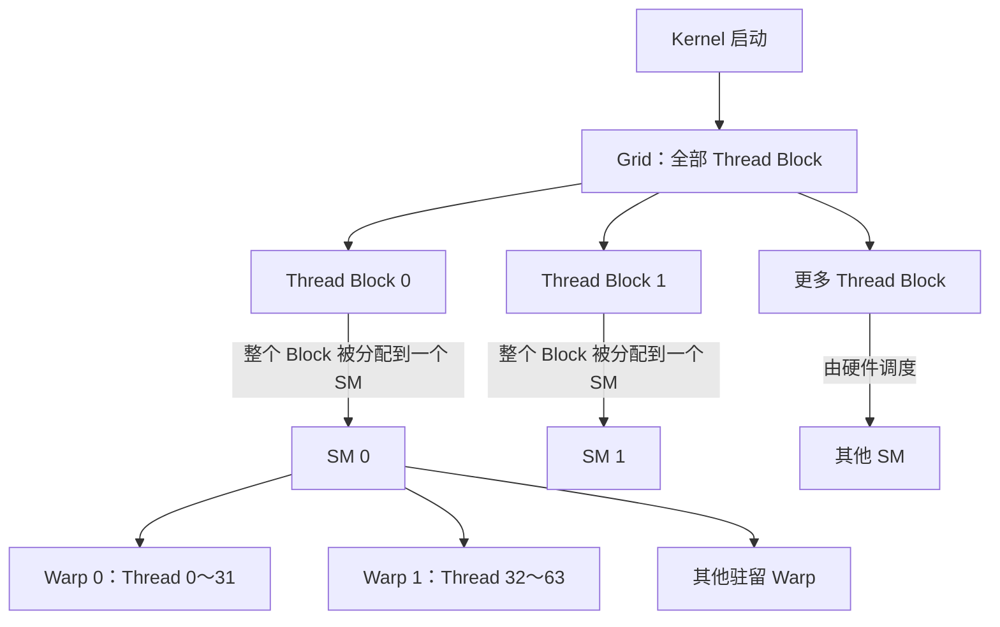

> NVIDIA 官方说明：GPU 可以从 CUDA 编程模型角度看成多个 SM 的集合；一个 Thread Block 的全部线程在一个 SM 上执行。官方同时强调，真实硬件内部布局会随架构变化，因此本文使用的是 CUDA 编程模型保证的抽象，而不是假设所有型号内部完全相同。
>
> 官方资料：[CUDA Programming Guide — GPU Hardware Model、Thread Blocks and Grids](https://docs.nvidia.com/cuda/cuda-programming-guide/01-introduction/programming-model.html#gpu-hardware-model)

## 6.1 GPU Thread：程序员写出的一个逻辑执行实例

假设 Kernel 中有：

```cpp
int tid = blockIdx.x * blockDim.x + threadIdx.x;
out[tid] = in[tid] * 2;
```

可以通俗地理解为：

```text
每个 Thread 都拿到一个不同的 tid，
并负责处理自己对应的一个数据位置。
```

每个 CUDA Thread 从编程模型看具有：

- 自己的线程 ID；
- 自己的局部变量；
- 自己的逻辑寄存器状态；
- 自己的指令执行状态；
- 自己可以计算出的数据下标。

但需要避免一个常见误区：

> 一个 CUDA Thread 不等于一颗固定的物理“CUDA Core”，也不是从 Kernel 开始到结束一直独占某个算术单元。

Thread 是编程模型中的逻辑工作项。硬件把许多 Thread 组织成 Warp，再由 SM 的调度器把 Warp 指令发送给当前可用的功能单元。

通俗类比：

```text
Thread = 一张具体工单

工单写着：
“把第 tid 号货物从 src 搬到 dst。”

工单不是一台机器；
SM 才是拥有调度员、工具和工作台的车间。
```

> NVIDIA 官方说明：Kernel Launch 可以理解成让大量线程并行执行同一段 Kernel 代码；每个线程通过内建索引确定自己负责的数据或操作。
>
> 官方资料：[CUDA Programming Guide — Heterogeneous Systems、Thread Blocks and Grids](https://docs.nvidia.com/cuda/cuda-programming-guide/01-introduction/programming-model.html#thread-blocks-and-grids)

## 6.2 Thread Block：一组必须落在同一个 SM 上的线程

程序启动 Kernel 时会指定：

```cpp
kernel<<<gridDim, blockDim>>>(...);
```

其中：

- `gridDim` 决定有多少个 Block；
- `blockDim` 决定每个 Block 有多少个 Thread。

例如：

```cpp
kernel<<<80, 256>>>(...);
```

表示：

```text
80 个 Thread Block
× 每个 Block 256 个 Thread
= 20480 个逻辑 Thread
```

一个 Block 的全部线程会被分配给同一个 SM。这是因为同一 Block 内的线程需要能够：

- 使用同一块 Shared Memory；
- 使用 `__syncthreads()` 做 Block 内同步；
- 高效交换数据。

同一个 SM 可以同时驻留一个或多个 Block，具体数量受以下资源限制：

- 每个 Thread 使用多少寄存器；
- 每个 Block 使用多少 Shared Memory；
- 每个 Block 有多少 Thread；
- 该架构允许的最大驻留 Block、Warp 和 Thread 数量。

通俗类比：

```text
Block = 一支施工队
SM    = 一个施工车间

整支施工队必须进入同一个车间，
因为队员要共用车间里的公告板（Shared Memory），
还要一起集合（__syncthreads）。
```

需要注意：

```text
一个 Block 只会在一个 SM 上执行；
一个 SM 则可能同时容纳多个 Block。
```

不同 Block 的调度顺序没有一般性保证，因此普通 Kernel 不能假设 Block 0 一定先于 Block 1 完成。

> NVIDIA 官方说明：一个 Thread Block 的所有线程由单个 SM 执行；一个 SM 可以有一个或多个活跃 Block，不同 Block 的分配顺序没有保证。
>
> 官方资料：[CUDA Programming Guide — Thread Blocks and Grids](https://docs.nvidia.com/cuda/cuda-programming-guide/01-introduction/programming-model.html#thread-blocks-and-grids)

## 6.3 SM：不是一颗“大 CPU 核”，而是一座并行执行车间

SM 的全称是 Streaming Multiprocessor。

NVIDIA 官方把 GPU 描述为多个 SM 的集合，并说明每个 SM 包含：

- 本地 Register File；
- Unified Data Cache；
- Shared Memory 和 L1 所使用的片上资源；
- 多种执行计算的 Functional Units。

更深入的官方章节还说明：

> 一个 SM 被设计为并发执行数百个线程，并通过 SIMT 和硬件多线程管理它们。

因此不要把 SM 简化成：

```text
SM = 一颗 CUDA Core
```

更合理的理解是：

```text
SM = 调度系统 + 片上存储 + 多种执行单元组成的并行处理器
```

通俗类比：

```text
SM 是一座车间：

Warp Scheduler  = 调度员
Register File   = 每组工人随手可取的工具柜
Shared Memory   = 同一个 Block 共用的工作台
Load/Store Unit = 仓库出入库窗口
功能单元         = 执行整数、浮点、矩阵等工作的机器
```

车间不是同一时刻只处理一张工单。它会保留许多 Warp 的执行状态，并不断从“当前已经准备好”的 Warp 中选择下一组工作。

> NVIDIA 官方依据：
>
> - [CUDA Programming Guide — GPU Hardware Model](https://docs.nvidia.com/cuda/cuda-programming-guide/01-introduction/programming-model.html#gpu-hardware-model)
> - [CUDA Programming Guide — Hardware Implementation](https://docs.nvidia.com/cuda/cuda-programming-guide/03-advanced/advanced-kernel-programming.html#hardware-implementation)

## 6.4 Warp：SM 实际调度 Thread 时使用的 32 线程组

在一个 Thread Block 内，硬件会按照连续、递增的 Thread ID，把线程划分成 Warp：

```text
Warp 0：Thread 0  ～ Thread 31
Warp 1：Thread 32 ～ Thread 63
Warp 2：Thread 64 ～ Thread 95
...
```

每个 Warp 包含 32 个 Lane：

```text
Lane 0 ～ Lane 31
```

这里可以这样区分：

```text
Thread = 程序员视角中的逻辑线程
Lane   = 这个 Thread 在当前 Warp 中的位置
Warp   = SM 的基本线程调度组
```

例如，一个 Block 有 256 个 Thread：

```text
256 / 32 = 8 个 Warp
```

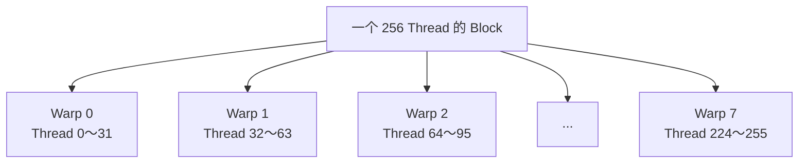

> NVIDIA 官方说明：SM 以 32 个并行 Thread 为一组创建、管理、调度和执行 Warp；Block 被划分为 Warp 时，每个 Warp 包含连续递增的 Thread ID，第一个 Warp 从 Thread 0 开始。
>
> 官方资料：[CUDA Programming Guide — SIMT Execution Model、Hardware Multithreading](https://docs.nvidia.com/cuda/cuda-programming-guide/03-advanced/advanced-kernel-programming.html#simt-execution-model)

## 6.5 SIMT：同一条指令，多条逻辑线程

SIMT 是 Single-Instruction, Multiple-Thread。

初学者可以先把它理解成：

```text
Warp 中的 32 个 Thread 通常共同推进同一段 Kernel 代码，
但每个 Thread 仍然拥有自己的数据、寄存器状态和逻辑身份。
```

例如：

```cpp
out[tid] = in[tid] + 1;
```

某个 Warp 执行这条语句时，可以概念化为：

```text
Lane 0 处理 in[base + 0]
Lane 1 处理 in[base + 1]
Lane 2 处理 in[base + 2]
...
Lane 31 处理 in[base + 31]
```

它和传统 SIMD 的共同点是：

```text
一条指令控制多个并行处理位置。
```

区别是 CUDA 仍然向程序员提供独立 Thread 的语义：

- 每个 Thread 有自己的索引；
- 每个 Thread 可访问不同地址；
- 每个 Thread 可以做不同的分支选择；
- 每个 Thread 有独立的寄存器和执行状态。

因此不能把 SIMT 简单等同于“一个固定宽度的 C++ 向量变量”。

> NVIDIA 官方说明：Warp 执行同一段 Kernel 代码，但 SIMT 允许线程拥有自己的控制流；这正是 SIMT 与传统 SIMD 暴露固定向量宽度的模型之间的重要区别。
>
> 官方资料：[CUDA Programming Guide — Warps and SIMT](https://docs.nvidia.com/cuda/cuda-programming-guide/01-introduction/programming-model.html#warps-and-simt)

### 关于 Volta 之后的 Independent Thread Scheduling

Compute Capability 7.0 及之后支持 Independent Thread Scheduling，硬件可以维护更细粒度的每线程执行状态，并在子 Warp 粒度重组活跃线程。

但这不表示：

```text
Warp 已经不存在
或
每个 Thread 都完全变成类似 CPU Thread 的独立调度单位
```

Warp 仍然是重要的执行和性能组织单位。旧代码如果依赖“Warp 内永远隐式锁步”，应使用 `__syncwarp()` 等显式同步重新检查正确性。

> NVIDIA 官方资料：[CUDA Programming Guide — Independent Thread Scheduling](https://docs.nvidia.com/cuda/cuda-programming-guide/03-advanced/advanced-kernel-programming.html#independent-thread-scheduling)

## 6.6 Warp Scheduler：为什么等待内存时 GPU 不一定停下来

一个 SM 通常同时保留多个驻留 Warp。

可以想象当前 SM 中有：

```text
Warp 0：等待 Global Load 返回
Warp 1：下一条算术指令已就绪
Warp 2：等待某个依赖
Warp 3：下一条 Store 已就绪
```

Warp Scheduler 可以选择一个当前 Ready 的 Warp 发射下一条指令：

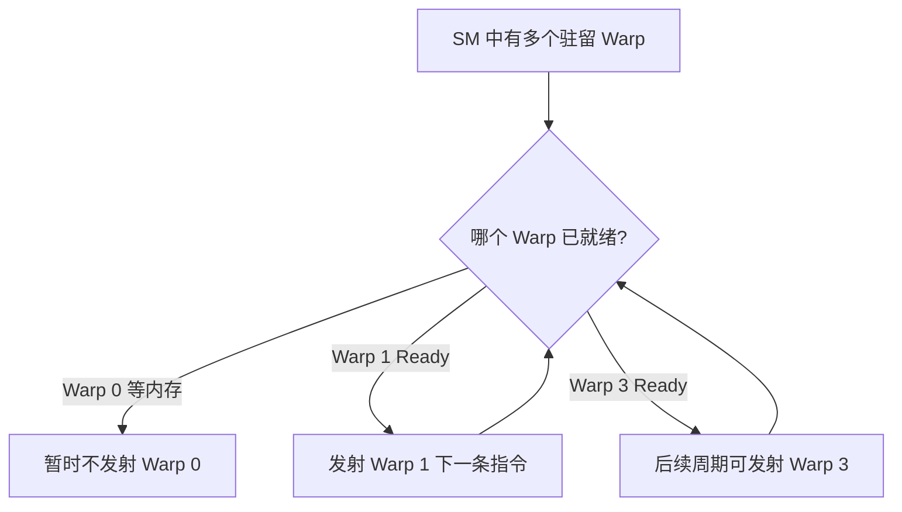

这就是常说的“用其他 Warp 隐藏延迟”。

通俗类比：

```text
一组工人在等远端仓库送货时，
调度员不会站着一起等；
他会让另一组已经拿到材料的工人继续工作。
```

NVIDIA 官方说明了两个关键事实：

1. Warp 的程序计数器、寄存器等执行上下文在其生命周期内保留在片上；
2. Warp Scheduler 在指令发射周期选择已准备好执行下一条指令的 Warp。

因此官方文档将 Warp 切换描述为不需要类似 CPU 操作系统线程那样的上下文换入换出成本。

但需要准确理解：

> “Warp 切换无额外上下文切换成本”不等于任何 Kernel 都能完全隐藏延迟。还必须有足够多的 Ready Warp，并且寄存器、Shared Memory、依赖关系和访存并发允许这些 Warp 同时驻留和推进。

> NVIDIA 官方依据：
>
> - [CUDA Programming Guide — Hardware Multithreading](https://docs.nvidia.com/cuda/cuda-programming-guide/03-advanced/advanced-kernel-programming.html#hardware-multithreading)
> - [CUDA Best Practices Guide — Occupancy](https://docs.nvidia.com/cuda/cuda-c-best-practices-guide/index.html#occupancy)

## 6.7 Occupancy：SM 中“有多少可用 Warp”，但不是越高越好

Occupancy 通常定义为：

```text
当前 SM 的 Active Warp 数
÷
该 SM 理论允许的最大 Active Warp 数
```

它反映 SM 的 Warp 容量被使用了多少。

低 Occupancy 往往意味着：

```text
当少数 Warp 因内存或数据依赖暂停时，
SM 可能没有足够多的其他 Ready Warp 可以调度。
```

但高 Occupancy 不自动等于高性能。原因包括：

- 带宽可能已经饱和；
- 更多 Warp 可能并不能增加有效 Outstanding 请求；
- 为了提高 Occupancy 强行减少寄存器，可能引发 Spill；
- 某些 Kernel 可以用较高的指令级并行度覆盖延迟；
- 算法瓶颈可能不在延迟隐藏。

通俗类比：

```text
车间里多安排几支施工队，通常能减少等待；
但车间已经挤满、仓库窗口已经满负荷后，
继续塞人不一定更快。
```

> NVIDIA 官方明确提醒：较低 Occupancy 会影响隐藏内存延迟的能力，但更高 Occupancy 并不总是带来更高性能。
>
> 官方资料：[CUDA Best Practices Guide — Occupancy](https://docs.nvidia.com/cuda/cuda-c-best-practices-guide/index.html#occupancy)

## 6.8 Warp Divergence：同一个 Warp 走不同分支会发生什么

考虑：

```cpp
if ((threadIdx.x & 1) == 0) {
  do_even_work();
} else {
  do_odd_work();
}
```

一个 Warp 中：

```text
Lane 0、2、4、... 走 even 分支
Lane 1、3、5、... 走 odd 分支
```

概念上硬件需要分别推进两条路径：

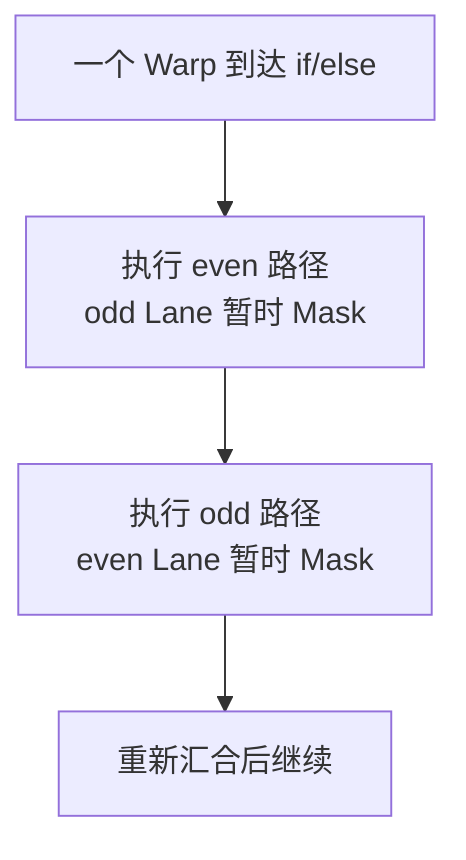

这叫 Warp Divergence。

重要边界：

- Divergence 的性能影响发生在同一个 Warp 内；
- 不同 Warp 走不同代码路径没有这种“同 Warp Lane 被 Mask”的问题；
- 分支并不天然很慢，关键看同一 Warp 内是否发生数据相关的路径分歧；
- 边界判断只影响最后少量 Lane 时，代价可能很小；
- 长时间、复杂的分歧路径通常更值得关注。

> NVIDIA 官方说明：当 Warp 内线程选择不同分支时，Warp 会执行各条被选择的路径，并禁用当前不在该路径上的线程；完整效率出现在 32 个线程同意执行路径时。
>
> 官方资料：[CUDA Programming Guide — SIMT Execution Model](https://docs.nvidia.com/cuda/cuda-programming-guide/03-advanced/advanced-kernel-programming.html#simt-execution-model)

## 6.9 Warp Coalescing：32 个小访问怎样变成高效内存事务

考虑一个 Warp 的 32 个线程都读取一个 `float`：

```cpp
float value = src[base + laneId];
```

逻辑上是：

```text
32 个 Thread × 每个 4B = 128B 有效数据
```

对 Compute Capability 6.0 及之后的通用规则，Global Memory 访问按所需的 32B 段组织。连续、对齐的 32 个 `float` 通常可由：

```text
4 个 32B Memory Transaction
```

覆盖。

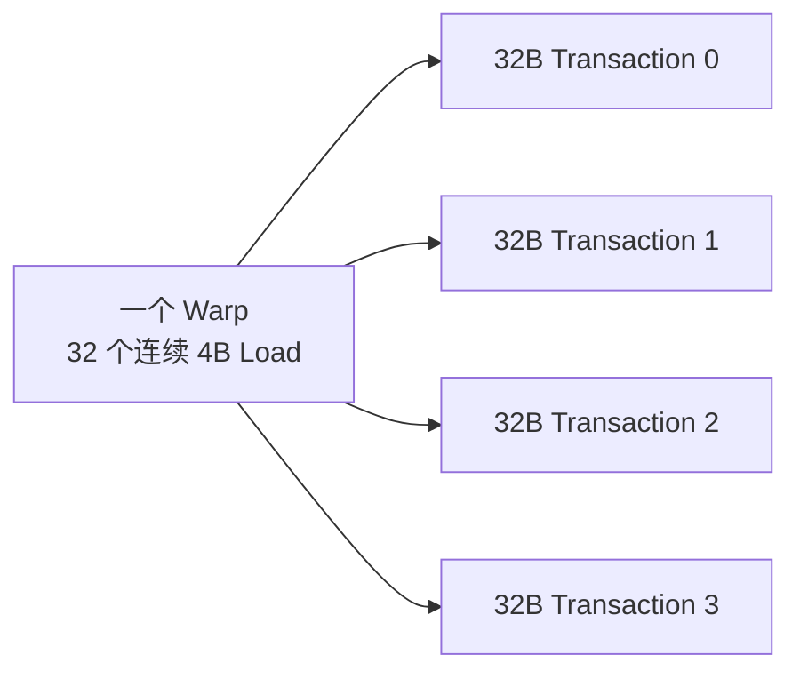

如果 32 个线程访问非常分散的地址，硬件可能需要更多事务，取回的大量字节也可能没有被真正使用。

因此 Coalescing 的核心不是：

```text
把 32 条 C++ 语句魔法般变成一条 128B 指令
```

而是：

```text
Warp 的地址分布允许内存系统用尽可能少的 Transaction
满足这 32 个 Lane 的请求。
```

NVIDIA 官方将 Global Memory Coalescing 列为高优先级优化，并明确说明 Warp 中线程的 Global Load/Store 会被合并为尽可能少的事务。

> 官方资料：
>
> - [CUDA Programming Guide — Coalesced Global Memory Access](https://docs.nvidia.com/cuda/cuda-programming-guide/02-basics/writing-cuda-kernels.html#coalesced-global-memory-access)
> - [CUDA Best Practices Guide — Coalesced Access to Global Memory](https://docs.nvidia.com/cuda/cuda-c-best-practices-guide/index.html#coalesced-access-to-global-memory)

## 6.10 把这些概念放回 MemoryChannel 的 copy 代码

再次看：

```cpp
for (size_t i = threadId; i < numElems; i += numThreads) {
  reg = src[i];
  dst[i] = reg;
}
```

假设：

- `threadId` 是连续的全局线性线程 ID；
- `T = longlong2`，每个元素 16B；
- `src` 和 `dst` 满足适当对齐；
- 同一个 Warp 中的线程都进入当前循环迭代。

那么第一次迭代中：

```text
Lane 0 访问元素 0
Lane 1 访问元素 1
...
Lane 31 访问元素 31
```

下一次迭代：

```text
Lane 0 访问元素 numThreads + 0
Lane 1 访问元素 numThreads + 1
...
Lane 31 访问元素 numThreads + 31
```

同一个 Warp 的 Lane 在每一轮访问连续元素，所以具备形成高效合并访存的基本地址模式。

对于 `longlong2`：

```text
每个 Thread：16B
一个 Warp：32 × 16B = 512B 逻辑数据范围
```

但是必须保持专业表述：

> 512B 是一个 Warp 在该条访问指令上的逻辑有效数据总量，不代表底层一定只有一个 512B 总线事务。实际事务数量由地址分布、对齐、缓存、目标内存和具体架构共同决定。

在 `put()` 中：

```text
Warp 从本地 src_ 读取连续数据
→ 每个 Thread 的值进入自己的寄存器
→ Warp 向远端 dst_ 写连续数据
```

在 `get()` 中：

```text
Warp 从远端 dst_ 读取连续数据
→ 数据返回各 Thread 寄存器
→ Warp 向本地 src_ 写连续数据
```

这也是为什么理解 Warp 不能只停留在“32 个线程”这句话上。它同时影响：

- SM 如何调度工作；
- 内存请求如何合并；
- 如何隐藏远端访问延迟；
- 分支是否浪费 Lane；
- Block Size 是否浪费最后一个 Warp；
- 寄存器和 Shared Memory 是否限制驻留 Warp 数量。

## 6.11 初学者术语表

| 术语 | 专业含义 | 通俗理解 |
|---|---|---|
| Thread | Kernel 的一个逻辑执行实例 | 一张具体工单 |
| Lane | Thread 在 Warp 中的编号 0～31 | 工人在本小组中的座位号 |
| Warp | 32 个 Thread 组成的调度和执行组 | 一组共同推进工作的 32 名工人 |
| Thread Block | 可同步、可共享 Shared Memory 的线程组 | 必须进入同一个车间的施工队 |
| SM | 管理和执行大量 Warp 的并行处理器 | 有调度员、工具柜和多种机器的车间 |
| Resident Warp | 执行状态和资源已经驻留在 SM 上的 Warp | 已进入车间等待或工作的队伍 |
| Active Thread | 当前 Warp 指令中实际参与的 Lane | 当前这道工序正在干活的人 |
| Warp Divergence | 同 Warp 的线程走不同控制流路径 | 同组人被迫分批完成不同工序 |
| Coalescing | 将 Warp 的地址请求组织为较少内存事务 | 把相邻小件合并成少量整车运输 |
| Occupancy | Active Warp 与硬件最大 Warp 容量的比例 | 车间的队伍容量使用率 |

---

# 7. Warp 为什么是 32 个线程：官方能确认什么

这一问题需要严格区分：

```text
NVIDIA 官方明确规定的事实
和
根据硬件行为作出的工程解释
```

## 7.1 官方能够直接确认的事实

NVIDIA CUDA Programming Guide 明确说明：

1. SM 以 Warp 为单位创建、管理、调度和执行线程；
2. 每个 Warp 是 32 个线程；
3. Warp Lane 编号为 0～31；
4. Block 被划分为 Warp 时，线程 ID 连续递增；
5. Warp 数量按向上取整计算；
6. Block Thread 数不是 32 的倍数时，最后一个 Warp 会存在未使用 Lane。

公式为：

```text
Warps per Block = ceil(Threads per Block / 32)
```

官方资料：

- [CUDA Programming Guide — Warps and SIMT](https://docs.nvidia.com/cuda/cuda-programming-guide/01-introduction/programming-model.html#warps-and-simt)
- [CUDA Programming Guide — Hardware Multithreading](https://docs.nvidia.com/cuda/cuda-programming-guide/03-advanced/advanced-kernel-programming.html#hardware-multithreading)

## 7.2 官方没有给出一条“为什么恰好是 32”的唯一推导公式

旧版文字容易写成：

```text
NVIDIA 因为调度开销、分支发散、寄存器和访存折中，
所以精确计算后选择了 32。
```

这种表述听起来合理，但它并不是 CUDA Programming Guide 给出的正式因果推导。

更准确的说法是：

> Warp Size = 32 是当前 CUDA 编程模型和 NVIDIA GPU 架构向程序员提供的硬件契约。官方文档详细说明了 32 线程 Warp 对调度、分支、资源驻留和访存合并的影响，但没有公开一条可以从若干参数唯一推导出“必须等于 32”的通用公式。

因此本文不会把未经官方文档确认的历史设计原因写成确定事实。

## 7.3 可以作出的专业工程解释，但必须标明它是解释

虽然官方没有公布唯一推导，但从官方描述的行为可以看出，Warp Size 会同时影响：

- 一条 Warp 指令覆盖多少 Lane；
- Block 被切分成多少调度组；
- 分支发散时可能被 Mask 的 Lane 数量；
- 一条 Load/Store 需要处理多少线程地址；
- Register File 如何在驻留 Warp 之间分配；
- SM 需要维护多少 Warp 上下文；
- 需要多少 Active Warp 才能隐藏延迟。

这说明 Warp 宽度确实是一个贯穿调度、执行和内存系统的架构参数。

但下面这句话属于**工程解释**，不是 NVIDIA 官方原句：

> 32 可以理解为 NVIDIA 架构长期采用的一种并行粒度选择，它在执行宽度、线程级并行、分支利用率、资源管理和内存访问组织之间形成了一个具体设计点。

这里应避免进一步声称：

```text
16 一定太小
64 一定太大
或
32 对所有硬件都是理论最优值
```

AMD GPU、CPU SIMD、NPU Vector 单元可以采用不同执行宽度，这本身就说明 32 不是普适数学常数。

## 7.4 为什么 Block Size 通常选择 32 的倍数

NVIDIA 官方建议 Block 的 Thread 数通常使用 32 的倍数，原因非常直接：避免最后一个 Warp 长期存在无效 Lane，并有利于内存访问组织。

| Block Thread 数 | 分配的 Warp 数 | 总 Lane 容量 | 未使用 Lane |
|---:|---:|---:|---:|
| 1 | 1 | 32 | 31 |
| 31 | 1 | 32 | 1 |
| 32 | 1 | 32 | 0 |
| 33 | 2 | 64 | 31 |
| 64 | 2 | 64 | 0 |
| 128 | 4 | 128 | 0 |
| 256 | 8 | 256 | 0 |

例如 Block Size 为 33：

```text
Warp 0：Thread 0～31，32 个有效 Lane
Warp 1：只有 Thread 32，另外 31 个 Lane 没有对应 Thread
```

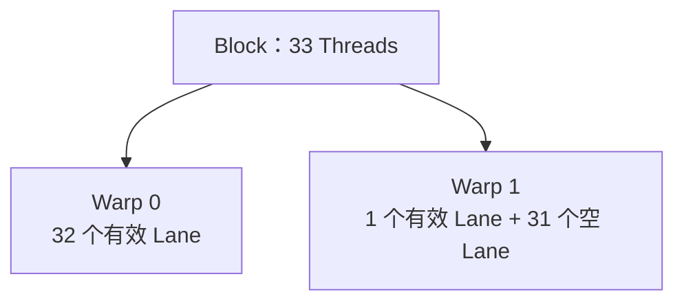

这并不表示 33 Thread 的 Block 不能运行，只是通常会浪费最后一个 Warp 的部分执行和访存能力。

> NVIDIA 官方资料：
>
> - [CUDA Programming Guide — Warps and SIMT](https://docs.nvidia.com/cuda/cuda-programming-guide/01-introduction/programming-model.html#warps-and-simt)
> - [CUDA Best Practices Guide — Thread and Block Heuristics](https://docs.nvidia.com/cuda/cuda-c-best-practices-guide/index.html#thread-and-block-heuristics)

## 7.5 为什么不能只说“32 个线程同时执行，所以就是 32 倍性能”

以下推导是错误的：

```text
一个 Warp 有 32 个线程
→ 所有操作固定得到 32 倍加速
```

实际性能还取决于：

- 有多少 Lane 是 Active；
- 是否发生 Warp Divergence；
- 地址是否可以高效 Coalescing；
- 指令使用的功能单元吞吐；
- 是否存在数据依赖；
- 是否有足够 Resident Warp 隐藏延迟；
- Register 和 Shared Memory 是否限制 Occupancy；
- HBM、NVLink 或 PCIe 是否已经饱和。

例如：

```text
32 个 Lane 都发 Load
```

不等于：

```text
32 个 Load 都立即完成
```

Warp 可以快速产生一组地址请求，但请求还要经过缓存、内存分区、互联和目标 HBM。

## 7.6 Warp Size 对 MemoryChannel 搬运的实际意义

`MemoryChannelDeviceHandle` 的 `copy()` 使用每线程分片：

```cpp
for (size_t i = threadId; i < numElems; i += numThreads) {
  reg = src[i];
  dst[i] = reg;
}
```

当 `T = longlong2` 时：

```text
1 Thread：16B
1 Warp：32 × 16B = 512B 逻辑有效数据
```

Warp Size = 32 在这里至少影响四件事。

### 7.6.1 连续地址范围

同一 Warp 的 32 个 Thread 在同一轮访问连续的 32 个 `longlong2`：

```text
元素 base + 0 ～ base + 31
```

逻辑覆盖 512B 连续地址范围。

### 7.6.2 内存事务组织

硬件根据这 32 个 Lane 的地址，生成满足它们所需的若干 Memory Transaction。

```text
512B 逻辑 Payload
≠ 必然一个 512B Transaction
```

实际事务数量受对齐、地址段、缓存和架构影响。

### 7.6.3 延迟隐藏

远端 NVLink/PCIe P2P 访问可能具有较高延迟。一个 Warp 等待时，SM 需要调度其他 Ready Warp，才能继续填充链路和隐藏等待时间。

### 7.6.4 资源占用

更多 Warp 需要更多寄存器和其他 SM 资源。若每 Thread 寄存器使用太高，能够同时驻留的 Warp 变少，远端访存延迟可能更难隐藏。

所以最准确的总结是：

> `longlong2` 提供每 Thread 16B 的访问粒度；Warp 提供 32 Lane 的请求组织；多个 Active Warp 和多个 SM 提供持续并发；地址连续和对齐决定这些请求能否高效使用内存与互联事务。

## 7.7 官方资料索引

本节和第 6 节主要依据以下 NVIDIA 官方文档：

1. [CUDA Programming Guide — Programming Model](https://docs.nvidia.com/cuda/cuda-programming-guide/01-introduction/programming-model.html)
   - GPU Hardware Model；
   - Thread Blocks and Grids；
   - Warps and SIMT。
2. [CUDA Programming Guide — Advanced Kernel Programming](https://docs.nvidia.com/cuda/cuda-programming-guide/03-advanced/advanced-kernel-programming.html)
   - Hardware Implementation；
   - SIMT Execution Model；
   - Independent Thread Scheduling；
   - Hardware Multithreading。
3. [CUDA Programming Guide — Coalesced Global Memory Access](https://docs.nvidia.com/cuda/cuda-programming-guide/02-basics/writing-cuda-kernels.html#coalesced-global-memory-access)
4. [CUDA Best Practices Guide — Coalesced Access to Global Memory](https://docs.nvidia.com/cuda/cuda-c-best-practices-guide/index.html#coalesced-access-to-global-memory)
5. [CUDA Best Practices Guide — Occupancy](https://docs.nvidia.com/cuda/cuda-c-best-practices-guide/index.html#occupancy)
6. [CUDA Best Practices Guide — Thread and Block Heuristics](https://docs.nvidia.com/cuda/cuda-c-best-practices-guide/index.html#thread-and-block-heuristics)

这些链接用于佐证本文中的术语、执行模型和性能规则。文中的“车间、施工队、工单、运输”等只是帮助初学者理解的类比，不是 NVIDIA 官方术语；每个类比旁边都给出了对应的专业概念和官方资料。

---

# 8. 什么是 GPU 寄存器

从编程模型看，每个 CUDA 线程拥有自己的逻辑寄存器；从物理位置看，寄存器资源位于当前 GPU 的 SM Register File。

```text
当前 GPU
└── SM
    └── Register File
        ├── Thread 0 的逻辑寄存器
        ├── Thread 1 的逻辑寄存器
        └── ...
```

关键结论：

> Kernel 在 GPU 0 上执行，`reg` 就属于 GPU 0 的 SM；即使 `src` 或 `dst` 指向 GPU 1，寄存器也不会跑到 GPU 1。

如果寄存器压力过高，编译器可能发生 Register Spill。CUDA 的 `local memory` 虽然逻辑上线程私有，但通常由当前 GPU 的 Global Memory/HBM 承载，并不等于 SM 内部寄存器。

---

# 9. 什么是 Global Load 和 Global Store

CUDA 中：

```cpp
value = ptr[index];
ptr[index] = value;
```

通常会形成概念上的：

```text
ld.global
st.global
```

`global` 表示 GPU 的 Global Address Space，不直接说明物理内存一定在本地。

同一条 Global Load/Store 可能访问：

- 当前 GPU 的本地 HBM；
- 通过 CUDA IPC 或 VMM 映射的 Peer GPU HBM；
- 映射后的 Host Memory；
- 其他 GPU 可访问地址。

因此判断数据路径时，不能只看指令名字，还必须判断指针最终映射到哪块物理内存。

---

# 10. put 的真实数据路径

假设 Kernel 在 GPU 0 上执行，`src_` 在 GPU 0，`dst_` 映射到 GPU 1：

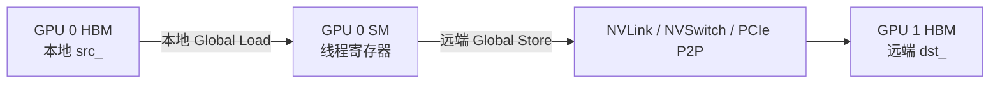

即：

```text
GPU 0 HBM
→ GPU 0 SM 寄存器
→ GPU 互联
→ GPU 1 HBM
```

这是由 GPU 0 的 SM 主动 Push 数据。

---

# 11. get 的真实数据路径

仍假设 Kernel 在 GPU 0 上执行：

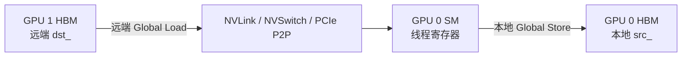

即：

```text
GPU 1 HBM
→ GPU 互联
→ GPU 0 SM 寄存器
→ GPU 0 HBM
```

`get` 的远端读取包含请求和返回，对远端访问延迟及 Outstanding Read 数量通常更加敏感。

---

# 12. longlong2 搬运为什么可能很快

代码：

```cpp
longlong2 reg;
reg = src[i];
dst[i] = reg;
```

`longlong2` 是 16 字节。单个线程每次只处理 16B，但 GPU 不能只看单线程：

```text
1 个线程：16B
1 个 Warp：32 × 16B = 512B 逻辑数据
多个 Warp：持续产生请求
多个 SM：进一步并发
```

同一 Warp 的线程访问连续地址时，硬件可以把它们组织为较少的内存 Transaction，而不是把 32 个线程完全当作互不相关的小请求。

真正使它变快的是：

- 连续地址；
- 合适对齐；
- Warp 级合并访存；
- 足够多的活跃 Warp；
- 足够多的 Outstanding 请求；
- 多个 SM 并行；
- 本地 HBM、远端 HBM 和互联带宽能够被填满。

> 不是因为 `longlong2` 这个类型本身“自带高带宽”。

---

# 13. 这种写法是不是最快

不一定。

## 13.1 纯大块复制

对于纯粹的大块连续数据复制，应当对比：

- `put/get` 的 SM Copy；
- `cudaMemcpyPeerAsync()`；
- 通信库或硬件专用复制路径。

专用复制路径可能减少 SM 占用，并与计算并发。

## 13.2 SM Copy 的价值

SM Copy 的优势常常不是单独 memcpy 峰值，而是：

- Kernel 内自主通信；
- Persistent Kernel；
- 低延迟小消息；
- 不规则 Scatter/Gather；
- 边通信边计算；
- Packet 协议；
- 避免返回 Host 再启动复制。

因此应比较端到端目标，而不是只比较一段 memcpy 的孤立带宽。

---

# 14. Packet 搬运机制与完整数据路径

Packet 路径是本章最容易产生误解的部分。

普通 `put()` 只搬数据；Packet 路径则把：

```text
Payload + Flag
```

一起写入接收端缓冲区。接收端通过检查 Flag 判断：

> 当前读到的 Payload 是否已经属于自己等待的这一轮，而不是旧数据或尚未完整到达的数据。

## 14.1 为什么要使用 Packet

普通数据传输经常需要两条逻辑路径：

```text
数据路径：写 Payload
控制路径：Signal / Wait 通知数据已经完成
```

Packet 协议把小粒度的“数据”和“到达标志”放在同一个 Packet 中：

```text
[data][flag]
```

因此接收端可以直接轮询 Packet 自身，而不必为每一个很小的数据片段单独维护一个 Semaphore。

通俗类比：

- 普通 `put()`：先送包裹，再单独打电话说“包裹到了”；
- `putPackets()`：每个包裹上都贴有本轮批次号，收件人看到正确批次号才拆包。

## 14.2 发送端和接收端连在一起的完整主图

假设 GPU 0 向 GPU 1 发送 Packet。下面这张图把发送端、互联、接收端、轮询和最终解包目标按照从上到下的顺序连成一条完整链路：

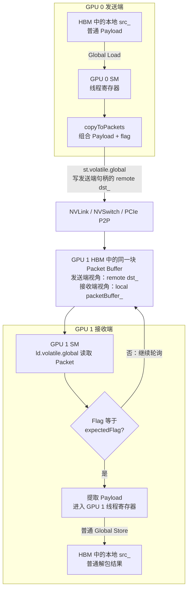

这张图必须从上到下连起来理解：

```text
GPU 0 本地 src_
↓
GPU 0 SM 读取 Payload
↓
加入 Flag，形成 Packet
↓
对远端 dst_ 发出 Volatile Global Store
↓
NVLink / NVSwitch / PCIe P2P
↓
GPU 1 HBM 中的 Packet Buffer
↓
GPU 1 SM 反复 Volatile Load 并检查 Flag
↓
Flag 匹配后提取 Payload
↓
写入 GPU 1 本地 src_
```

最关键的地址关系是：

```text
发送端看到：remote dst_
接收端看到：local packetBuffer_
物理位置：GPU 1 HBM 中的同一块 Packet Buffer
```

> `remote dst_` 和 `local packetBuffer_` 不是两块内存，也不是还需要额外复制一次；它们是同一块接收端物理缓冲区在两张 GPU 地址空间中的不同视图。

## 14.3 端到端时序图

主图描述空间上的数据路径，下面的时序图描述时间上的先后关系：

```mermaid
sequenceDiagram
    participant SData as GPU 0 本地 src_
    participant SSM as GPU 0 SM
    participant Link as NVLink / PCIe P2P
    participant PBuf as GPU 1 Packet Buffer
    participant RSM as GPU 1 SM
    participant RData as GPU 1 本地 src_

    RSM->>PBuf: ld.volatile.global 读取 Packet
    PBuf-->>RSM: 返回旧 Flag / 未完成状态
    RSM->>PBuf: 继续轮询

    SSM->>SData: Global Load 读取 Payload
    SData-->>SSM: Payload 进入寄存器
    SSM->>SSM: 组合 Payload + 当前 flag
    SSM->>Link: st.volatile.global 写远端 Packet
    Link->>PBuf: Packet 到达 GPU 1 HBM

    RSM->>PBuf: 再次读取 Packet
    PBuf-->>RSM: Payload + 匹配的 Flag
    RSM->>RData: Global Store 写入解包 Payload
```

这里允许接收端先开始轮询。它不需要知道远端写请求在哪一个周期到达，只需要等待 Flag 变成目标值。

## 14.4 LL16Packet 的布局

源码中的 `LL16Packet` 总大小为 16B：

```cpp
struct {
  uint32_t data1;
  uint32_t flag1;
  uint32_t data2;
  uint32_t flag2;
};
```

图示：

```text
字节偏移      0        4        8        12       16
             ┌────────┬────────┬────────┬────────┐
LL16Packet   │ data1  │ flag1  │ data2  │ flag2  │
             └────────┴────────┴────────┴────────┘
有效 Payload     4B                4B
元数据                    4B                4B
```

因此：

```text
Packet 总大小：16B
有效 Payload：8B
Flag 元数据：8B
Payload 效率：50%
```

可以把一个 LL16Packet 看成两个 8B 小单元：

```text
[data1, flag1] + [data2, flag2]
```

源码注释假设底层至少提供 8B 写入原子性。两个 Flag 的目的，是帮助接收端识别 16B Packet 是否只更新了一半。

## 14.5 LL8Packet 的布局

`LL8Packet` 总大小为 8B：

```cpp
struct {
  uint32_t data;
  uint32_t flag;
};
```

```text
字节偏移      0        4        8
             ┌────────┬────────┐
LL8Packet    │ data   │ flag   │
             └────────┴────────┘
有效 Payload    4B
元数据                   4B
```

LL8 的有效 Payload 同样只有总字节数的 50%。

## 14.6 发送端 `putPackets()` 做了什么

接口内部方向可以简化为：

```cpp
copyToPackets(
    dst_ + targetOffset,   // GPU 1 的远程 Packet Buffer
    src_ + originOffset,  // GPU 0 的本地普通数据
    originBytes,
    threadId,
    numThreads,
    flag);
```

发送端逐步执行：

1. GPU 0 的线程从本地 `src_` 读取 Payload；
2. Payload 进入 GPU 0 当前线程寄存器；
3. 线程把 Payload 和调用者给出的 `flag` 组合成 LL16 或 LL8 Packet；
4. GPU 0 的 SM 对远端 `dst_` 发出 Volatile Global Store；
5. 写请求经过 NVLink、NVSwitch 或 PCIe P2P；
6. Packet 最终落入 GPU 1 HBM 中的 Packet Buffer。

注意：

> `putPackets()` 并不是先在发送端生成一份完整 Packet 临时数组，再调用 DMA；它由参与线程逐个读取 Payload，并直接向远端 Packet 地址写入编码结果。

## 14.7 接收端 `unpackPackets()` 做了什么

内部方向可以简化为：

```cpp
copyFromPackets(
    src_ + originOffset,             // GPU 1 本地普通数据目标
    packetBuffer_ + targetOffset,    // GPU 1 本地 Packet Buffer
    originBytes,
    threadId,
    numThreads,
    expectedFlag);
```

接收端逐步执行：

1. GPU 1 的线程从本地 `packetBuffer_` 读取 Packet；
2. 使用显式 Volatile Global Load，使轮询持续读取目标地址；
3. 检查 Packet 中的 Flag；
4. 如果 Flag 不是期待的本轮值，就继续读取同一个 Packet；
5. Flag 匹配后，Payload 被取到 GPU 1 当前线程寄存器；
6. 当前线程把 Payload 写入 GPU 1 本地普通数据区 `src_`。

因此 `unpackPackets()` 同时完成：

```text
等待当前 Packet 到达
+
把 Packet 格式转换回普通数据格式
```

## 14.8 多线程如何分工

LL16 每个 Packet 承载 8B Payload：

```cpp
size_t nElem = originBytes / sizeof(uint64_t);
for (size_t i = threadId; i < nElem; i += numThreads) {
  pkt[i].write(data1, data2, flag);
}
```

例如：

```text
originBytes = 32B
numThreads = 2
```

则共有 4 个 LL16Packet：

```text
线程 0：Packet 0、Packet 2
线程 1：Packet 1、Packet 3
```

物理 Packet Buffer 占用：

```text
4 × 16B = 64B
```

也就是 32B Payload 需要 64B Packet Buffer。

## 14.9 Flag 如何表示“数据属于本轮”

假设每轮通信使用不同 Flag：

```text
第 1 轮：flag = 1
第 2 轮：flag = 2
第 3 轮：flag = 3
```

接收端第 2 轮只接受：

```text
packet.flag == 2
```

即使 Packet Buffer 中仍保存着第 1 轮旧 Payload，只要 Flag 不匹配，接收端就不会误用。

通俗类比：

```text
Payload = 包裹内容
Flag    = 批次号
```

工程上还要考虑 Flag 回绕、Buffer 复用以及最慢参与者是否已经退出旧轮次。

## 14.10 LL16 为什么需要两个 Flag

接收端只有在：

```text
flag1 == expectedFlag
并且
flag2 == expectedFlag
```

时才接受 `data1 + data2`。

假设期待 `flag = 7`：

```text
完整到达：
[data1_new, 7, data2_new, 7]  → 接受

只更新前 8B：
[data1_new, 7, data2_old, 6]  → 继续轮询

只更新后 8B：
[data1_old, 6, data2_new, 7]  → 继续轮询
```

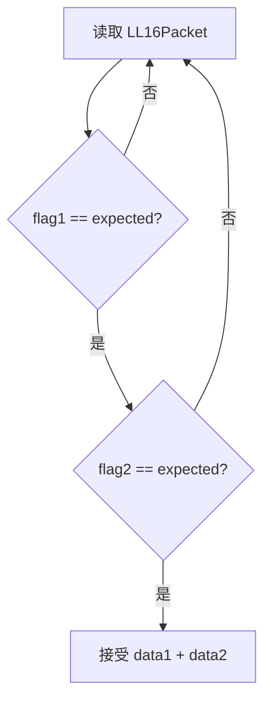

因此重复 Flag 的核心作用是：

> 在假设每个 8B 单元具有足够原子性的前提下，帮助检测 16B Packet 的部分更新或撕裂状态。

它并不表示整个 16B Store 必然原子。

## 14.11 CUDA 指令层面的读写

LL16 使用类似：

```text
st.volatile.global.v4.u32
ld.volatile.global.v4.u32
```

LL8 使用类似：

```text
st.volatile.global.v2.u32
ld.volatile.global.v2.u32
```

`volatile` 在这里的重要意义是：

- 发送端确实发出目标 Global Store；
- 接收端轮询时确实重复读取目标地址；
- 避免编译器把轮询读取错误复用为旧值或删除。

但必须注意：

> Volatile Load/Store 不能被简单等同为任意场景下完整的 C++ Release/Acquire，也不能自动为 Packet 之外的所有普通内存访问建立顺序。

如果协议还依赖其他独立内存区域，就仍需分析 Semaphore、Fence、Atomic 和内存序。

## 14.12 Packet 路径与普通 put 的对比

| 维度 | 普通 `put()` | `putPackets()` + `unpackPackets()` |
|---|---|---|
| 远端写入内容 | 纯 Payload | Payload + Flag |
| 接收端目标 | 普通数据缓冲区 | Packet Buffer，之后再解包 |
| 到达判断 | 常依赖额外 Signal/Wait | 每个 Packet 自带 Flag |
| 接收端操作 | 直接消费普通数据 | 轮询、检查 Flag、提取 Payload |
| Payload 效率 | 接近 100%，不考虑对齐和协议开销 | LL16/LL8 均为 50% |
| 典型目标 | 大块数据 Goodput | 小消息低延迟、细粒度流水 |
| 额外本地写 | 通常没有 Packet 解包写 | 解包后写入本地 `src_` |
| 对旧数据识别 | 依赖外部同步协议 | Flag 直接区分通信轮次 |

## 14.13 为什么 Packet 适合小消息

Packet 的优势：

- Payload 和到达标志一起传输；
- 接收端可以提前启动并轮询；
- 不必给每一个小片段单独安排 Semaphore；
- 适合细粒度生产者—消费者流水；
- 可以在 Persistent Kernel 中边到达边消费；
- 对低延迟协议很有价值。

Packet 的代价：

- 只有 50% 的字节是有效 Payload；
- 接收端轮询会消耗 SM 执行资源和内存流量；
- 解包还要产生一次本地写；
- 大消息下元数据开销明显；
- Flag 轮次管理错误会导致永久等待或读取错误轮次；
- Volatile 并不替代完整的内存顺序设计。

因此：

> Packet 追求的是小消息和细粒度流水的低延迟，不是大块纯 Payload 的最高 Goodput。

## 14.14 一个完整例子

假设 GPU 0 向 GPU 1 发送 16B 普通数据，使用 LL16Packet，当前 `flag = 5`。

发送端编码后：

```text
Packet 0：[data0_low][5][data0_high][5]  共 16B
Packet 1：[data1_low][5][data1_high][5]  共 16B
```

数据量变化：

```text
原始 Payload：16B
远端 Packet Buffer 占用：32B
```

端到端路径：

```text
GPU 0 src_ 中的 16B 普通数据
  ↓ GPU 0 线程读取
GPU 0 SM 寄存器
  ↓ 加入 flag=5
两个 LL16Packet
  ↓ 远端 Global Store
NVLink / PCIe P2P
  ↓
GPU 1 packetBuffer_ 中的 32B Packet 数据
  ↓ GPU 1 线程轮询，确认两个 Flag 都为 5
GPU 1 SM 寄存器中的 16B Payload
  ↓ 本地 Global Store
GPU 1 src_ 中的 16B 普通数据
```

## 14.15 Packet 调试检查表

遇到 Packet 卡住或数据错误时，建议依次检查：

1. 发送端 `dst_` 是否真的映射到接收端对应的 Packet Buffer；
2. 接收端 `packetBuffer_` 是否指向同一块物理缓冲区；
3. LL16 的 `originBytes` 是否为 8B 的整数倍；
4. LL8 的 `originBytes` 是否为 4B 的整数倍；
5. `targetOffset` 是否按照 Packet 存储大小计算，而不是只按照 Payload 大小计算；
6. 发送端写入的 Flag 是否与接收端等待的 Flag 完全一致；
7. 不同轮次复用 Buffer 时，Flag 是否正确推进；
8. `threadId` 和 `numThreads` 是否覆盖全部 Packet 且没有越界；
9. 是否把已废弃的 `getPackets()` 误认为远端 Pull；
10. 是否错误地把 Volatile 当成对所有相关内存的完整 Fence；
11. 是否存在某些线程没有参与解包，却又提前消费本地 `src_`；
12. 是否需要 Block 或 Grid 级同步来保证所有 Packet 都已解包完成。

---

# 15. DeviceSyncer 的作用和原理

`DeviceSyncer` 是同一个 Kernel 内的 Device-wide Barrier，用于多个 Block 的阶段同步。

`__syncthreads()` 只能同步同一个 Block，不能同步不同 Block。

实现步骤：

1. Block 内执行 `__syncthreads()`；
2. 每个 Block 的 `threadIdx.x == 0` 作为代表；
3. 代表线程对全局计数器执行 Atomic Fetch Add；
4. 代表线程轮询直到计数等于参与 Block 数；
5. 使用 Acquire/Release 建立跨 Block 可见性；
6. 再执行一次 Block 内 `__syncthreads()`，放行本 Block 其他线程。

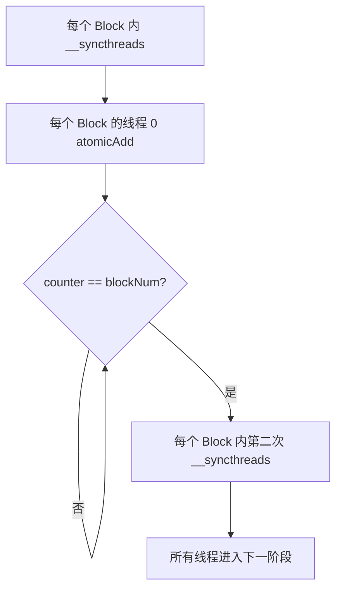

源码使用三个计数器轮转，避免不同 Barrier 代际互相污染，并支持同步 Block 数变化的场景。

---

# 16. 为什么 DeviceSyncer 不能随便省略

典型流程：

```text
线程 0 与远端完成握手
        ↓
DeviceSyncer.sync()
        ↓
所有线程共同 put/get/Packet 解包
        ↓
DeviceSyncer.sync()
        ↓
线程 0 Signal 或进入下一阶段
```

第一个 Sync 保证其他线程和 Block 不会在握手完成前开始搬运；第二个 Sync 保证线程 0 通知远端或消费结果前，所有参与线程都已经完成自己的数据部分。

Packet 场景中同样可能需要同步：某个线程完成自己负责的 Packet，并不代表全部 Packet 已经完成。如果后续阶段要把整段 `src_` 当成完整数据使用，就需要合适的 Block/Grid 同步。

软件 Grid Barrier 还有一个重要工程约束：如果已驻留 Block 在 Barrier 中自旋，而尚未调度的 Block 因 SM 资源不足无法进入，可能死锁。因此必须评估：

- Grid 大小；
- Block 大小；
- 寄存器占用；
- Shared Memory 占用；
- GPU SM 数量；
- 实际可同时驻留的 Block 数量。

---

# 17. 与昇腾 NPU 的图文对比

这一节重点回答两个问题：

1. 为什么 NVIDIA GPU 上 `reg = src[i]; dst[i] = reg;` 可能很快？
2. 为什么不能把这种编程方式逐行照搬到昇腾 NPU？

最核心的答案：

> 两种芯片负责“制造高并发大吞吐内存请求”的硬件主体不同。
>
> NVIDIA GPU 主要依靠 SM 中的大量 Warp；昇腾 AI Core 的典型高吞吐数据通路主要依靠 MTE/SDMA 和显式流水。

## 17.1 两种架构的主力搬运工不同

### NVIDIA GPU：大量 Warp 是主力搬运工

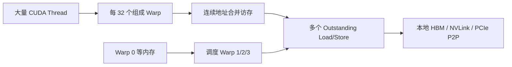

GPU 的线程系统本身就是大规模内存并发请求生成器：

```text
32 Lane / Warp
× 多个 Active Warp / SM
× 多个 SM
= 大量并发内存请求
```

### 昇腾 NPU：MTE/SDMA 是主力搬运工

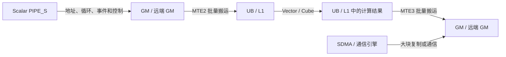

典型 Ascend C AI Core 流水可粗略理解为：

| 流水/单元 | 主要职责 |
|---|---|
| `PIPE_S` | 标量控制、地址计算、少量标量访问 |
| `PIPE_V` | UB 上的向量计算 |
| `PIPE_M` | 矩阵/Cube 计算 |
| `PIPE_MTE2` | GM → UB/L1 批量搬运 |
| `PIPE_MTE3` | UB → GM 批量搬运 |
| SDMA/通信引擎 | 特定大块复制和通信路径 |

这里不是说昇腾完全不能访问 GM，而是说：

> 对大块连续数据而言，高吞吐路径通常不是让标量流水逐元素读写，而是给 MTE/SDMA 一个批量搬运描述。

## 17.2 相似代码为什么落到不同硬件路径

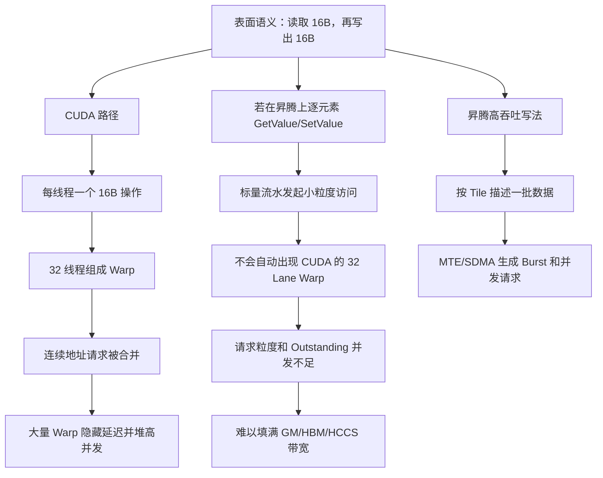

因此：

```text
相同的高级语言语义
≠ 相同的硬件执行组织
≠ 相同的性能
```

## 17.3 通俗类比：搬箱子

GPU 模型像 32 个搬运工组成一组：

```text
32 个搬运工同时出发
每人拿一个 16B 小箱子
地址连续时，仓库系统把它们组织成成批装卸
某一组在等车，调度员安排另一组继续工作
```

昇腾逐元素标量 GM 访问则更像：

```text
让负责登记和调度的管理员
亲自一小箱一小箱往返仓库
```

MTE/SDMA 更像叉车和货运流水线：

```text
提交源地址、目的地址、总长度、块数、块长度和 Stride
硬件搬运流水批量生成请求
管理员只负责提交任务和处理事件
```

根因不是“昇腾寄存器慢”，而是：

> 把 GPU 的主力搬运通路，错误映射成了 NPU 的控制/标量通路。

## 17.4 最核心根因：高带宽请求生成器不同

| 维度 | NVIDIA GPU | 昇腾 NPU 典型 AI Core 模型 |
|---|---|---|
| 高带宽请求生成器 | SM 中大量 Warp/Lane | MTE/SDMA 描述符和搬运流水 |
| 基本并发来源 | 多线程、多 Warp、多 SM | Tile、Burst、搬运队列、多流水重叠 |
| 连续访问聚合 | Warp Coalescing | MTE Block/BlockLen/Stride 描述 |
| 隐藏延迟 | Warp 切换 | MTE2/Vector/MTE3 流水重叠、双缓冲 |
| 计算的主要数据位置 | 可由大量线程访问 Global Memory | Vector/Cube 通常围绕 UB/L1 数据工作 |
| 单个 16B 类型的意义 | 每 Lane 16B，再乘 32 Lane | 16B 类型本身不会自动创造 32 Lane 并发 |
| 大块纯复制 | SM Copy 或 Copy Engine | MTE、SDMA 或通信库路径 |
| 同步方式 | Warp/Block/Grid + 内存序 | Queue/Event/SetFlag/WaitFlag/流水 Barrier |

一句话归纳：

> GPU 用“很多线程一起发请求”制造吞吐；昇腾用“专用搬运流水批量发请求”制造吞吐。

## 17.5 为什么 longlong2 不能机械翻译

CUDA：

```cpp
longlong2 reg;
reg = src[i];
dst[i] = reg;
```

在 GPU 上快的完整条件是：

```text
16B / Thread
× 32 Thread / Warp
× 多个 Warp / SM
× 多个 SM
+ 连续地址合并
+ 足够 Outstanding 请求
```

如果在昇腾上只换一个 16B 结构体，再逐元素访问 GM，通常缺少：

- 32 Lane Warp；
- Warp Coalescer；
- 大量 Active Warp；
- Warp Scheduler 的延迟隐藏；
- 由这些 Warp 产生的大量 Outstanding 请求。

所以：

```text
使用 16B 类型只是访问粒度
达到高带宽还需要并发请求生成机制
```

## 17.6 为什么 GM→UB→GM 多一跳反而更快

表面上：

```text
GM → UB → GM
```

比直接 `GM → GM` 多了一跳，但 MTE 路径可以：

- 以 Tile 为单位提交；
- 生成连续 Burst；
- 描述 Block 和 Stride；
- 异步执行；
- 与 Vector/Cube 流水重叠；
- 使用双缓冲或多缓冲。

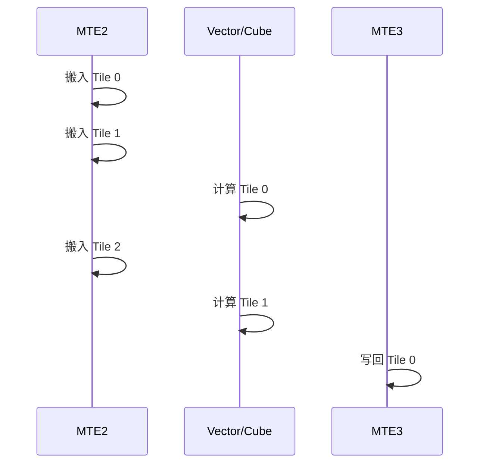

真正比较的不是物理上经过几个存储层，而是：

```text
每条路径能产生多大请求
能保持多少并发
能否与其他流水重叠
```

## 17.7 正确迁移方式

错误迁移：

```text
CUDA 每线程 load/store
→ Ascend 每核逐元素 GetValue/SetValue
```

更合理的语义迁移：

```text
GPU 的大量 Warp 合并 Load/Store
→ NPU 的 MTE/SDMA 批量 Burst 搬运
```

昇腾上的连续 GM→GM Copy 通常应优先考虑：

```text
GM
→ MTE2 批量搬入 UB
→ 事件/队列同步
→ MTE3 批量写回 GM
```

跨卡大块数据还应比较 HCCS 通信库、SDMA 或专用通信通路，而不是默认让 AI Core 标量流水逐元素搬运。

---

# 18. 常见误区

## 误区 1：`longlong2 reg` 位于远端 GPU

错误。`reg` 属于当前执行 Kernel 的线程，物理资源位于当前 GPU 的 SM Register File。

## 误区 2：Global Load 一定读取本地 HBM

错误。Global 是地址空间概念，地址可能映射到本地 HBM、Peer HBM 或 Host Memory。

## 误区 3：`dst[i] = src[i]` 是 DMA

错误。当前 `copy()` 实现由 SM 执行 Load 到寄存器，再 Store 到目标地址。

## 误区 4：一个线程搬 16B，所以一定很慢

不完整。GPU 性能来自 Warp、多个活跃 Warp 和多个 SM 的并行。

## 误区 5：发送端的 `dst_` 和接收端的 `packetBuffer_` 是两块内存

错误。在 Packet Channel 配置正确时，它们是同一块接收端物理 Packet Buffer 的远端视图和本地视图。

## 误区 6：`getPackets()` 是从远端取 Packet

错误。它只是 `unpackPackets()` 的已废弃别名，读取的是本地 `packetBuffer_`。

## 误区 7：Flag 匹配就等于所有相关内存都具备 Release/Acquire

错误。Flag 首先证明当前 Packet 的轮次和完整性；其他独立内存仍需单独分析顺序和可见性。

## 误区 8：`__syncthreads()` 能同步整个 Kernel

错误。它只能同步一个 Block。多个 Block 需要合适的 Grid 级同步机制。

## 误区 9：普通 write 后立刻 signal 一定安全

不一定。需要确认所有参与线程是否完成，以及 Signal/Wait 是否具备所需内存序。

## 误区 10：NVIDIA 的线程 Load/Store 写法可以原样移植到昇腾

错误。两者的高吞吐请求生成器不同，昇腾通常应使用 MTE/SDMA 和显式流水。

## 误区 11：使用 DSL 就不需要理解底层数据路径

错误。DSL 能降低编程门槛，但对齐、缓冲区容量、Channel 选择、同步依赖和硬件拓扑仍然决定正确性与性能。

## 误区 12：一个 CUDA Thread 就对应一颗固定 CUDA Core

错误。Thread 是逻辑执行实例，硬件以 Warp 为主要调度组，由 SM 把 Warp 指令发射给可用功能单元。

## 误区 13：Warp 的 32 个 Thread 必然一直严格锁步

不完整。SIMT 编程模型仍以 Warp 共同推进为基础，但 Compute Capability 7.0 之后支持 Independent Thread Scheduling；依赖隐式 Warp 同步的代码需要使用明确的 Warp 同步原语。

## 误区 14：32 × 16B 等于一次 512B 硬件事务

错误。512B 是一个 Warp 的逻辑有效访问总量，实际会被组织成若干内存事务，数量取决于地址、对齐、缓存和架构。

---

# 19. 性能分析建议

分析普通 `put/get` 时，建议比较：

1. `put()`；
2. `get()`；
3. `cudaMemcpyPeerAsync()`；
4. Alignment 4/8/16；
5. 不同 Block Size；
6. 不同 Grid Size；
7. NVLink 和 PCIe 拓扑；
8. 不同消息大小；
9. 单次搬运与通信计算融合；
10. 是否使用 Packet 协议。

分析 Packet 时还要单独观察：

- Packet Buffer 实际占用字节；
- Payload Goodput，而不仅是链路总字节；
- 接收端轮询产生的 Load 流量；
- Flag 匹配等待时间；
- 解包阶段本地 Store 流量；
- 每个线程处理的 Packet 数量；
- LL8 与 LL16 的粒度差异；
- Buffer 复用和 Flag 回绕；
- 是否因同步不足提前消费 `src_`；
- 是否因线程或 Block 数量过多造成资源竞争。

重点观察：

- 有效链路吞吐；
- Payload Goodput；
- SM Occupancy；
- Active/Eligible Warp 数量；
- 寄存器数量；
- Register Spill；
- Warp Stall 原因；
- Branch Efficiency；
- Memory Dependency Stall；
- Global Load/Store Efficiency；
- 每个 Warp 的内存事务数量；
- L2 吞吐；
- NVLink Tx/Rx；
- PCIe P2P 带宽；
- 同步和轮询开销。

典型性能曲线通常经历：

```text
线程太少：
延迟隐藏不足，带宽低

线程适中：
Outstanding 请求增加，带宽快速上升

线程过多：
链路或 HBM 已饱和，继续增加线程收益很小，
还可能增加资源占用、轮询和同步开销
```

---

# 20. 最终总结

`MemoryChannelDeviceHandle` 的核心思想是：

> 把远端 GPU 内存映射成当前 GPU Kernel 可直接访问的地址，让 GPU SM 自己发起通信，而不是每次返回 Host 调用复制接口。

普通 `put()`：

```text
本地 HBM
→ 当前 GPU SM 寄存器
→ NVLink / PCIe P2P
→ 远端 HBM
```

普通 `get()`：

```text
远端 HBM
→ NVLink / PCIe P2P
→ 当前 GPU SM 寄存器
→ 本地 HBM
```

Packet 的完整端到端路径：

```text
发送端本地 src_
→ 发送端 SM 读取 Payload
→ 组合 Payload + Flag
→ 对 remote dst_ 发出远端 Global Store
→ GPU 互联
→ 接收端 HBM 中的 Packet Buffer
→ 接收端通过 local packetBuffer_ 轮询 Flag
→ Flag 匹配后提取 Payload
→ 接收端本地 src_
```

Packet 路径最关键的地址关系是：

```text
发送端 remote dst_
          ╲
           同一块物理内存：接收端 Packet Buffer
          ╱
接收端 local packetBuffer_
```

其中：

- Thread 是 Kernel 的逻辑执行实例，不是固定物理核心；
- 一个 Block 的全部线程由同一个 SM 执行；
- SM 是包含调度、寄存器、缓存和多种功能单元的并行处理器；
- Warp 是 NVIDIA 以 32 Thread 组成的调度和执行组；
- Warp Scheduler 通过选择 Ready Warp 帮助隐藏访存和数据依赖延迟；
- 分支发散会让同 Warp 的不同路径分阶段执行；
- 连续地址使 Warp 的 Global Load/Store 能够合并为较少事务；
- 每个线程拥有自己的逻辑寄存器，物理资源位于当前 GPU SM；
- Global Load/Store 可访问本地或映射后的远端地址；
- 高带宽依赖 Warp 合并访存和大量并发请求；
- Packet 用 Payload + Flag 实现细粒度到达和轮次检测；
- LL16 使用双 Flag 帮助检测部分更新；
- LL16 和 LL8 的 Payload 效率均为 50%；
- Volatile 不能被简单当成完整 Release/Acquire；
- DeviceSyncer 用于多个 Block 的阶段同步；
- 昇腾 NPU 更应使用 MTE/SDMA 批量搬运，而不是照搬 GPU 的逐线程 Global Load/Store；
- XCCL++ DSL 将 Channel、同步和数据操作组织为可编译的执行计划，但底层仍受上述硬件和内存语义约束。

一句话概括：

> 普通 MemoryChannel 依靠 SM 中多个 Warp 持续产生并组织 Load/Store 请求；Packet Channel 在同一条远端写入链路上加入 Flag；DSL 再把这些底层能力组合成可复用的集合通信算法。

---

## 源码阅读顺序建议

初学者推荐按以下顺序阅读：

1. [`include/mscclpp/memory_channel_device.hpp`](include/mscclpp/memory_channel_device.hpp)
2. [`include/mscclpp/copy_device.hpp`](include/mscclpp/copy_device.hpp)
3. [`include/mscclpp/packet_device.hpp`](include/mscclpp/packet_device.hpp)
4. [`include/mscclpp/semaphore_device.hpp`](include/mscclpp/semaphore_device.hpp)
5. [`include/mscclpp/concurrency_device.hpp`](include/mscclpp/concurrency_device.hpp)
6. `examples/tutorials/03-memory-channel/` 下的示例

阅读时始终带着四个问题：

```text
谁在执行？
源和目的物理上位于哪张 GPU？
当前指针是本地视图还是远端映射视图？
完成和可见性由什么协议保证？
```

只要这四个问题能够回答清楚，MemoryChannel 和 Packet Channel 的数据路径就基本理解了。

---

# 21. XCCL++ DSL 入门：从算法描述到 NPU 执行

> 本节根据《XCCL++ DSL 介绍 v1.1》整理，API 名称沿用 PPT 中的 `xcclpp`。
>
> PPT 中部分接口参数沿用了 `stream`、`block` 等兼容命名。具体类型、默认值和可用后端应以当前代码版本为准。

## 21.1 DSL 是什么

DSL 是 Domain-Specific Language，中文通常称为“领域特定语言”。

XCCL++ DSL 提供基于 Python 的通信算法描述接口，目标是让开发者能够通过 Python 描述：

- 哪些 Rank 参与通信；
- 创建哪种 Channel；
- 数据从哪个 Rank、哪个 Buffer、哪个 Offset 流向哪里；
- 什么时候执行 `signal/wait`；
- 什么时候执行 `put/get/copy/reduce/broadcast`；
- 算法适用于多大的消息、多少张 NPU、哪种协议；
- 最终如何编译并交给 NPU 执行。

通俗地说：

> 不再要求用户先手写一整套底层 CANN 通信 Kernel，而是先用 Python 画出“谁给谁搬什么、什么时候搬、搬完怎么通知”的执行蓝图。

但 DSL 不是解释执行每一条 Python 语句。典型过程是：

```text
Python 描述算法
→ 生成 CollectiveProgram
→ 编译为 JSON 执行计划
→ C++ Runtime 加载执行计划
→ Executor 调度 NPU Kernel 和 Channel
```

## 21.2 DSL 与本文前面内容的关系

前面章节主要解释的是设备端的具体搬运机制，例如：

```text
MemoryChannelDeviceHandle.put()
MemoryChannelDeviceHandle.get()
signal()/wait()
Packet 编码和轮询
```

DSL 位于这些机制的上层：

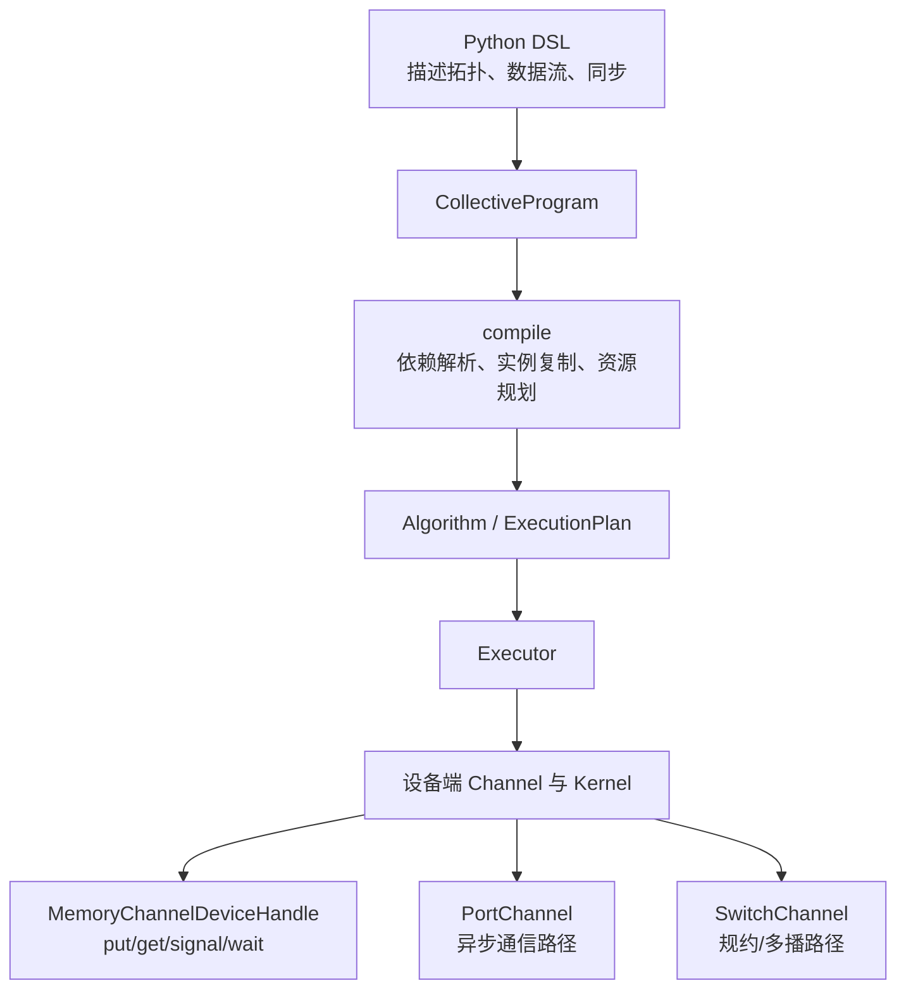

因此可以建立两层心智模型：

```text
上层：DSL 决定“算法要做什么”
底层：Channel 和设备端 Handle 决定“硬件怎样完成”
```

DSL 能减少样板代码，但不会改变底层事实：

- Channel 必须适配实际拓扑；
- Buffer 地址和 Offset 必须正确；
- 对齐和容量必须满足要求；
- Signal/Wait 依赖必须正确；
- 大块搬运仍需选择合适的数据通路；
- 性能仍受链路、并发度和硬件搬运引擎约束。

## 21.3 PPT 中的超节点拓扑与三类 Channel

PPT 给出的拓扑是分层的 UB 超节点：

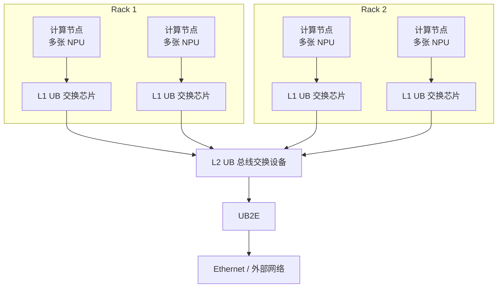

在这一模型中，PPT 将 Channel 分为三类：

| Channel | PPT 中的定位 | 适合表达的操作 |
|---|---|---|
| `MemoryChannel` | 基于 UB OBMM 内存映射形成 NPU 内存池，NPU 可直接读写远端映射内存 | `put/get/read/write`、细粒度远端内存访问 |
| `PortChannel` | 基于 RDMA 端口映射，支持 NPU 间异步读写远端内存 | 跨节点异步传输、端口化通信 |
| `SwitchChannel` | 使用超节点交换能力完成多 NPU 规约和多播 | Reduce、Broadcast、规约后多播 |

可以把它们理解为三种“运输工具”：

```text
MemoryChannel：拿到对方仓库地址，直接去对方仓库读写
PortChannel：把任务交给 RDMA 端口，异步运输
SwitchChannel：让交换设备在途中完成规约或一发多收
```

PPT 将 `SwitchChannel` 类比为 NVLS 一类的硬件规约/多播能力。这里应理解为功能层面的类比，不应把不同厂商的具体实现细节当成完全相同。

## 21.4 DSL 的完整使用流程

PPT 中的整体过程可以归纳为三阶段：

1. 通信算法定义；
2. 初始化与编译；
3. 算法调用。

完整竖向流程如下：

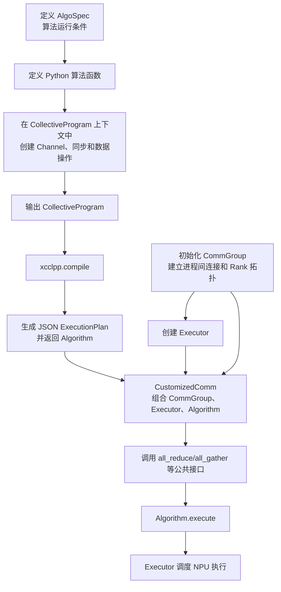

最容易记住的简化版是：

```text
AlgoSpec：在什么条件下运行
CollectiveProgram：数据如何流动
compile：把蓝图变成执行计划
CommGroup：参与者如何互相找到
Executor：谁负责实际调度
Algorithm.execute：本次拿哪些 Buffer 开始执行
CustomizedComm：把以上对象封装成易用接口
```

## 21.5 第一步：AlgoSpec 定义“在什么条件下跑”

`xcclpp.language.AlgoSpec` 描述算法的外围约束。

示意代码：

```python
spec = xcclpp.language.AlgoSpec(
    name="allgather_example",
    collective=AllGather(...),
    nranks_per_node=nranks_per_node,
    world_size=world_size,
    in_place=True,
    instances=nranks_per_node,
    protocol="Simple",
    num_threads_per_block=1024,
    min_message_size=1 << 20,
    max_message_size=48 << 30,
)
```

常见参数：

| 参数 | 含义 |
|---|---|
| `name` | 算法名称或算法标识符 |
| `collective` | 集合通信类型，如 AllReduce、AllGather |
| `nranks_per_node` | 每个计算节点上的 NPU/Rank 数量 |
| `world_size` | 全局 Rank 总数 |
| `in_place` | 是否原地操作 |
| `instances` | 算法流水实例或副本数量 |
| `protocol` | 传输协议，如 `Simple` 或 `LL` |
| `instr_fusion` | 是否启用指令融合 |
| `auto_sync` | 是否让编译器自动补充部分同步 |
| `replication_policy` | 多实例复制和排布策略 |
| `reuse_resources` | 是否复用 Channel、Buffer 等资源 |
| `num_threads_per_block` | 每个执行块的线程数 |
| `use_double_scratch_buffer` | 是否使用双 Scratch Buffer |
| `buffer_alignment` | Buffer 对齐字节数 |
| `min_message_size` | 算法适用的最小消息字节数 |
| `max_message_size` | 算法适用的最大消息字节数 |
| `tags` | 自定义标签和算法元数据 |

AlgoSpec 不负责描述具体通信步骤。

例如：

```text
8 张 NPU 变成 16 张 NPU
消息范围从 1 MB 变成 64 MB
协议从 Simple 变成 LL
```

这些通常属于 AlgoSpec 的变化。

可以把 AlgoSpec 理解为活动报名表：

```text
有多少人参加？
在哪个场地？
使用哪套规则？
允许多大的输入？
是否启用多条流水线？
```

## 21.6 第二步：CollectiveProgram 定义“数据怎样流动”

DSL 算法通常是一个 Python 函数：

```python
def allgather_example(spec: AlgoSpec) -> CollectiveProgram:
    with CollectiveProgram(
        spec.name,
        spec.collective,
        spec.world_size,
        instances=spec.instances,
        protocol=spec.protocol,
        instr_fusion=spec.instr_fusion,
        auto_sync=spec.auto_sync,
        replication_policy=spec.replication_policy,
        reuse_resources=spec.reuse_resources,
        num_threads_per_block=spec.num_threads_per_block,
        use_double_scratch_buffer=spec.use_double_scratch_buffer,
        buffer_alignment=spec.buffer_alignment,
        min_message_size=spec.min_message_size,
        max_message_size=spec.max_message_size,
    ) as program:
        # 在这里创建 Channel、同步并描述数据操作
        ...

    return program
```

函数内部通常按四个步骤组织：

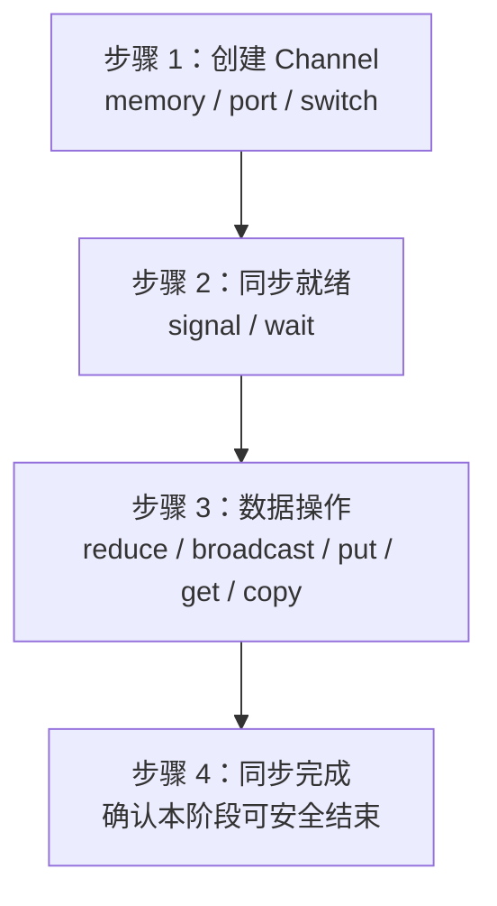

### 21.6.1 创建 Channel

伪代码：

```python
memory_channels = {}
port_channels = {}
switch_channels = {}

memory_channels[(dst_rank, src_rank)] = MemoryChannel(...)
port_channels[(dst_rank, src_rank)] = PortChannel(...)
switch_channels[group_id] = SwitchChannel(...)
```

Channel 决定数据实际走哪类硬件和运行时通路。

### 21.6.2 同步就绪

```python
channel.signal(...)
channel.wait(...)
```

这一阶段解决的是：

```text
接收端 Buffer 是否已经准备好？
远端映射是否已经建立？
当前通信轮次是否可以开始？
```

### 21.6.3 数据操作

```python
channel.put(...)
channel.get(...)
channel.copy(...)
channel.reduce(...)
channel.broadcast(...)
```

这些 DSL 操作会被记录到 `CollectiveProgram`，而不是在 Python 解释器中立即完成全部数据传输。

### 21.6.4 同步完成

数据操作之后通常还需要建立阶段边界：

```text
所有分片是否已经完成？
后续操作是否依赖完整结果？
是否可以复用 Buffer 或进入下一轮？
```

这与前文解释的 `DeviceSyncer`、Semaphore 和 Release/Acquire 问题属于同一类正确性问题，只是 DSL 可以帮助生成和组织部分依赖。

## 21.7 AlgoSpec 与算法函数如何配合

二者的关系可以画成：

```mermaid
flowchart LR
    A[AlgoSpec<br/>外围约束] --> C[xcclpp.compile]
    B[算法函数<br/>内部数据流逻辑] --> C
    C --> D[Algorithm<br/>可执行对象]
```

区别：

| 内容 | AlgoSpec | 算法函数 / CollectiveProgram |
|---|---|---|
| 关注点 | 算法适用条件 | 算法内部步骤 |
| 典型问题 | 几张 NPU、消息多大、什么协议 | 谁给谁发、Offset 是多少、何时同步 |
| 是否描述拓扑边 | 间接描述规模 | 直接创建 Channel 和 Rank 关系 |
| 是否包含 put/get | 否 | 是 |
| 是否影响编译缓存键 | 是 | 是 |

一句话：

> AlgoSpec 描述“舞台有多大”，算法函数描述“演员怎样走位”。

## 21.8 第三步：CommGroup 建立进程和 Rank 拓扑

`xcclpp.CommGroup()` 的主要职责：

- 通过 TCP Bootstrap 建立进程间初始连接；
- 收集各进程的 Rank 信息；
- 让 Rank 0 作为默认 Master 汇总信息；
- 将完整 Rank 信息广播给其他进程；
- 创建 C++ 端 `CppCommunicator`；
- 为 Executor 和 Algorithm 提供共同的通信上下文；
- 建立 Rank 与 NPU 的一一绑定关系。

关键属性：

| 属性 | 说明 |
|---|---|
| `communicator` | C++ 端 Communicator，核心通信上下文 |
| `interfaceIpPortTrio` | Master 所在网卡、IP、Port 信息 |
| `rank` | 当前进程 Rank |
| `nranks` | 全局 Rank 总数 |

典型初始化：

```python
rank = int(os.environ["RANK"])
world = int(os.environ["WORLD_SIZE"])
master_addr = os.environ["xcclpp_MASTER_ADDR"]
master_port = os.environ["xcclpp_MASTER_PORT"]

interface_ip_port = f"{interface}:{master_addr}:{master_port}"

comm_group = xcclpp.CommGroup(
    interfaceIpPortTrio=interface_ip_port,
    rank=rank,
    size=world,
)
```

组网过程：

```mermaid
sequenceDiagram
    participant R0 as Rank 0 / Master
    participant R1 as Rank 1
    participant RN as 其他 Rank

    R1->>R0: 上报本 Rank、节点和设备信息
    RN->>R0: 上报本 Rank、节点和设备信息
    R0->>R0: 汇总全局 Rank 拓扑
    R0-->>R1: 广播完整拓扑
    R0-->>RN: 广播完整拓扑
    R1->>R1: 创建本地 Communicator 视图
    RN->>RN: 创建本地 Communicator 视图
```

通俗类比：

> CommGroup 像会议签到和通讯录分发。所有人先向主持人报到，主持人整理完整名单，再把名单发给每个人。

## 21.9 第四步：`xcclpp.compile()` 生成执行计划

PPT 中的编译过程分为五步：

```mermaid
flowchart TD
    A[1. 调用算法函数<br/>产生 CollectiveProgram] --> B[2. 序列化为 JSON]
    B --> C[依赖解析、同步处理、实例复制和优化]
    C --> D[3. 写入编译缓存]
    D --> E[4. CppExecutionPlan 加载 JSON]
    E --> F[5. 返回 Algorithm]
```

示意调用：

```python
algorithms = []
algo = xcclpp.compile(
    algo=allgather_example,
    algo_spec=spec,
    rank=rank,
)
algorithms.append(algo)
```

编译阶段的主要工作：

| 步骤 | 说明 |
|---|---|
| 调用算法函数 | 根据 `spec` 运行 Python 构图代码，得到 `CollectiveProgram` |
| 序列化 | `CollectiveProgram.to_json()` 形成初始执行计划 |
| 后处理 | 优化、解析同步依赖、复制多实例、分配资源 |
| 缓存 | 将 JSON 写入缓存目录，避免相同算法重复编译 |
| 创建 ExecutionPlan | C++ 端根据 Rank 加载计划并准备运行时对象 |
| 返回 Algorithm | 封装 `id`、`execution_plan`、`tags` 和约束信息 |

PPT 给出的缓存目录包括：

```text
MSCCLPP_CACHE_DIR
或
~/.cache/mscclpp
```

并以算法源码和 Spec 元数据的哈希作为缓存键。

因此当以下内容变化时，通常应生成不同缓存项：

- 算法函数逻辑；
- Rank 数；
- 协议；
- 消息范围；
- 实例数；
- 对齐或线程配置。

## 21.10 第五步：Executor 是实际调度者

`xcclpp.Executor()` 接收 `CommGroup` 中的 Communicator，并负责把编译后的执行计划交给 NPU 运行。

```python
executor = xcclpp.Executor(comm_group.communicator)
```

核心对象关系：

| 对象 | 职责 |
|---|---|
| `CommGroup` | 建立进程连接和全局 Rank 拓扑 |
| `CppCommunicator` | C++ 端通信上下文和资源入口 |
| `Algorithm` | 编译完成的执行计划及约束 |
| `Executor` | 调度 NPU Kernel、Channel 和执行阶段 |

通俗类比：

```text
Algorithm = 施工图纸
Communicator = 工地通信和人员名册
Executor = 现场总调度
NPU Kernel/Channel = 真正施工的设备和工人
```

## 21.11 第六步：`Algorithm.execute()` 绑定本次 Buffer 并执行

`Algorithm` 是编译后的算法模板；`execute()` 则为本次调用提供真实的 Buffer、大小、数据类型和 Stream。

示意：

```python
algo.execute(
    comm=comm_group.communicator,
    executor=executor,
    input_buffer=tensor.data_ptr(),
    output_buffer=tensor.data_ptr(),
    input_size=tensor.nbytes,
    output_size=tensor.nbytes,
    dtype=to_xcclpp_dtype(tensor.dtype),
    stream=stream_handle,
)
```

PPT 中列出的主要参数：

| 参数 | 类型 | 说明 |
|---|---|---|
| `comm` | `CppCommunicator` | 通信器 |
| `input_buffer` | `int` | 输入缓冲区 NPU 地址 |
| `output_buffer` | `int` | 输出缓冲区 NPU 地址 |
| `input_size` | `int` | 输入字节数 |
| `output_size` | `int` | 输出字节数 |
| `dtype` | `DataType` | 元素数据类型 |
| `op` | `ReduceOp` | 规约操作，默认可为 NOP |
| `stream` | `int` | 运行时 Stream 句柄 |
| `executor` | `CppExecutor` | DSL 算法执行器 |
| `nblocks` | `int` | 执行块数量，0 表示自动 |
| `nthreads_per_block` | `int` | 每个块线程数，0 表示自动 |
| `symmetric_memory` | `bool` | 是否使用对称内存 |
| `extras` | `dict` | 算法特定参数 |
| `accum_dtype` | `DataType` | 累加数据类型 |

需要区分：

```text
compile()：生成“算法模板”
execute()：为模板绑定本次真实数据并启动执行
```

同一个 `Algorithm` 可以在满足约束的情况下被多次执行，但每次可以传入不同的 Buffer 地址和 Stream。

## 21.12 第七步：CustomizedComm 封装公共 API

直接管理 `CommGroup + Algorithm + Executor` 对业务调用者仍然偏复杂，因此 PPT 使用 `CustomizedComm` 再封装一层。

示意：

```python
class CustomizedComm:
    def __init__(self, comm: xcclpp.CommGroup, algorithms=None):
        self.comm = comm
        self.rank = comm.my_rank
        self.world_size = comm.nranks
        self.local_rank = comm.my_rank % comm.nranks_per_node
        self.executor = xcclpp.Executor(comm.communicator)
        self.algorithms = algorithms or []

    def all_gather(self, tensor, stream=None):
        algo = self.algorithms[0]
        algo.execute(
            comm=self.comm.communicator,
            executor=self.executor,
            input_buffer=tensor.data_ptr(),
            output_buffer=tensor.data_ptr(),
            input_size=tensor.nbytes,
            output_size=tensor.nbytes,
            dtype=to_xcclpp_dtype(tensor.dtype),
            stream=stream_handle(stream),
        )
```

上层使用者最终只需要：

```python
comm = init_dist()
comm.barrier_cpu()
comm.all_gather(x, stream=current_stream)
comm.barrier_cpu()
comm.destroy()
```

这使接口风格接近 `torch.distributed`：

```text
用户看到的是 all_gather/all_reduce
内部实际组合了 CommGroup、Executor 和 Algorithm.execute
```

## 21.13 一个从定义到执行的最小骨架

下面把 PPT 的七个步骤放到一个简化示例中。它用于建立整体心智模型，并不是可直接运行的完整实现。

```python
import os
import xcclpp


def build_spec(world_size: int, nranks_per_node: int):
    return xcclpp.language.AlgoSpec(
        name="my_allgather",
        collective=xcclpp.language.AllGather(...),
        nranks_per_node=nranks_per_node,
        world_size=world_size,
        in_place=True,
        instances=nranks_per_node,
        protocol="Simple",
        buffer_alignment=16,
    )


def my_allgather(spec):
    with xcclpp.language.program.CollectiveProgram(
        spec.name,
        spec.collective,
        spec.world_size,
        instances=spec.instances,
        protocol=spec.protocol,
        auto_sync=spec.auto_sync,
        buffer_alignment=spec.buffer_alignment,
    ) as program:
        channels = {}

        # 1. 创建 Channel
        for src_rank in range(spec.world_size):
            dst_rank = (src_rank + 1) % spec.world_size
            channels[(dst_rank, src_rank)] = MemoryChannel(
                dst_rank=dst_rank,
                src_rank=src_rank,
            )

        # 2. 同步就绪
        for channel in channels.values():
            channel.signal(...)
            channel.wait(...)

        # 3. 数据操作
        for channel in channels.values():
            channel.put(...)

        # 4. 同步完成
        for channel in channels.values():
            channel.signal(...)
            channel.wait(...)

    return program


def init_runtime():
    rank = int(os.environ["RANK"])
    world = int(os.environ["WORLD_SIZE"])
    nranks_per_node = get_local_device_count()

    comm_group = xcclpp.CommGroup(
        interfaceIpPortTrio=build_master_endpoint(),
        rank=rank,
        size=world,
    )

    spec = build_spec(world, nranks_per_node)
    algorithm = xcclpp.compile(
        algo=my_allgather,
        algo_spec=spec,
        rank=rank,
    )

    executor = xcclpp.Executor(comm_group.communicator)
    return comm_group, executor, algorithm


def run(tensor):
    comm_group, executor, algorithm = init_runtime()

    algorithm.execute(
        comm=comm_group.communicator,
        executor=executor,
        input_buffer=tensor.data_ptr(),
        output_buffer=tensor.data_ptr(),
        input_size=tensor.nbytes,
        output_size=tensor.nbytes,
        dtype=to_xcclpp_dtype(tensor.dtype),
        stream=current_stream_handle(),
    )
```

## 21.14 DSL 操作最终如何落到底层数据搬运

以 DSL 中的一次 `MemoryChannel.put()` 为例，可以建立如下映射：

```mermaid
flowchart TD
    A[DSL：channel.put<br/>描述 Rank、Offset、长度] --> B[CollectiveProgram 记录操作]
    B --> C[compile 解析依赖和资源]
    C --> D[ExecutionPlan 中的 Channel 指令]
    D --> E[Executor 启动设备端执行]
    E --> F[构造或取得 Device Handle]
    F --> G[设备端多线程执行 put]
    G --> H[Global Load → 寄存器 → 远端 Global Store]
```

对应关系：

| DSL 概念 | 底层含义 |
|---|---|
| `MemoryChannel` | 一组可访问的本地/远端内存和同步资源 |
| `channel.put()` | 生成一段本地到远端的搬运操作 |
| `channel.get()` | 生成一段远端到本地的搬运操作 |
| `signal/wait` | 建立阶段依赖和生产者—消费者关系 |
| `protocol="LL"` | 可能选择低延迟 Packet/Flag 类协议 |
| `instances` | 复制多个执行实例以增加流水并行度 |
| `buffer_alignment` | 约束可使用的访问粒度和搬运效率 |
| `auto_sync` | 编译阶段自动管理部分依赖，并非取消同步语义 |

重要结论：

> DSL 中写一行 `put()`，不代表硬件只执行一条指令；它代表向执行计划中加入一个数据搬运阶段，运行时可能由多个核、多个线程或专用引擎共同完成。

## 21.15 Simple 与 LL 协议的直观区别

PPT 中 `protocol` 常见值包括 `Simple` 和 `LL`。

可以用前文内容建立直觉：

| 协议思路 | 直观特点 | 更适合的目标 |
|---|---|---|
| `Simple` | 主要传输纯 Payload，配合独立同步 | 大块数据、更高 Payload 利用率 |
| `LL` | Payload 携带 Flag，接收端可细粒度轮询 | 小消息、低延迟、边到达边消费 |

LL 类协议的代价包括：

- Flag 占用带宽；
- 接收端需要轮询；
- Buffer 容量按 Packet 存储量计算；
- Flag 轮次和回绕必须正确管理。

因此协议选择不能只看名称，应结合：

```text
消息大小
同步频率
是否需要流水消费
有效 Payload 比例
轮询开销
链路带宽
```

## 21.16 `auto_sync` 不等于“不需要考虑同步”

`auto_sync=True` 的合理理解是：

> 编译器根据 DSL 图中的依赖，尝试自动插入或组织它能够识别的同步关系。

它不意味着：

- 任意两个 Buffer 都天然可见；
- 自定义裸指针操作自动获得 Release/Acquire；
- 多个生产者可以安全地裸加同一个计数器；
- 用户可以省略所有阶段边界；
- 外部 Kernel 和 DSL 内部操作之间自动有正确顺序。

使用者仍需明确：

```text
谁生产数据？
谁消费数据？
依赖是否在同一个 CollectiveProgram 中？
是否跨 Block、跨核、跨进程或跨设备？
Signal 前是否保证全部写操作完成？
Wait 后是否建立所需的可见性？
```

## 21.17 DSL 调试时应该从哪一层排查

建议按下面顺序定位：

```mermaid
flowchart TD
    A[AlgoSpec 是否匹配当前 world_size 和消息大小] --> B[CollectiveProgram 的 Rank、Offset、长度是否正确]
    B --> C[Channel 类型是否匹配物理拓扑]
    C --> D[signal/wait 依赖是否闭合]
    D --> E[compile 生成的 JSON 计划是否符合预期]
    E --> F[CommGroup 的 Rank 组网是否正确]
    F --> G[Executor 是否使用正确 Communicator]
    G --> H[execute 的 Buffer、Size、DType、Stream 是否正确]
    H --> I[设备端 Kernel、MTE/SDMA/远端访存是否正常]
```

常见问题：

| 现象 | 优先检查 |
|---|---|
| 编译阶段报约束不匹配 | `world_size`、消息范围、`in_place`、协议 |
| 某些 Rank 永久等待 | Rank 映射、Signal/Wait 配对、Flag 轮次 |
| 数据写错位置 | Rank、Buffer 类型、Offset、元素数与字节数 |
| 小消息延迟高 | Channel/协议选择、同步次数、Kernel 启动和轮询 |
| 大消息带宽低 | Channel 是否匹配拓扑、并发实例、搬运粒度、链路瓶颈 |
| 重复执行第二轮出错 | Buffer 复用、Flag 回绕、缓存计划与运行参数 |
| 只有多机失败 | CommGroup Bootstrap、网卡选择、PortChannel/RDMA 配置 |

## 21.18 初学者最终应建立的心智模型

把整个系统想象成物流系统：

```text
AlgoSpec
= 这次物流任务的规模、规则和适用范围

CollectiveProgram
= 物流线路图和每一步操作顺序

Memory/Port/SwitchChannel
= 公路、专线和带聚合能力的交换枢纽

CommGroup
= 全部仓库和司机的通讯录

compile
= 把线路图转换成调度系统能执行的工单

Algorithm
= 已经编译好的工单模板

Executor
= 现场调度员

Algorithm.execute
= 给工单填入本次真实货物地址并开始执行

MemoryChannelDeviceHandle
= 设备端搬运工手中的具体地址卡和门铃
```

最重要的分层关系：

```text
业务接口：all_reduce / all_gather
        ↓
Python DSL：AlgoSpec + CollectiveProgram
        ↓
编译产物：Algorithm + ExecutionPlan
        ↓
运行时：CommGroup + Executor
        ↓
设备端：Channel + DeviceHandle + Kernel
        ↓
硬件：MTE / SDMA / 远端内存访问 / 交换网络
```

学习 DSL 时，不要只背 API。始终追问：

```text
这条 DSL 语句最终创建了什么执行阶段？
数据的源和目的物理上在哪里？
它使用哪一种 Channel 和硬件路径？
完成与可见性由哪个同步关系保证？
编译器自动做了什么，哪些仍然由用户保证？
```

回答清楚这些问题，才能真正把 DSL、MemoryChannelDeviceHandle、Packet、MTE/SDMA 和集合通信算法连成一个完整体系。
