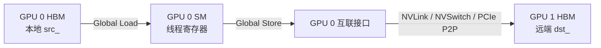
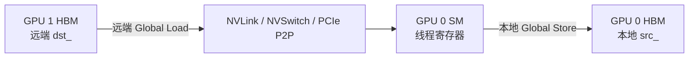
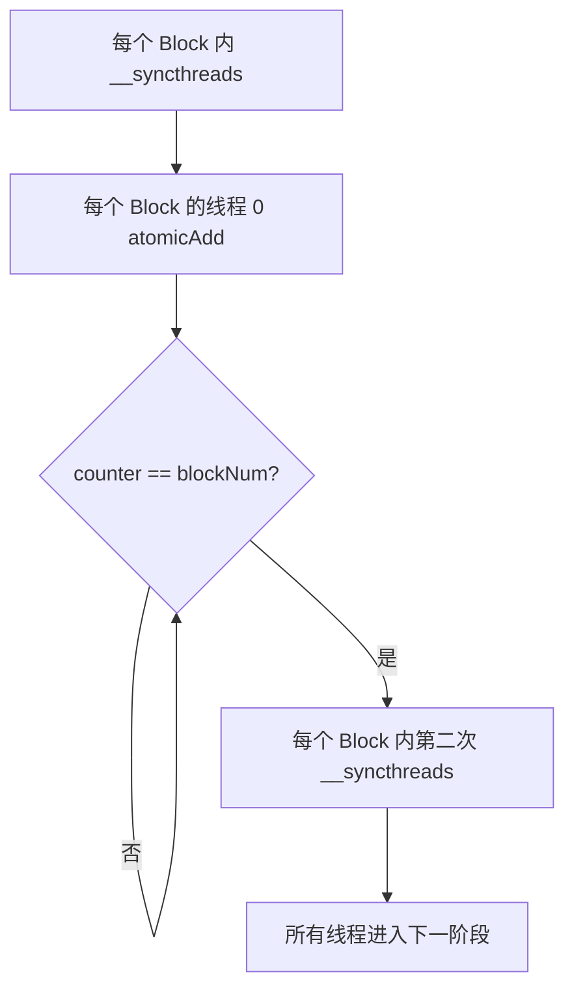
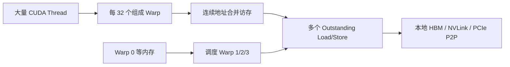
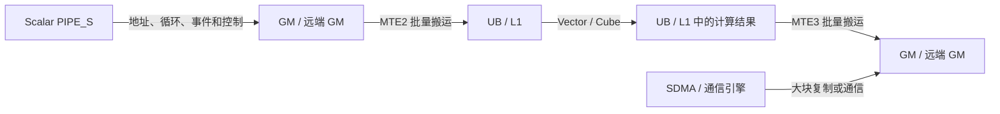
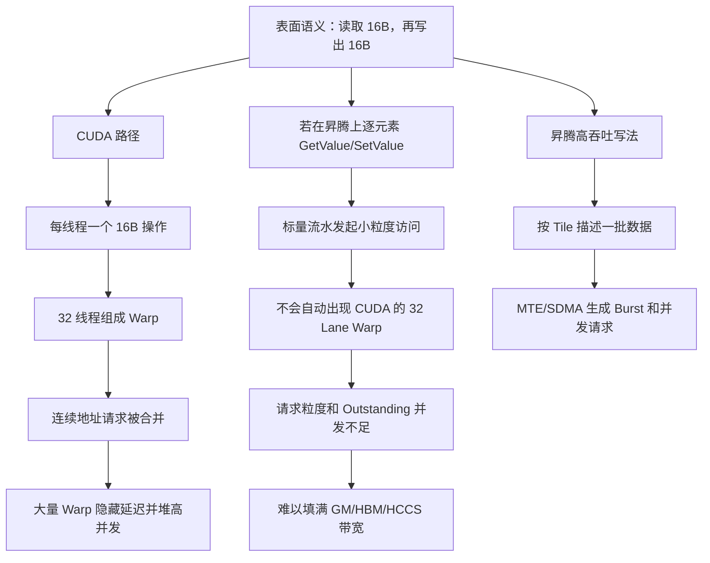
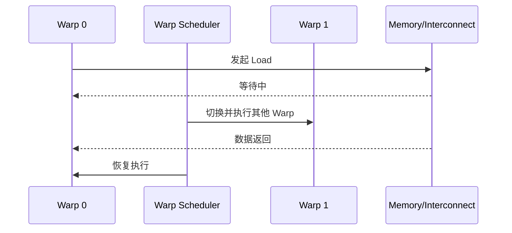
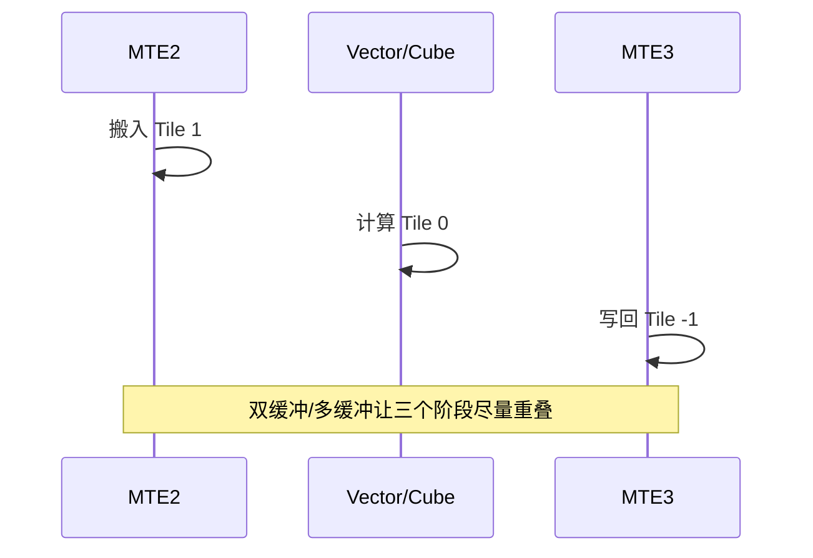
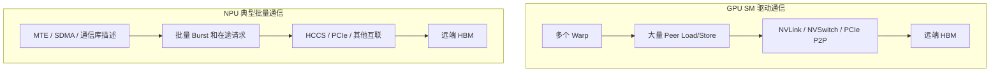

# MemoryChannelDeviceHandle 数据搬运分析

> 面向第一次接触 GPU 通信、CUDA 内存模型、MSCCL++ 和昇腾 Ascend C 的读者。
>
> 本文尽量同时做到两点：
>
> 1. 保持技术描述准确，便于继续阅读源码和分析性能；
> 2. 使用通俗类比、流程图和对照表解释 SM、Warp、寄存器、Global Load/Store、远端显存、MTE/SDMA 和同步。

---

## 目录

- [1. 先给出整体结论](#1-先给出整体结论)
- [2. MemoryChannelDeviceHandle 是什么](#2-memorychanneldevicehandle-是什么)
- [3. 三个核心地址：dst_、src_、packetBuffer_](#3-三个核心地址dst_src_packetbuffer)
- [4. read、write、put、get、putPackets、getPackets 的区别](#4-readwriteputgetputpacketsgetpackets-的区别)
- [5. put 和 get 的底层 copy 原理](#5-put-和-get-的底层-copy-原理)
- [6. 什么是 SM、Warp 和 GPU 线程](#6-什么是-smwarp-和-gpu-线程)
- [7. 为什么一个 Warp 是 32 个线程](#7-为什么一个-warp-是-32-个线程)
- [8. 什么是 GPU 寄存器](#8-什么是-gpu-寄存器)
- [9. 什么是 Global Load 和 Global Store](#9-什么是-global-load-和-global-store)
- [10. put 的真实数据路径](#10-put-的真实数据路径)
- [11. get 的真实数据路径](#11-get-的真实数据路径)
- [12. longlong2 搬运为什么可能很快](#12-longlong2-搬运为什么可能很快)
- [13. 这种写法是不是最快](#13-这种写法是不是最快)
- [14. Packet 搬运机制](#14-packet-搬运机制)
- [15. DeviceSyncer 的作用和原理](#15-devicesyncer-的作用和原理)
- [16. 为什么 DeviceSyncer 不能随便省略](#16-为什么-devicesyncer-不能随便省略)
- [17. 与昇腾 NPU 的图文对比](#17-与昇腾-npu-的图文对比)
- [18. 常见误区](#18-常见误区)
- [19. 性能分析建议](#19-性能分析建议)
- [20. 最终总结](#20-最终总结)

---

# 1. 先给出整体结论

`MemoryChannelDeviceHandle` 可以理解成：

> GPU Kernel 内部使用的一张“通信操作卡”，其中保存了本地内存、远端内存和同步信号的地址。

它支持两大类操作：

1. **普通内存访问**
   - `read<T>()`
   - `write<T>()`
   - `put()`
   - `get()`
2. **带 Packet 标志的数据访问**
   - `putPackets()`
   - `unpackPacket()`
   - `unpackPackets()`
   - 已废弃的 `getPackets()`

最重要的结论：

- `read/write` 是单个线程直接访问一个值；
- `put/get` 是多个 GPU 线程协同搬运一整段数据；
- `put` 是本地数据写向远端，相当于 **push**；
- `get` 是从远端读取数据到本地，相当于 **pull**；
- 当前 `put/get` 实现本质是 GPU SM 执行 Global Load/Store；
- 它不是代码中显式调用的 `cudaMemcpy`，也不是显式调用的 DMA/Copy Engine；
- 数据会短暂经过当前执行线程的寄存器；
- 寄存器永远属于当前执行 Kernel 的 GPU，不会位于远端 GPU；
- `getPackets()` 不是“从远端拉 Packet”，它只是已废弃的本地 Packet 解包接口别名；
- `DeviceSyncer` 用于同一 Kernel 内多个 Block 的阶段同步；
- NVIDIA GPU 和昇腾 NPU 的高吞吐请求生成器不同，因此代码不能只做语法翻译。

相关源码：

- [`include/mscclpp/memory_channel_device.hpp`](include/mscclpp/memory_channel_device.hpp)
- [`include/mscclpp/copy_device.hpp`](include/mscclpp/copy_device.hpp)
- [`include/mscclpp/packet_device.hpp`](include/mscclpp/packet_device.hpp)
- [`include/mscclpp/concurrency_device.hpp`](include/mscclpp/concurrency_device.hpp)

---

# 2. MemoryChannelDeviceHandle 是什么

源码结构可以简化为：

```cpp
struct MemoryChannelDeviceHandle : public BaseMemoryChannelDeviceHandle {
  void* dst_;
  void* src_;
  void* packetBuffer_;
};
```

这里的 `DeviceHandle` 表示它是给 GPU Device 端代码，也就是 CUDA Kernel 使用的轻量句柄。

Host 侧负责：

- 创建和注册内存；
- 建立 CUDA IPC 或其他可访问映射；
- 创建 Semaphore；
- 把最终可供 GPU 使用的地址封装进 DeviceHandle。

Kernel 拿到句柄后，可以直接操作其中的地址。

通俗类比：

```text
MemoryChannelDeviceHandle
├── dst_          对方仓库地址
├── src_          本地仓库地址
├── packetBuffer_ 本地收件缓存区
└── semaphore_    双方约定的门铃/通知器
```

---

# 3. 三个核心地址：dst_、src_、packetBuffer_

## 3.1 `dst_`

`dst_` 通常表示远端目标内存映射到当前 GPU 地址空间后的地址。

> 它在当前进程里表现为普通 Device Pointer，但背后的物理内存可能位于另一张 GPU 的 HBM。

因此：

```cpp
*(reinterpret_cast<T*>(dst_) + index)
```

从 C++ 语法看只是普通指针访问，硬件实际可能通过 NVLink、NVSwitch 或 PCIe P2P 访问另一张 GPU 的显存。

## 3.2 `src_`

`src_` 通常是当前 GPU 的本地内存地址：

- `put()` 从 `src_` 读取，再写入 `dst_`；
- `get()` 从 `dst_` 读取，再写入 `src_`。

## 3.3 `packetBuffer_`

`packetBuffer_` 是本地 Packet 接收缓冲区。

远端通过 `putPackets()` 把带 Flag 的 Packet 写进该缓冲区后，本地 GPU 使用 `unpackPacket()` 或 `unpackPackets()` 检查 Flag，并解包有效 Payload。

---

# 4. read、write、put、get、putPackets、getPackets 的区别

| 接口 | 数据方向 | 调用粒度 | 多线程协作 | Packet Flag | 典型用途 |
|---|---|---:|---:|---:|---|
| `read<T>` | 远端 → 当前线程寄存器 | 一个 `T` | 否 | 否 | 状态、控制字段 |
| `write<T>` | 当前线程寄存器 → 远端 | 一个 `T` | 否 | 否 | 状态、控制字段 |
| `put` | 本地 `src_` → 远端 `dst_` | 一段数据 | 是 | 否 | 大块 Push |
| `get` | 远端 `dst_` → 本地 `src_` | 一段数据 | 是 | 否 | 大块 Pull |
| `putPackets` | 本地数据 → 远端 Packet Buffer | 一段 Payload | 是 | 写入 | 小消息、低延迟协议 |
| `unpackPacket` | 本地 Packet Buffer → 返回值 | 一个 Packet | 否 | 检查 | 读取一个 Packet |
| `unpackPackets` | 本地 Packet Buffer → 本地 `src_` | 多个 Packet | 是 | 检查 | 批量解包 |
| `getPackets` | 本地 Packet Buffer → 本地 `src_` | 多个 Packet | 是 | 检查 | 已废弃别名 |

## 4.1 `read<T>()`

```cpp
template <typename T>
T read(uint64_t index) {
  return *(reinterpret_cast<T*>(dst_) + index);
}
```

当前 GPU 的一个线程发起读取，数据返回当前线程的寄存器。它适合少量数据，不适合让单个线程循环搬运大块数据。

## 4.2 `write<T>()`

```cpp
template <typename T>
void write(uint64_t index, const T& v) {
  *(reinterpret_cast<T*>(dst_) + index) = v;
}
```

它是普通内存写，不自动等价于原子操作，也不天然提供完整的跨线程同步语义。

## 4.3 `put()` 与 `get()`

```text
put：本地 src_ → 远端 dst_
get：远端 dst_ → 本地 src_
```

它们调用同一个 `copy()`，只是源和目的方向相反。

## 4.4 `getPackets()`

源码中它直接调用 `unpackPackets()`，所以：

> `getPackets()` 不是远端版 `get()`，而是历史命名留下的本地 Packet 解包接口。

---

# 5. put 和 get 的底层 copy 原理

核心代码：

```cpp
template <typename T>
void copy(T* dst, T* src,
          uint64_t numElems,
          uint32_t threadId,
          uint32_t numThreads) {
  T reg;
  for (size_t i = threadId; i < numElems; i += numThreads) {
    reg = src[i];
    dst[i] = reg;
  }
}
```

可以把它理解成一群搬运工共同搬仓库：

```text
线程 0：搬 0、N、2N、3N ...
线程 1：搬 1、N+1、2N+1 ...
线程 2：搬 2、N+2、2N+2 ...
...
```

每个线程执行：

```text
Global Load → 本线程寄存器 → Global Store
```

`Alignment=16` 时使用 `longlong2`，每个线程每次处理 16 字节；头尾不满足 16 字节主体对齐时，辅助逻辑会使用更小粒度处理。

---

# 6. 什么是 SM、Warp 和 GPU 线程

## 6.1 SM

SM（Streaming Multiprocessor）是 NVIDIA GPU 执行 Kernel 的主要计算单元，内部包含：

- Warp Scheduler；
- CUDA Core / ALU；
- Load/Store Unit；
- Register File；
- Shared Memory / L1；
- 其他专用执行单元。

## 6.2 Warp

Warp 是 NVIDIA GPU 的基本线程调度和执行组，通常由连续的 32 个 CUDA 线程组成：

```text
Warp 0：thread 0  ～ thread 31
Warp 1：thread 32 ～ thread 63
...
```

一个 Warp 中的每个线程也称为一个 Lane。

## 6.3 SIMT

CUDA 对程序员表现为多个独立线程，但硬件把 32 个线程组合成 Warp 执行同一条或同一路径上的指令。这称为 SIMT：Single Instruction, Multiple Threads。

---

# 7. 为什么一个 Warp 是 32 个线程

32 不是数学定理，而是 NVIDIA 的架构选择，是以下因素的工程折中：

- 指令获取和调度开销；
- 执行吞吐；
- 内存访问合并；
- 分支发散代价；
- 寄存器和其他资源占用；
- 延迟隐藏能力。

Warp 太小，调度开销相对变大；Warp 太大，分支发散和资源占用会更严重。NVIDIA 长期选择 32 Lane 作为平衡点。

如果 Block 有 256 个线程，则逻辑上包含：

```text
256 / 32 = 8 个 Warp
```

Block 大小不是 32 的倍数时，最后一个 Warp 会有部分 Lane 不工作。

---

# 8. 什么是 GPU 寄存器

从编程模型看，每个 CUDA 线程拥有自己的逻辑寄存器；从物理位置看，寄存器资源位于当前 GPU 的 SM Register File。

```text
当前 GPU
└── SM
    └── Register File
        ├── Thread 0 的逻辑寄存器
        ├── Thread 1 的逻辑寄存器
        └── ...
```

关键结论：

> Kernel 在 GPU 0 上执行，`reg` 就属于 GPU 0 的 SM；即使 `src` 或 `dst` 指向 GPU 1，寄存器也不会跑到 GPU 1。

如果寄存器压力过高，编译器可能发生 Register Spill。CUDA 的 `local memory` 虽然逻辑上线程私有，但物理上通常由当前 GPU 的显存和缓存层次承载，并不是 SM 内的寄存器。

---

# 9. 什么是 Global Load 和 Global Store

```cpp
reg = src[i];
dst[i] = reg;
```

概念上可能对应：

```text
ld.global  从 Global 地址空间读取
st.global  向 Global 地址空间写入
```

`Global` 是地址空间概念，不等于“必定访问本地 HBM”。地址可能映射到：

- 当前 GPU HBM；
- 另一张 GPU 的 Peer HBM；
- 映射后的 Host Memory。

所以判断物理位置不能只看 `ld.global/st.global`，还要看指针的映射来源。

---

# 10. put 的真实数据路径

假设 Kernel 在 GPU 0 上执行，`src_` 是 GPU 0 本地内存，`dst_` 是 GPU 1 的远端映射内存：



对应一句话：

> GPU 0 的 SM 先把本地数据加载到 GPU 0 的线程寄存器，再从该寄存器向 GPU 1 的映射地址发出 Store。

---

# 11. get 的真实数据路径

仍假设 Kernel 在 GPU 0 上执行：



`get` 的远端读取包含请求和返回，对远端访问延迟及 Outstanding Read 数量通常更加敏感。

---

# 12. longlong2 搬运为什么可能很快

代码：

```cpp
longlong2 reg;
reg = src[i];
dst[i] = reg;
```

`longlong2` 是 16 字节。单个线程每次只处理 16B，但 GPU 不能只看单线程：

```text
1 个线程：16B
1 个 Warp：32 × 16B = 512B 逻辑数据
多个 Warp：持续产生请求
多个 SM：进一步并发
```

同一 Warp 的线程访问连续地址时，硬件可以把它们组织为较少的内存 Transaction，而不是把 32 个线程完全当作互不相关的小请求。

真正使它变快的是：

- 连续地址；
- 合适对齐；
- Warp 级合并访存；
- 足够多的活跃 Warp；
- 足够多的 Outstanding 请求；
- 多个 SM 并行；
- 本地 HBM、远端 HBM 和互联带宽能够被填满。

> 不是因为 `longlong2` 这个类型本身“自带高带宽”。

---

# 13. 这种写法是不是最快

不一定。

## 13.1 纯大块复制

对于纯粹的大块连续数据复制，应当对比：

- `put/get` 的 SM Copy；
- `cudaMemcpyPeerAsync()`；
- 通信库或硬件专用复制路径。

专用复制路径可能减少 SM 占用，并与计算并发。

## 13.2 SM Copy 的价值

SM Copy 的优势常常不是单独 memcpy 峰值，而是：

- Kernel 内自主通信；
- Persistent Kernel；
- 低延迟小消息；
- 不规则 Scatter/Gather；
- 边通信边计算；
- Packet 协议；
- 避免返回 Host 再启动复制。

因此应比较端到端目标，而不是只比较一段 memcpy 的孤立带宽。

---

# 14. Packet 搬运机制

## 14.1 LL16Packet

LL16Packet 总大小 16B，但有效 Payload 是 8B：

```text
[data1][flag1][data2][flag2]
```

接收方只有在 `flag1` 和 `flag2` 都等于预期轮次 Flag 时，才接受 Payload。重复 Flag 用于帮助识别部分更新或撕裂状态。

## 14.2 LL8Packet

LL8Packet 总大小 8B，有效 Payload 是 4B：

```text
[data][flag]
```

## 14.3 访问方式

CUDA 实现使用显式的 Volatile Global Load/Store，并轮询 Flag：

```text
st.volatile.global
ld.volatile.global
```

Packet 协议适合小消息和低延迟到达检测，但 Flag 会占用额外带宽，因此不适合追求大块纯 Payload 的最高 Goodput。

---

# 15. DeviceSyncer 的作用和原理

`DeviceSyncer` 是同一个 Kernel 内的 Device-wide Barrier，用于多个 Block 的阶段同步。

`__syncthreads()` 只能同步同一个 Block，不能同步不同 Block。

实现步骤：

1. Block 内执行 `__syncthreads()`；
2. 每个 Block 的 `threadIdx.x == 0` 作为代表；
3. 代表线程对全局计数器执行 Atomic Fetch Add；
4. 代表线程轮询直到计数等于参与 Block 数；
5. 使用 Acquire/Release 建立跨 Block 可见性；
6. 再执行一次 Block 内 `__syncthreads()`，放行本 Block 其他线程。



源码使用三个计数器轮转，避免不同 Barrier 代际互相污染，并支持同步 Block 数变化的场景。

---

# 16. 为什么 DeviceSyncer 不能随便省略

典型流程：

```text
线程 0 与远端完成握手
        ↓
DeviceSyncer.sync()
        ↓
所有线程共同 put/get
        ↓
DeviceSyncer.sync()
        ↓
线程 0 Signal 通知远端完成
```

第一个 Sync 保证其他线程和 Block 不会在握手完成前开始搬运；第二个 Sync 保证线程 0 发 Signal 前，所有参与线程都已经完成自己的数据部分。

软件 Grid Barrier 还存在工程约束：如果已驻留 Block 在 Barrier 中自旋，而尚未调度的 Block 因 SM 资源不足无法进入，可能死锁。因此必须评估 Grid 大小、Block 大小、寄存器、Shared Memory 和实际可同时驻留 Block 数量。

---

# 17. 与昇腾 NPU 的图文对比

这一节重点回答两个问题：

1. 为什么 NVIDIA GPU 上 `reg = src[i]; dst[i] = reg;` 可能很快？
2. 为什么不能把这种编程方式逐行照搬到昇腾 NPU？

先给出最核心的答案：

> 两种芯片负责“制造高并发大吞吐内存请求”的硬件主体不同。
>
> NVIDIA GPU 主要依靠 SM 中的大量 Warp；昇腾 AI Core 的典型高吞吐数据通路主要依靠 MTE/SDMA 和显式流水。

## 17.1 两种架构的“主力搬运工”不同

### NVIDIA GPU：大量 Warp 是主力搬运工



GPU 的线程系统本身就被设计成大规模内存并发请求生成器：

```text
32 Lane / Warp
× 多个 Active Warp / SM
× 多个 SM
= 大量并发内存请求
```

### 昇腾 NPU：MTE/SDMA 是主力搬运工



典型 Ascend C AI Core 流水可粗略理解为：

| 流水/单元 | 主要职责 |
|---|---|
| `PIPE_S` | 标量控制、地址计算、少量标量访问 |
| `PIPE_V` | UB 上的向量计算 |
| `PIPE_M` | 矩阵/Cube 计算 |
| `PIPE_MTE2` | GM → UB/L1 批量搬运 |
| `PIPE_MTE3` | UB → GM 批量搬运 |
| SDMA/通信引擎 | 特定大块复制和通信路径 |

这里不是说昇腾完全不能访问 GM，而是说：

> 对大块连续数据而言，高吞吐路径通常不是让标量流水逐元素读写，而是给 MTE/SDMA 一个批量搬运描述。

## 17.2 一段相似代码，为什么落到不同硬件路径

从 C++ 表面看，两边都可能写成“读一个值，再写一个值”，但编译后的执行组织不同：



因此：

```text
相同的高级语言语义
≠ 相同的硬件执行组织
≠ 相同的性能
```

## 17.3 通俗类比：搬箱子

### GPU 模型

可以把一个 Warp 想象成 32 个搬运工：

```text
32 个搬运工同时出发
每人拿一个 16B 小箱子
地址连续时，仓库系统把它们组织成成批装卸
某一组在等车，调度员马上安排另一组继续干活
```

虽然每个人每次拿得不多，但搬运工数量多、出发并发高，最终可以形成很大的数据流。

### 昇腾标量照搬模型

如果使用逐元素标量 GM 访问，可以类比成：

```text
让负责登记、调度和控制的管理员
亲自一箱一箱往返仓库搬货
```

管理员可以搬，但这不是系统为大宗货物设计的主通路。

### 昇腾 MTE/SDMA 模型

MTE/SDMA 更像叉车和货运流水线：

```text
告诉叉车：
源地址、目的地址、总长度、块数、每块长度、Stride

然后叉车批量搬运，管理员只负责提交任务和处理事件
```

根因不是“昇腾寄存器慢”，而是：

> 把 GPU 的主力搬运通路，错误映射成了 NPU 的控制/标量通路。

## 17.4 最核心根因：高带宽请求生成器不同

| 维度 | NVIDIA GPU | 昇腾 NPU 典型 AI Core 模型 |
|---|---|---|
| 高带宽请求生成器 | SM 中大量 Warp/Lane | MTE/SDMA 描述符和搬运流水 |
| 基本并发来源 | 多线程、多 Warp、多 SM | Tile、Burst、搬运队列、多流水重叠 |
| 连续访问聚合 | Warp Coalescing | MTE Block/BlockLen/Stride 描述 |
| 隐藏延迟 | Warp 切换 | MTE2/Vector/MTE3 流水重叠、双缓冲 |
| 计算的主要数据位置 | 可直接大量访问 Global Memory | Vector/Cube 通常围绕 UB/L1 数据工作 |
| 单个大类型的含义 | 每 Lane 16B，再乘 32 Lane | 16B 类型本身不会自动创造 32 Lane 并发 |
| 大块纯复制 | SM Copy 或 Copy Engine | MTE、SDMA 或通信库路径 |
| 同步方式 | Warp/Block/Grid + 内存序 | Queue/Event/SetFlag/WaitFlag/流水 Barrier |

一句话归纳：

> GPU 用“很多线程一起发请求”制造吞吐；昇腾用“专用搬运流水批量发请求”制造吞吐。

## 17.5 为什么 `longlong2` 不能机械翻译

CUDA 代码：

```cpp
longlong2 reg;
reg = src[i];
dst[i] = reg;
```

它在 GPU 上快的完整条件是：

```text
16B / Thread
× 32 Thread / Warp
× 多个 Warp / SM
× 多个 SM
+ 连续地址合并
+ 足够 Outstanding 请求
```

如果在昇腾上仅仅换一个 16B 结构体，然后调用逐元素 GM 读写，通常缺少：

- 32 Lane Warp；
- Warp Coalescer；
- 大量 Active Warp；
- Warp Scheduler 的延迟隐藏；
- 由这些 Warp 产生的大量 Outstanding 请求。

所以：

```text
“使用 16B 类型”只是访问粒度
“达到高带宽”还需要并发生成机制
```

类型相同，不代表吞吐机制相同。

## 17.6 为什么昇腾 GM→UB→GM 多一跳反而更快

表面看：

```text
直接方式：GM → GM
MTE 方式：GM → UB → GM
```

MTE 方式多了一次 UB 中转，似乎应该更慢。但性能不能只数“经过几站”，还要看每一站使用什么硬件。


MTE 路径的优势：

- 一条描述覆盖整块数据；
- 形成较大 Burst；
- 支持 Block、BlockLen 和 Stride；
- 允许多个请求在途；
- 搬运是异步流水；
- 可以与 Vector/Cube 计算重叠；
- 可以使用双缓冲或多缓冲。

在 Ascend 开源代码的 GM→GM 示例中，真实做法就是按 Tile 执行：

```text
CpGM2UB
→ MTE2 到 MTE3 的事件同步
→ CpUB2GM
→ MTE3 到 MTE2 的事件同步
→ 处理下一个 Tile
```

参考：

- [Ascend RecSDK `datacopy_gm2gm.h`](https://github.com/Ascend/RecSDK/blob/fe03cbbbde249a70b85b9d6fd68ebc627bbf6457/cust_op/ascendc_op/ai_core_op/lccl/v220/op_kernel/datacopy_gm2gm.h)

这说明对典型 AI Core 编程模型而言，UB 并不是“无意义绕路”，而是连接批量搬运流水和 Vector/Cube 计算的数据站点。

## 17.7 两种架构如何隐藏延迟

### GPU：线程级延迟隐藏



### 昇腾：流水级延迟隐藏



两者目标相同：不要让高延迟使整个芯片停下来；但实现方法完全不同。

## 17.8 为什么不能直接照搬编程：七个根因

### 根因 1：执行粒度不同

CUDA 的一个标量语句会被 32 Lane Warp 成组执行；昇腾标量语句不会自动变成 32 Lane Warp 访问。

### 根因 2：内存请求聚合机制不同

GPU 依赖相邻 Lane 的地址形成合并事务；昇腾 MTE 依赖搬运参数显式描述 Block、长度和 Stride。

### 根因 3：延迟隐藏机制不同

GPU 用大量 Warp 切换隐藏延迟；昇腾用 MTE2、Vector/Cube、MTE3 以及双缓冲重叠流水。

### 根因 4：高吞吐数据层级不同

GPU 编程天然允许大量线程直接操作 Global Memory；昇腾 Vector/Cube 的高效计算通常围绕 UB/L1 展开，GM 由 MTE 批量搬入搬出。

### 根因 5：异步完成模型不同

MTE 搬运通常是异步的。函数或指令提交完成，不代表数据已经可以被下一条流水安全消费，需要 Queue/Event 或 SetFlag/WaitFlag 建立依赖。

### 根因 6：跨卡通路和可访问能力不同

CUDA Peer Pointer、NVLink P2P、昇腾远端 GM、HCCS、SDMA 和通信库支持范围不是同一套抽象。某条本地 GM 路径能够工作，不代表相同指针语义可直接用于跨卡。

### 根因 7：功能可移植不等于性能可移植

把代码翻译到“结果正确”只完成了功能移植；还必须把并发、Tile、数据层级、流水和同步重新映射，才能完成性能移植。

## 17.9 错误迁移与正确迁移

### 错误思路：逐行翻译

```text
CUDA threadId 循环
→ 换成 Ascend 核内循环

longlong2 load/store
→ 换成 16B 结构体 GetValue/SetValue

__syncthreads
→ 随便加一个 Barrier
```

这种翻译可能功能正确，但性能和同步都可能不正确。

### 正确思路：迁移“目的”，不是迁移“表面语句”

| CUDA/MSCCL++ 中的目的 | 昇腾侧应重新设计为 |
|---|---|
| 多线程分摊整段数据 | 多核分片 + 每核 Tile 化 |
| Warp 连续合并访问 | MTE 连续 Block/BlockLen/Stride |
| 多 Warp 隐藏访存延迟 | 双缓冲、多缓冲、MTE/Vector/MTE 重叠 |
| `longlong2` 增大每 Lane 粒度 | 增大 Tile 和 Burst，满足对齐要求 |
| SM 发起 Peer Load/Store | 根据芯片和软件栈选择远端 MTE、SDMA、HCCL/HCCS 路径 |
| Block/Grid 同步 | 根据范围选择 Queue/Event、SetFlag/WaitFlag、核间同步 |
| 数据搬完后 Signal | 先确认对应 MTE/SDMA 完成，再发布远端可见信号 |

## 17.10 一个更合理的昇腾 GM→GM 思路

伪代码仅表达设计思想：

```cpp
for (每个分配给当前 AI Core 的 tile) {
    // 1. MTE2：批量搬入，不是逐元素 GetValue
    DataCopy(localBuffer, srcGlobal[tileOffset], tileBytes);

    // 2. 等待 MTE2 → 消费流水的数据依赖
    WaitCopyInReady();

    // 3. 可选：在 UB 上执行 Vector/Cube 计算
    // Compute(localBuffer);

    // 4. MTE3：批量写出
    DataCopy(dstGlobal[tileOffset], localBuffer, tileBytes);

    // 5. 通过 Queue/Event 管理 Buffer 复用和下一 Tile
    WaitCopyOutOrRotateBuffer();
}
```

若是纯跨卡大块复制，还应优先评估专用 SDMA 或通信库，而不是强行占用 AI Core 做逐元素循环。

## 17.11 跨卡对比



两者的共同目标是：

> 产生足够大的请求粒度和足够高的并发，填满内存与互联带宽。

不同点是“谁负责产生这些请求”。

## 17.12 最终对照口诀

```text
NVIDIA GPU：
线程多 → Warp 多 → 合并访问 → 用 Warp 隐藏延迟

昇腾 NPU：
Tile 大 → MTE/SDMA Burst → 流水重叠 → 用 Buffer/Event 隐藏延迟
```

因此，合理对应关系不是：

```text
GPU longlong2 Load/Store
≈ NPU GetValue/SetValue
```

而更接近：

```text
GPU 大量 Warp 的合并 Load/Store
≈ NPU MTE/SDMA 的批量 Burst 搬运
```

> 注意：昇腾不同芯片代际、软件版本和数据通路能力可能不同。具体是否支持某种直接 GM→GM、远端 GM 或专用指令，应以目标产品的 Ascend C API 和性能实测为准。本文描述的是典型的性能模型，而不是声称所有产品只有唯一实现。

---

# 18. 常见误区

## 误区 1：`longlong2 reg` 位于远端 GPU

错误。`reg` 属于当前执行 Kernel 的线程，远端的是指针映射的 HBM。

## 误区 2：Global Load 一定读取本地 HBM

错误。Global 是地址空间概念，可以映射到本地、Peer 或 Host Memory。

## 误区 3：`dst[i] = src[i]` 是 DMA

错误。当前 MSCCL++ `copy()` 是 SM 执行 Load 到寄存器，再 Store 到目标地址。

## 误区 4：一个线程搬 16B，所以一定很慢

不完整。GPU 性能来自 Warp、多活跃 Warp、多 SM 和合并访存。

## 误区 5：把类型换成 16B，NPU 就能得到 GPU Warp 带宽

错误。类型只决定单次访问粒度，不会自动创建 Warp、Coalescer 和大量 Outstanding 请求。

## 误区 6：GM→UB→GM 多一跳必然更慢

错误。专用 MTE 批量流水可能远快于标量逐元素 GM→GM。

## 误区 7：`getPackets()` 是从远端取 Packet

错误。它只是 `unpackPackets()` 的已废弃别名。

## 误区 8：`__syncthreads()` 能同步整个 Kernel

错误。它只同步一个 Block。

## 误区 9：普通 Write 后立刻 Signal 一定安全

不一定。必须确认所有线程完成、跨 Block 同步、Release/Fence 和接收侧 Acquire。

## 误区 10：CUDA 代码逐行翻译成 Ascend C 就完成移植

错误。逐行翻译可能只完成功能移植；性能移植必须重构并发、Tile、内存层级、流水和同步。

---

# 19. 性能分析建议

分析 GPU `put/get` 时建议比较：

1. `put()`；
2. `get()`；
3. `cudaMemcpyPeerAsync()`；
4. Alignment 4/8/16；
5. 不同 Block Size 和 Grid Size；
6. NVLink、NVSwitch 和 PCIe 拓扑；
7. 不同消息大小；
8. 单纯复制与通信计算融合；
9. Packet 与非 Packet。

重点观察：

- 有效链路吞吐；
- SM Occupancy；
- 寄存器数量和 Spill；
- Warp Stall / Memory Dependency；
- Global Load/Store 效率；
- L2、HBM、NVLink、PCIe 吞吐；
- 同步和轮询开销。

分析昇腾方案时建议比较：

1. 标量 `GetValue/SetValue` 基线；
2. MTE2/MTE3 Tile 搬运；
3. 单 Buffer、双 Buffer、多 Buffer；
4. 不同 Tile Size；
5. 对齐与 Stride；
6. AI Core MTE 与 SDMA/通信库；
7. 本卡与跨卡；
8. Event/Queue 等待开销；
9. HBM/HCCS 实际吞吐；
10. 是否成功实现搬运和计算重叠。

不要只看理论峰值，必须结合 Profiler 和端到端基准定位瓶颈。

---

# 20. 最终总结

`MemoryChannelDeviceHandle` 的核心思想是：

> 把远端 GPU 内存映射成当前 GPU Kernel 可访问的地址，让 GPU SM 自己发起通信，而不是每次返回 Host 调用复制接口。

`put()`：

```text
本地 HBM
→ 当前 GPU SM 寄存器
→ NVLink / PCIe P2P
→ 远端 HBM
```

`get()`：

```text
远端 HBM
→ NVLink / PCIe P2P
→ 当前 GPU SM 寄存器
→ 本地 HBM
```

其中：

- SM 是执行 Kernel 的计算单元；
- Warp 是 NVIDIA 调度的 32 线程基本单位；
- 寄存器位于当前 GPU SM；
- Global Load/Store 可访问本地或映射后的远端地址；
- 高带宽依赖 Warp 合并访存和大量并发请求；
- `longlong2` 一次搬 16B 只是单线程视角；
- 一个 Warp 每轮逻辑上可处理 512B；
- `put/get` 不保证在所有场景下比专用 Copy Engine 更快；
- Packet 通过 Payload + Flag 实现细粒度到达检测；
- DeviceSyncer 用于多个 Block 的阶段同步。

GPU 与昇腾对比的最终结论：

> NVIDIA GPU 用大量 Warp 把普通 Load/Store 组织成高并发数据流；昇腾 NPU 通常用 MTE/SDMA 把 Tile 描述组织成批量 Burst 数据流。

所以不能直接照搬编程的根因不是语法不同，而是：

```text
执行粒度不同
+ 请求聚合机制不同
+ 延迟隐藏机制不同
+ 高效数据层级不同
+ 异步完成和同步模型不同
+ 跨卡通路不同
```

移植时应牢记：

> 翻译代码语句只能保证“可能算对”；重新映射硬件并发和数据通路，才能“跑得对、跑得快”。

---

## 源码阅读顺序建议

1. [`include/mscclpp/memory_channel_device.hpp`](include/mscclpp/memory_channel_device.hpp)
2. [`include/mscclpp/copy_device.hpp`](include/mscclpp/copy_device.hpp)
3. [`include/mscclpp/packet_device.hpp`](include/mscclpp/packet_device.hpp)
4. [`include/mscclpp/semaphore_device.hpp`](include/mscclpp/semaphore_device.hpp)
5. [`include/mscclpp/concurrency_device.hpp`](include/mscclpp/concurrency_device.hpp)
6. `examples/tutorials/03-memory-channel/`
7. [Ascend RecSDK `datacopy_gm2gm.h`](https://github.com/Ascend/RecSDK/blob/fe03cbbbde249a70b85b9d6fd68ebc627bbf6457/cust_op/ascendc_op/ai_core_op/lccl/v220/op_kernel/datacopy_gm2gm.h)

阅读时始终带着四个问题：

```text
谁在执行？
数据物理上在哪里？
谁在产生高并发内存请求？
完成和可见性由什么同步机制保证？
```

只要这四个问题能回答清楚，就不容易把 GPU 的 Warp 模型和 NPU 的 MTE/SDMA 模型混为一谈。
