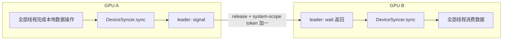
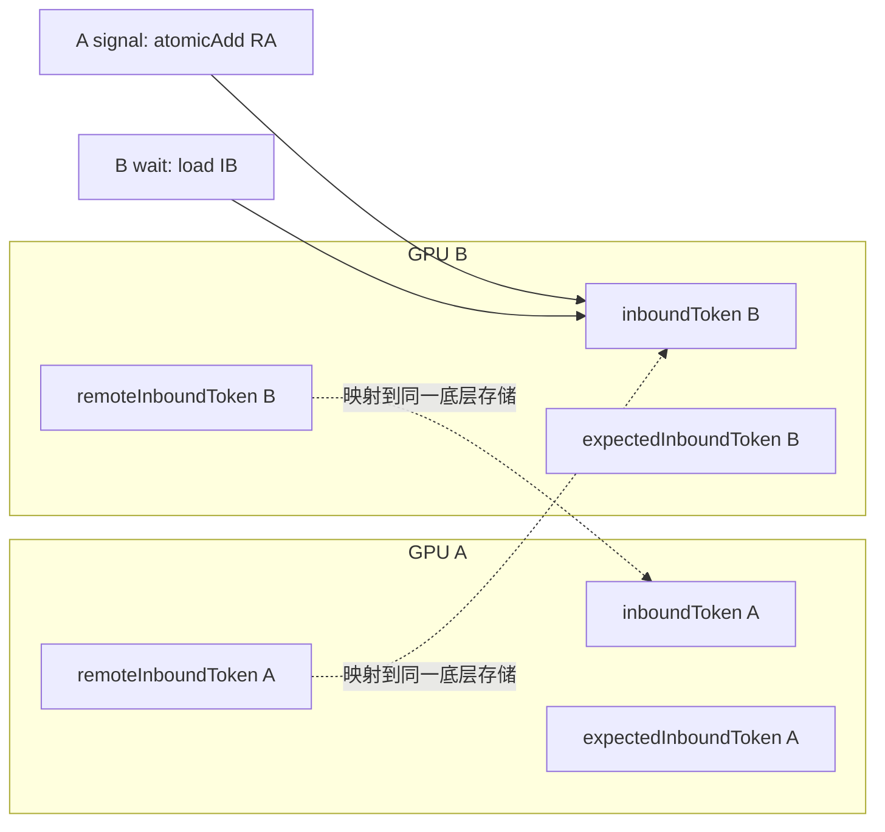
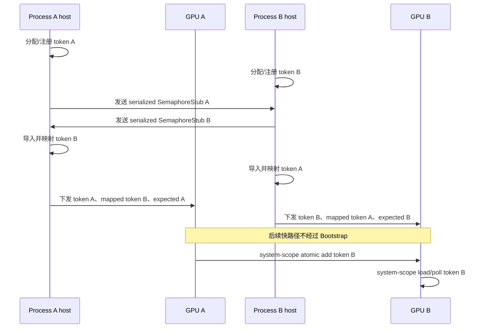
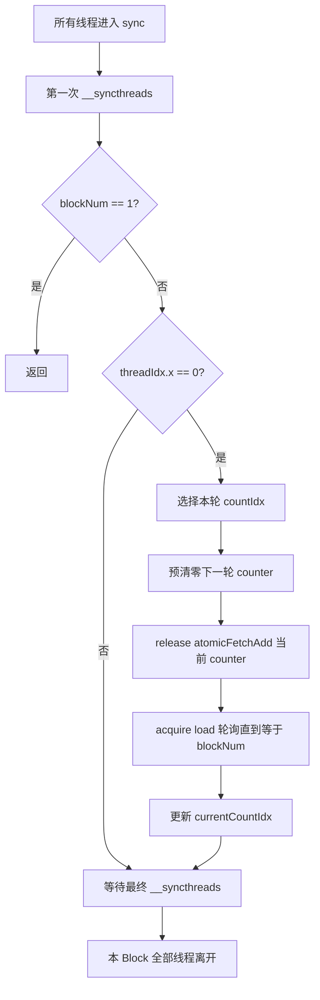
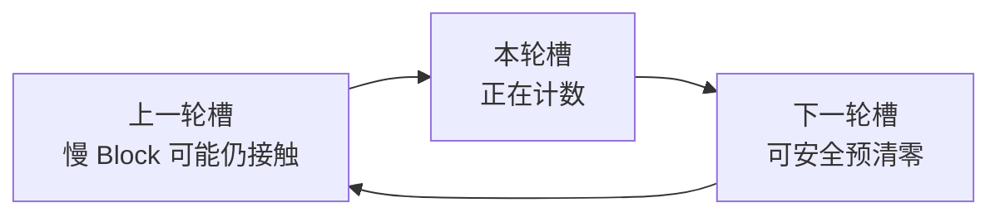
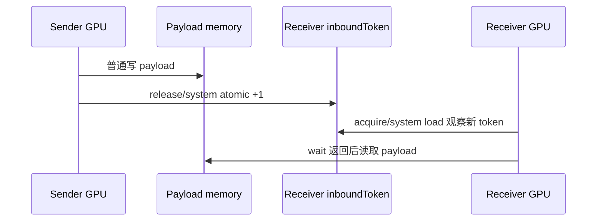
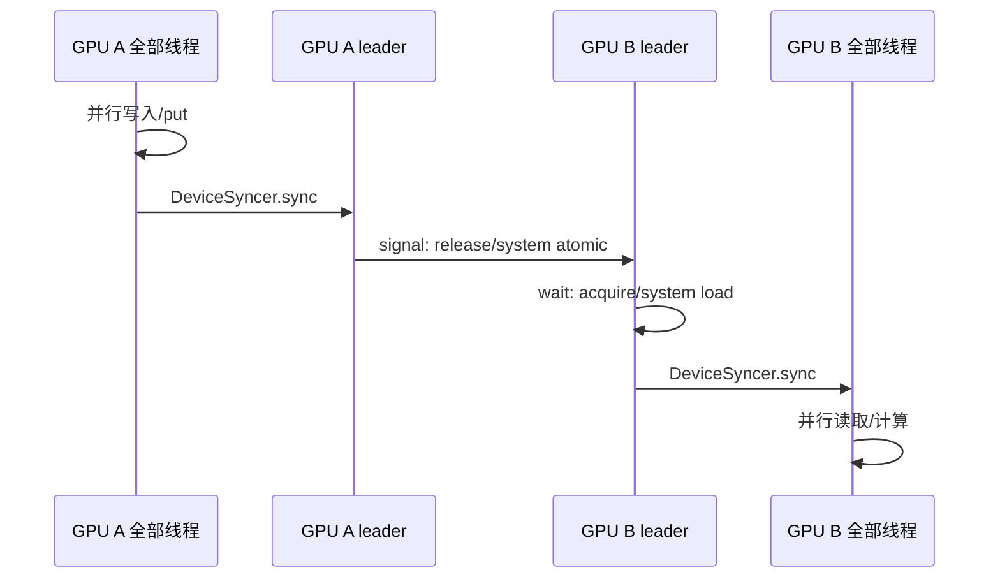
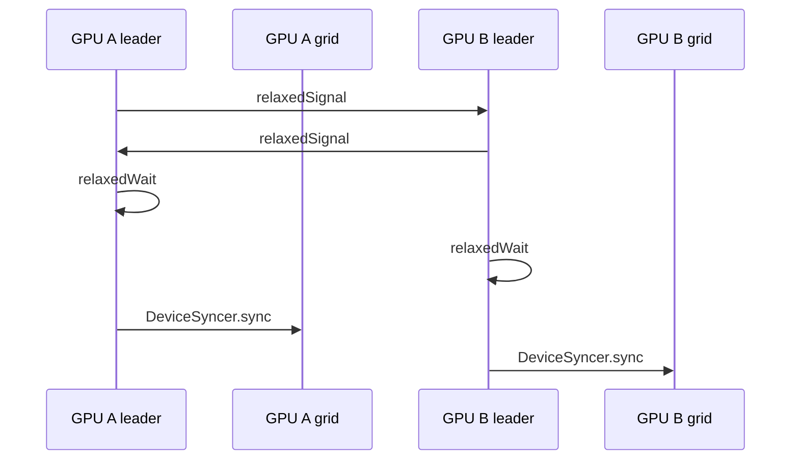

# DeviceSyncer 与 Device-to-Device Semaphore 同步机制分析

> 分析基线：`10wvw01/mscclpp`，`main@4fab500e7133e502409f8ae91c00d5f86b504ef3`。
>
> 名称校正：问题中的 **samephone** 对应源码中的 **semaphore**；`relaxedWwait` 对应实际接口 **`relaxedWait()`**。本文所说的 `signal()`、`relaxedSignal()`、`wait()`、`relaxedWait()`，具体指 [`MemoryDevice2DeviceSemaphoreDeviceHandle`](./include/mscclpp/semaphore_device.hpp#L62-L137) 的接口，并由 [`BaseMemoryChannelDeviceHandle`](./include/mscclpp/memory_channel_device.hpp#L16-L56) 转发给用户。

---

## 0. 结论先行

MSCCL++ 把同步拆成两个互补层次：

| 同步原语 | 解决的问题 | 作用范围 | 核心机制 |
|---|---|---|---|
| `DeviceSyncer::sync()` | 本 GPU 的多个 Thread Block 是否都到达同一阶段 | 单 GPU、单 Kernel | `__syncthreads()` + device-scope release/acquire 原子计数 |
| D2D semaphore | 对端 GPU 是否到达；对端此前的数据是否已发布 | 两个 GPU endpoint | system-scope 64 位原子 token；strict 为 release/acquire，relaxed 为 relaxed |

最典型的组合不是二选一，而是：

```text
一个线程使用 semaphore 与对端 GPU 握手
                    ↓
DeviceSyncer.sync() 把握手结果扩散给本 GPU 的所有参与 Block/Thread
```

仓库示例正是这样组织的：先由 `tid == 0` 执行跨 GPU 的 `relaxedSignal/relaxedWait`，再调用 `devSyncer.sync(gridDim.x)`；数据 `put()` 完成后，则先做本地 `sync()`，再由 `tid == 0` 执行严格的 `signal/wait`。见 [`bidir_memory_channel.cu`](./examples/tutorials/03-memory-channel/bidir_memory_channel.cu#L50-L68)。



---

# 问题一：从进程内同步、跨进程同步看设计哲学

## 1.1 不要把“进程边界”与“GPU 同步范围”混为一谈

同一进程可以管理两个 GPU；两个进程也可以分别控制同一节点上的两个 GPU。MSCCL++ 的两类原语分别面向 GPU 执行层次，而不是简单按 host 进程分类：

| 场景 | `DeviceSyncer::sync()` | D2D semaphore |
|---|---|---|
| 同一 GPU、同一 Kernel、多个 Block | 适用 | 通常不需要 |
| 同一进程、两个 GPU | 每个 GPU 内各自使用 | 用于 GPU 间通知 |
| 两个进程、同节点、两个 GPU | 每个进程控制的 GPU 内各自使用 | host 初始化时交换并导入 CUDA IPC 内存；Kernel 中直接操作 token |
| 两个节点、两个 GPU | 仍然只负责本 GPU | MemoryChannel 仅在底层支持远端 GPU 内存映射时成立；普通跨节点通常使用 PortChannel |

仓库基础教程明确说明，示意图中的 Process A/B 不一定是不同进程，甚至 endpoint 也可落在同一 GPU；MemoryChannel 教程则说明跨节点使用它需要底层硬件支持内存映射，例如 MNNVL。见 [`01-basic-concepts.md`](./docs/tutorials/01-basic-concepts.md#L37-L66) 与 [`03-memory-channel.md`](./docs/tutorials/03-memory-channel.md#L257-L262)。

## 1.2 `DeviceSyncer` 的哲学：只回答“本 GPU 是否共同到达”

`DeviceSyncer` 在源码注释中被定义为 device-wide barrier，用于一个 Kernel 内多个 Thread Block 的同步，见 [`concurrency_device.hpp`](./include/mscclpp/concurrency_device.hpp#L14-L71)。

它只依赖：

- 同一个 GPU 地址空间中的 `DeviceSyncer` 对象；
- Block 内的 `__syncthreads()`；
- Block leader 对本地全局计数器执行 `scopeDevice` 原子操作。

它完全没有：

- Connection、rank 或 transport；
- 内存注册、序列化或 IPC handle；
- remote pointer 或网络操作。

因此它不是跨 GPU、跨进程原语。其设计可以概括为：

> 先用 Block barrier 把每个 Block 的全部线程汇聚到 leader；再让每个 Block 的 leader 参加 device-wide 计数 barrier；最后用第二次 Block barrier 把“全局到齐”传播回 Block 内所有线程。

仓库示例将其声明为 `__device__ mscclpp::DeviceSyncer devSyncer;`。不同 GPU 有不同实例；不同进程的 context 也不会天然共享该 C++ device symbol。源码没有为它导出或导入 IPC 内存，所以不能借此跨进程同步。

## 1.3 semaphore 的哲学：host 建立可达性，GPU 快路径只操作 token

D2D semaphore 的 device handle 只有三个指针，见 [`semaphore_device.hpp`](./include/mscclpp/semaphore_device.hpp#L129-L136)：

```text
inboundToken
  本端接收计数；对端 signal 写它，本端 wait 读它

remoteInboundToken
  对端 inboundToken 在本端 GPU 地址空间中的映射；本端 signal 对它原子加一

expectedInboundToken
  本端 wait/poll 已经领取到的期望事件序号
```



它采用 **64 位单调计数器**，而不是布尔 flag：

- 每次 `signal()` 原子加一；
- 每次 `wait()` 先领取一个新的 expected ticket；
- signal 可以提前积累，不会因 flag 已经为 1 而合并丢失；
- 多个本地 waiter 通过原子 fetch-add 领取不同序号。

这体现了控制面与执行面的分离：

```text
host 控制面：分配 token → 注册内存 → 交换 metadata → 建立 remote mapping
GPU 执行面：atomic add → atomic load/poll
```

跨进程并不意味着每次 signal/wait 都要经过 CPU 或 TCP；这些开销主要发生在初始化阶段。

## 1.4 同进程建链：直接复用原始地址并配置访问权限

`SemaphoreStub` 为本端分配并清零一个 64 位 token，然后按 Connection 的 transport 注册，见 [`semaphore.cc`](./src/core/semaphore.cc#L34-L62)；`gpuCalloc()` 使用 `cudaMalloc` 后执行清零，见 [`gpu_utils.cc`](./src/core/gpu_utils.cc#L120-L127)。

构造 `Semaphore` 时，如果 remote memory 的 `hostHash`、`pidHash` 都与当前进程相同，走同进程分支，见 [`semaphore.cc`](./src/core/semaphore.cc#L99-L105)。`RegisteredMemory::deserialize()` 此时直接使用 `originalDataPtr`；若当前 GPU 与该内存所属 GPU 不同，必要时会为当前 GPU 设置读写访问权限，见 [`registered_memory.cc`](./src/core/registered_memory.cc#L146-L164)。

```text
同进程 remote token
= 原始 GPU 指针 + 当前 GPU 所需的访问权限
```

同进程示例见 [`gpu_ping_pong.cu`](./examples/tutorials/01-basic-concepts/gpu_ping_pong.cu#L66-L105)。

## 1.5 跨进程建链：交换 metadata，导入并映射 CUDA IPC 内存

`Communicator::buildSemaphore()` 的实现流程是：

1. 创建本地 `SemaphoreStub`；
2. 通过 Bootstrap 发送序列化数据；
3. 接收并反序列化对端 stub；
4. 用 local stub 与 remote stub 构造本端 `Semaphore`。

见 [`communicator.cc`](./src/core/communicator.cc#L164-L174)。

`RegisteredMemory` 序列化的数据包含原始地址、大小、host hash、pid hash、transport，以及 CUDA IPC handle 或 IB MR 信息，见 [`registered_memory.cc`](./src/core/registered_memory.cc#L87-L112)。当 PID 不同且 transport 包含 `CudaIpc` 时，接收进程导入 handle，映射得到本进程可用的 GPU 虚拟地址，见 [`registered_memory.cc`](./src/core/registered_memory.cc#L165-L185)。

最后 `MemoryDevice2DeviceSemaphore::deviceHandle()` 只是把本地 token、对端映射 token 与 expected token 填入三个指针，见 [`semaphore.cc`](./src/core/semaphore.cc#L232-L237)。



同进程与跨进程真正不同的是 **remote pointer 如何形成**；形成以后，Kernel 里的 device API 相同。

## 1.6 strict 与 relaxed：显式区分执行同步和数据同步

仓库文档明确给出：

- `relaxedSignal()/relaxedWait()` 同步执行流程，但不保证此前普通内存操作已经完成并对对端可见；
- `signal()/wait()` 用于数据交接，建立 release/acquire 关系。

见 [`01-basic-concepts.md`](./docs/tutorials/01-basic-concepts.md#L184-L212)。

### 纯执行握手

```cpp
relaxedSignal();
relaxedWait();
```

适合表达“我已启动”“我已到阶段 X”。仓库 MemoryChannel 示例用它确认双方 Kernel 都已开始，再由 `DeviceSyncer` 放行本 GPU 的全部线程。

### 数据发布与消费

```text
发送端：普通写数据 → signal()
接收端：wait() → 普通读数据
```

这里必须同时具备发送端 release 与接收端 acquire。以下半套组合不能被当作完整的数据发布协议：

```text
relaxedSignal() + wait()
signal() + relaxedWait()
```

还需强调：**relaxed 不等于非原子**。四个接口维护 token 时都使用原子访问；relaxed 去掉的是普通内存的排序/可见性保证。

---

# 问题二：`DeviceSyncer::sync()` 实现原理

完整实现位于 [`concurrency_device.hpp`](./include/mscclpp/concurrency_device.hpp#L38-L70)。其状态为：

```cpp
static const unsigned int NumCounters = 3U;
unsigned int count_[NumCounters];
unsigned int currentCountIdx_;
```

## 2.1 单轮执行流程



逐句解释：

1. **第一次 `__syncthreads()`**：保证本 Block 所有线程都完成 barrier 之前的工作；同时确保没有线程过早离开单 Block 快路径。
2. **`blockNum == 1`**：无需跨 Block 计数，第一次 Block barrier 已足够。
3. **仅 `threadIdx.x == 0` 参与全局计数**：把全局原子流量从“每线程一次”降为“每 Block 一次”。
4. **release 原子加一**：
   ```cpp
   atomicFetchAdd<unsigned int, scopeDevice>(count, 1U, memoryOrderRelease);
   ```
   leader 发布本 Block 在第一次 `__syncthreads()` 前完成的工作。
5. **acquire 轮询**：
   ```cpp
   atomicLoad<unsigned int, scopeDevice>(count, memoryOrderAcquire)
   ```
   直到计数精确等于 `blockNum`，确认所有参与 Block 到齐，并获取它们发布的内存效果。
6. **最后一次 `__syncthreads()`**：只有 leader 做了全局轮询，必须用 Block barrier 把“所有 Block 已到齐”传播给同 Block 的其余线程。

## 2.2 release/acquire 如何覆盖整个 Block

其 happens-before 链可理解为：

```text
Block A 普通线程写数据
  → Block A 第一次 __syncthreads()
  → Block A leader release-add counter
  → Block B leader acquire-load 观察到全体到齐
  → Block B 最后一次 __syncthreads()
  → Block B 全部线程读取数据
```

因此不需要每个线程都对全局计数器做 release/acquire；两次 Block barrier 把普通线程接入 leader 的全局同步链。

## 2.3 为什么使用三个计数器

每轮选择方式是：

```cpp
countIdx     = (currentCountIdx_ + 1) % 3;  // 本轮使用
nextCountIdx = (countIdx + 1) % 3;          // 下一轮将使用
count_[nextCountIdx] = 0;                   // 提前清零下一轮
```

三槽轮转示意：

```text
初始 current = 0
轮 0：使用 c1，预清 c2
轮 1：使用 c2，预清 c0
轮 2：使用 c0，预清 c1
轮 3：使用 c1，预清 c2
```

关键问题是：不同 Block 离开上一轮 barrier 的时刻并非完全相同。某个快 Block 可能已进入下一轮，而某个慢 Block 仍在上一轮的最终阶段。

若只有两个计数器，快 Block 为下一轮清零 counter 时，可能清掉慢 Block仍在观察的上一轮 counter。三个槽把“上一轮仍可能被观察的槽”“本轮使用的槽”“下一轮提前清零的槽”分开。到再次清零上一轮槽时，所有 Block 已经跨过中间一轮，正常协议下不会再有人观察更早那一轮。



## 2.4 为什么比较 `!= targetCnt`

源码轮询条件是“当前值不等于目标值”，不是“小于目标值”。正常情况下，每个参与 Block 恰好加一，最终应精确等于 `blockNum`。若发生重复参与或错误共享 syncer 导致超计数，使用 `!=` 不会把错误状态误判为成功。

## 2.5 executor 如何使用它

executor 中存在：

```cpp
__device__ DeviceSyncer deviceSyncers[MAX_DEVICE_SYNCERS];
```

Barrier operation 通过 `deviceSyncerIndex` 选择实例，再调用 `sync(op.nThreadBlocks)`，见 [`execution_kernel.hpp`](./src/core/include/execution_kernel.hpp#L26-L30) 和 [`execution_kernel.hpp`](./src/core/include/execution_kernel.hpp#L79-L82)。执行计划把 `barrier_id`、`num_threadblocks` 解析到这两个字段；`MAX_DEVICE_SYNCERS` 为 16，见 [`execution_common.hpp`](./src/core/include/execution_common.hpp#L17-L22)。

多个实例的意义是避免逻辑上独立的 barrier 组错误共享同一代计数状态。

## 2.6 使用前提与风险

这些不是额外“猜测”，而是由实现中的两次 `__syncthreads()`、固定目标计数与自旋等待直接决定：

1. **同一 Block 的全部线程必须一致调用**：部分线程进入会违反 `__syncthreads()` 的一致到达要求。
2. **所有参与 Block 必须以相同顺序调用同一 syncer**：跳过一轮或调用次数不同会使代际错位。
3. **`blockNum` 必须等于实际参与 Block 数**：少一个永远等不到，多一个会超计数。
4. **参与 Block 必须都能获得执行机会**：这是自旋式 grid barrier。若已驻留 Block忙等，而其余参与 Block因资源限制无法被调度，可能死锁。调用方应采用能够保证所有参与 Block推进的 cooperative/persistent 风格配置，或限制 grid/资源占用。
5. **对象必须从零状态开始**：默认构造函数没有类内字段初始化。仓库中的 `__device__` 全局对象具有静态存储期并从零开始；若用户把它放入自行分配的裸 device memory，应先清零。
6. **异常中断后不能假定自动恢复**：三计数器解决正常连续复用的代际覆盖，不是故障恢复协议。

---

# 问题三：`signal`、`relaxedSignal`、`wait`、`relaxedWait` 实现原理

## 3.1 device handle 的三个指针如何形成

`MemoryDevice2DeviceSemaphore::deviceHandle()`：

```cpp
device.remoteInboundToken =
    reinterpret_cast<uint64_t*>(semaphore_.remoteMemory().data());
device.inboundToken =
    reinterpret_cast<uint64_t*>(semaphore_.localMemory().data());
device.expectedInboundToken = expectedInboundToken_.get();
```

见 [`semaphore.cc`](./src/core/semaphore.cc#L232-L237)。`expectedInboundToken` 由 `gpuCallocUnique<uint64_t>()` 分配并清零。

## 3.2 `signal()`：release + system scope 的远端原子加一

CUDA 路径：

```cpp
asm volatile(
  "red.release.sys.global.add.u64 [%0], %1;"
  : : "l"(remoteInboundToken), "l"((uint64_t)1) : "memory");
```

HIP 路径使用 release `atomicFetchAdd`。见 [`semaphore_device.hpp`](./include/mscclpp/semaphore_device.hpp#L85-L92)。

| 指令部分 | 含义 |
|---|---|
| `add.u64` | 64 位 token 加一 |
| atomic | 并发 signal 不会发生普通读改写的丢计数 |
| `release` | 本线程此前普通内存操作在发布 token 之前完成排序 |
| `sys` / system scope | 同步范围覆盖系统中的其他 GPU/CPU agent |
| `global` | token 位于 global memory 地址空间 |
| `red` | 只需要完成 reduction，不需要返回旧值 |



需要注意：release 只排序 **调用 `signal()` 的线程** 之前的操作。如果 payload 由很多线程共同写入，必须先用 Block/grid 同步把这些线程的完成状态汇聚到 signal leader。仓库示例先 `devSyncer.sync()`，再由 `tid == 0` signal，正是为此。

## 3.3 `relaxedSignal()`：仍然原子，但不发布普通数据

CUDA 使用：

```cpp
red.relaxed.sys.global.add.u64
```

HIP 使用 relaxed `atomicFetchAdd`，见 [`semaphore_device.hpp`](./include/mscclpp/semaphore_device.hpp#L94-L101)。

它仍保证：

- 对 64 位 token 的原子加一；
- system scope；
- 多次 signal 的计数不被布尔合并。

它不保证 `relaxedSignal()` 之前的普通写已经对对端可见，因此只适合执行阶段通知。

## 3.4 `wait()`：领取 ticket，再 acquire 轮询本地 token

实现：

```cpp
auto expected = incExpectedInbound();
POLL_MAYBE_JAILBREAK(loadInbound() < expected, maxSpinCount);
```

见 [`semaphore_device.hpp`](./include/mscclpp/semaphore_device.hpp#L73-L77)。

### 第一步：领取本地 expected ticket

```cpp
atomicFetchAdd<uint64_t, scopeDevice>(
    expectedInboundToken, 1, memoryOrderRelaxed) + 1;
```

- `scopeDevice`：expected 只由本 GPU 线程共享；
- relaxed：这里只分配本地序号，不承担跨 GPU 数据发布；
- fetch-add：多个 waiter 获得互不相同的序号。

例如：

```text
waiter 0 → expected 11
waiter 1 → expected 12
waiter 2 → expected 13
```

### 第二步：acquire 轮询 inbound

```cpp
atomicLoad<uint64_t, scopeSystem>(
    inboundToken, memoryOrderAcquire);
```

见 [`semaphore_device.hpp`](./include/mscclpp/semaphore_device.hpp#L115-L119)。写入者可能是其他 GPU，所以必须是 system scope。

等待条件为 `inboundToken < expected`；也就是只有 `inboundToken >= expected` 才返回。使用 `>=` 允许 signal 提前积累：对端已 signal 5 次时，本端随后前 5 次 wait 可依次消费这些事件。

### 第三步：获取数据可见性

当 acquire load 观察到由对端 release signal 发布的 token 后，`wait()` 后的普通读取可获取该 release 之前发布的数据。

## 3.5 `relaxedWait()`：ticket 相同，只把 inbound load 改为 relaxed

实现：

```cpp
auto expected = incExpectedInbound();
POLL_MAYBE_JAILBREAK(loadInboundRelaxed() < expected, maxSpinCount);
```

其 inbound load 是 system-scope relaxed atomic，见 [`semaphore_device.hpp`](./include/mscclpp/semaphore_device.hpp#L79-L83) 与 [`semaphore_device.hpp`](./include/mscclpp/semaphore_device.hpp#L121-L125)。

它保证：

- 观察到足够数量的 signal；
- token 读取本身是原子的；
- 事件计数顺序不会因普通非原子读写而损坏。

它不保证：

- 对端在 relaxed signal 前写的普通数据已可见；
- 本端普通内存读取不会越过该 token 观察点。

## 3.6 四个接口对照

| API | token 操作 | scope | memory order | 用途 |
|---|---|---|---|---|
| `signal()` | 对 remote inbound 原子 +1 | system | release | 发布此前数据完成状态 |
| `relaxedSignal()` | 对 remote inbound 原子 +1 | system | relaxed | 只发送执行事件 |
| `wait()` | expected 原子 +1；轮询 inbound | expected=device，inbound=system | expected relaxed，inbound acquire | 等待并获取对端发布的数据 |
| `relaxedWait()` | expected 原子 +1；轮询 inbound | expected=device，inbound=system | relaxed | 只等待执行事件 |

## 3.7 为什么这是计数信号量，而不是裸 flag

若使用布尔 flag：

```text
signal 两次：flag = 1；flag = 1
接收端无法区分一次还是两次事件
```

当前协议：

```text
inbound：0 → 1 → 2 → 3
expected：wait#1 等待 >=1；wait#2 等待 >=2；wait#3 等待 >=3
```

所以它支持事件积累、发送方领先接收方，以及并发原子 signal 不丢计数。但它仍只是“事件计数”，不是携带业务 payload 的消息队列；两端必须对各阶段 token 的消费顺序达成一致。

## 3.8 为什么 semaphore 内部不做 `__syncthreads()`

这些接口是点对点 token 原语，只同步调用它们的线程。MSCCL++ 不强迫整个 Block/grid 都执行昂贵的远端原子和轮询，而是让一个 leader 完成 GPU 间握手，再用 `DeviceSyncer` 做本 GPU 内扩散：

```cpp
if (tid == 0) {
    devHandle->relaxedSignal();
    devHandle->relaxedWait();
}
devSyncer.sync(gridDim.x);
```

数据发送方向则是：

```text
全部线程 put
  → DeviceSyncer.sync 确认本地全部完成
  → leader signal 发布完成
```

---

# 4. 两类同步的组合模板

## 4.1 GPU A 向 GPU B 发布数据



- 只用 `DeviceSyncer`：GPU B 不知道 GPU A 的状态；
- 只让 leader `signal/wait`：本 GPU 其他线程不知道 leader 是否已完成握手；
- 两者组合才形成“本地全部完成 → 通知对端 → 对端全部开始”。

## 4.2 只做双方 Kernel 启动对齐



没有对端 payload 依赖时，relaxed 版本足够；仓库教程就是用它表达“对端已经开始执行”。

---

# 5. 常见误区

1. **`relaxed` 不是裸读写**：token 仍使用 system-scope 原子；只是没有普通内存的 release/acquire 排序。
2. **`DeviceSyncer` 不是跨进程 barrier**：它没有 IPC 共享状态，也没有 remote pointer。
3. **`DeviceSyncer` 不是 CUDA cooperative grid barrier 的简单封装**：源码自己维护全局计数器并自旋，没有调用 `cooperative_groups::this_grid().sync()`。
4. **`signal()` 不会自动等待其他线程**：若数据由多个线程产生，leader signal 前必须有正确的本地同步。
5. **跨进程成本主要在初始化**：Bootstrap、序列化、CUDA IPC import/map 完成后，每次 token 交换不再发送 TCP 控制消息。
6. **MemoryChannel 跨节点受物理可映射性限制**：普通网络并不能让一个远端 GPU 虚拟地址直接被 load/store；仓库因此建议普通 inter-node 场景使用 PortChannel。

---

# 6. 一句话总结

```text
DeviceSyncer.sync
= 本 GPU 内，把所有参与 Block/Thread 汇聚到同一阶段边界。

signal/wait
= 两个 GPU endpoint 之间，用 release/acquire 的计数 token 交接数据完成状态。

relaxedSignal/relaxedWait
= 仍是原子计数，只同步执行进度，不同步普通数据可见性。

同进程与跨进程
= host 建立 remote token 地址的方式不同；映射完成后，GPU 快路径使用同一套 device API。
```
