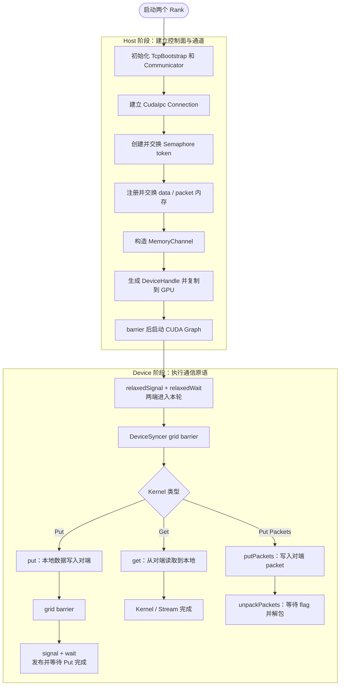
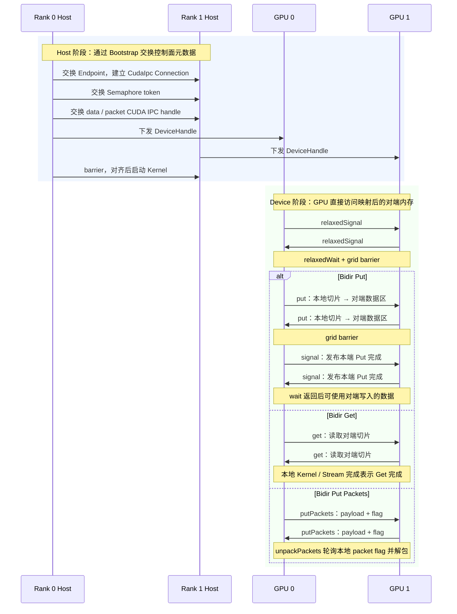

# MSCCL++ Bidirectional MemoryChannel 使用说明

本文基于 `examples/tutorials/03-memory-channel/bidir_memory_channel.cu`，说明从 Bootstrap 初始化到 Device 端使用 `put`、`get`、`signal` 等原语的关键流程。

> 示例使用 `Transport::CudaIpc`。TCP Bootstrap 只负责控制面元数据交换；真正的数据传输由 GPU 通过 CUDA IPC 映射地址直接完成。

## 1. 核心对象

每个 Rank 对应一个进程和一张 GPU：

- Rank 0 → GPU 0
- Rank 1 → GPU 1

`MemoryChannelDeviceHandle` 中最关键的内容是：

```text
src_                   本地数据缓冲区
dst_                   映射后的对端数据缓冲区
packetBuffer_          本地 packet 缓冲区
inboundToken           本地接收信号的 token
remoteInboundToken     对端 token 的映射地址
expectedInboundToken   本地 wait 的期望计数
```

## 2. Host + Device 全流程图



## 3. 双 Rank 时序图



## 4. Host 阶段关键步骤

### 4.1 Bootstrap 与 Connection

```cpp
auto bootstrap = std::make_shared<mscclpp::TcpBootstrap>(myRank, nRanks);
bootstrap->initialize(ipPort);
mscclpp::Communicator comm(bootstrap);

auto conn = comm.connect(
    {mscclpp::Transport::CudaIpc,
     {mscclpp::DeviceType::GPU, gpuId}},
    remoteRank).get();
```

Bootstrap 用来交换 Endpoint 元数据，`Connection` 用于后续构造 Semaphore 和注册内存。

### 4.2 Semaphore

```cpp
auto sema = comm.buildSemaphore(conn, remoteRank).get();
```

双方各自分配一个 GPU token，并交换其 CUDA IPC 映射信息。Device 端：

```text
signal()  → 原子递增 remoteInboundToken
wait()    → 轮询本地 inboundToken
```

### 4.3 内存注册与交换

```cpp
auto localRegMem =
    comm.registerMemory(buffer.data(), buffer.bytes(), transport);

comm.sendMemory(localRegMem, remoteRank);
auto remoteRegMem = comm.recvMemory(remoteRank).get();
```

`remoteRegMem.data()` 是映射后的对端 GPU 地址，可被 Device 端直接 load/store。

### 4.4 MemoryChannel

```cpp
mscclpp::MemoryChannel memChan(
    sema,
    /* dst */ remoteRegMem,
    /* src */ localRegMem);
```

因此：

```text
put：src_ 本地内存 → dst_ 对端内存
get：dst_ 对端内存 → src_ 本地内存
```

## 5. Device 原语语义

| 原语 | 作用 | 同步语义 |
|---|---|---|
| `relaxedSignal()` | 对端 token 加 1 | 仅用于执行握手，不保证此前数据完成 |
| `relaxedWait()` | 等待本地 token | Relaxed，不提供数据可见性保证 |
| `signal()` | 发布本端此前写操作完成 | System-scope release |
| `wait()` | 等待对端发布完成 | System-scope acquire |
| `put()` | 本地内存写到对端内存 | 多线程协作 GPU copy |
| `get()` | 从对端内存读取到本地 | 多线程协作 GPU copy |
| `putPackets()` | 将 payload 和 flag 写入对端 packet | flag 表示包就绪 |
| `unpackPackets()` | 等待本地 packet flag 后解包 | 包级细粒度同步 |
| `devSyncer.sync()` | 同步 Kernel 内所有 block | 防止部分线程尚未完成就发送 signal |

## 6. 三种 Kernel 的关键差异

### Bidir Put

```text
开头握手
→ 本地数据写入对端
→ grid barrier
→ signal 发布完成
→ wait 等待对端完成
```

Put 末尾的 `devSyncer.sync()` 很重要，否则 tid 0 可能在其他线程尚未完成写入时提前执行 `signal()`。

### Bidir Get

```text
开头握手
→ 主动读取对端数据
→ Kernel / Stream 完成
```

示例中 Get 没有末尾 `signal/wait`，因为只关心本地读取何时完成。

### Bidir Put Packets

```text
开头握手
→ putPackets 写 payload + flag 到对端
→ unpackPackets 等待本地 packet 的 flag
→ 解包到本地数据区
```

Packet 模式使用包内 flag 表示数据就绪，因此不再依赖末尾的 channel semaphore。

## 7. 需要注意的点

1. `Transport::CudaIpc` 要求两个 GPU 处于可建立 CUDA IPC/P2P 映射的环境中。
2. Bootstrap 是控制面，不承载 `put/get` 的数据传输。
3. `relaxedSignal/relaxedWait` 不能替代数据完成同步。
4. `signal/wait` 应与正确的 grid/block 同步配合使用。
5. `devSyncer.sync()` 是软件 grid barrier，需要保证所有 block 能够并发驻留，避免等待未被调度的 block。
