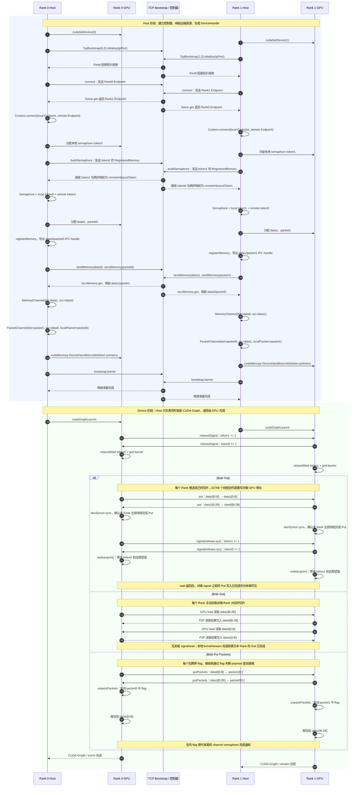

# MSCCL++ Bidirectional MemoryChannel 使用说明

本文基于：

- `examples/tutorials/03-memory-channel/bidir_memory_channel.cu`
- `include/mscclpp/memory_channel_device.hpp`
- `include/mscclpp/semaphore_device.hpp`
- `include/mscclpp/copy_device.hpp`
- `src/core/communicator.cc`
- `src/core/registered_memory.cc`
- `src/core/semaphore.cc`
- `src/core/memory_channel.cc`

目标是说明示例从 **TCP Bootstrap 建链**、**Host 侧交换连接/内存/信号量元数据**，到 **Device 侧使用 `put`、`get`、`putPackets`、`signal`、`wait` 等原语**的完整过程。

> 本示例固定使用 `Transport::CudaIpc`。TCP Bootstrap 只负责控制面元数据交换；真正的数据面是同一 CUDA IPC 域内的 GPU P2P 直接访存，不是 TCP 数据传输。

---

## 1. 总体结构

程序包含两个对称的 Rank：

- Rank 0：进程 0，绑定 GPU 0
- Rank 1：进程 1，绑定 GPU 1

无命令行参数时，`main()` 通过 `fork()` 启动两个子进程：

```text
worker(0, 0, "lo:127.0.0.1:50505")
worker(1, 1, "lo:127.0.0.1:50505")
```

每个 Rank 都创建相同结构的 `MemoryChannel`。在本地视角下：

```text
src_            = 本地普通数据缓冲区 localRegMem.data()
dst_            = 映射到本进程地址空间的对端普通数据缓冲区 remoteRegMem.data()
packetBuffer_   = 本地包缓冲区 localPktRegMem.data()
inboundToken    = 本地信号量 token
remoteInboundToken = 映射后的对端信号量 token
expectedInboundToken = 本地期望接收的 token 计数
```

因此，Device 端调用 `put/get` 时不再经过 Host，也不调用 TCP：GPU 线程直接访问本地或映射后的对端 GPU 地址。

---

## 2. Host + Device 全流程图

下面的同一张图分为 Host 和 Device 两个阶段。两个 Rank 执行相同流程，Host 阶段通过 Bootstrap 交换元数据，Device 阶段通过 CUDA IPC 映射地址进行 GPU 直接通信。

```mermaid
flowchart TB
    START([main]) --> MODE{启动方式}
    MODE -->|无参数| FORK[fork 两个子进程]
    MODE -->|ip_port rank gpu_id| WORKER[直接进入指定 Rank 的 worker]
    FORK --> R0[Rank 0 / GPU 0]
    FORK --> R1[Rank 1 / GPU 1]
    R0 --> WORKER
    R1 --> WORKER

    subgraph HOST[阶段一：Host 侧——控制面建立与资源准备]
        direction TB

        H1[cudaSetDevice gpuId]
        H2[创建 TcpBootstrap myRank, nRanks=2]
        H3[bootstrap.initialize ipPort]
        H4[创建 Communicator bootstrap]

        H5[comm.connect CudaIpc + 本地 GPU Endpoint]
        H5A[Bootstrap 发送本地 Endpoint 元数据]
        H5B[future.get 接收对端 Endpoint]
        H5C[Context.connect 建立 CudaIpc Connection]

        H6[comm.buildSemaphore conn, remoteRank]
        H6A[本地 GPU 分配 semaphore token]
        H6B[token 注册为 CudaIpc RegisteredMemory]
        H6C[双方交换 SemaphoreStub]
        H6D[构造 Semaphore：本地 token + 映射后的对端 token]

        H7[分配 256 MiB data buffer]
        H8[分配 256 MiB packet buffer]
        H9[registerMemory：导出 CUDA IPC memory handle]
        H10[sendMemory：发送两个本地 RegisteredMemory 元数据]
        H11[recvMemory future.get：接收并映射对端内存]

        H12[构造 MemoryChannel<br/>dst=remote data, src=local data]
        H13[构造 packet MemoryChannel<br/>dst=remote packet, src=local data,<br/>packetBuffer=local packet]
        H14[deviceHandle：封装 src/dst/packet/token 指针]
        H15[cudaMalloc DeviceHandle 存储]
        H16[cudaMemcpy HostToDevice]
        H17[创建 non-blocking CUDA stream]
        H18[注册 Put / Get / PutPackets 三类 kernel launcher]
        H19[cudaDeviceSynchronize + bootstrap.barrier]
        H20[捕获 1000 次 kernel 为 CUDA Graph]
        H21[两端 barrier 后同时 cudaGraphLaunch]

        H1 --> H2 --> H3 --> H4 --> H5 --> H5A --> H5B --> H5C
        H5C --> H6 --> H6A --> H6B --> H6C --> H6D
        H6D --> H7 --> H8 --> H9 --> H10 --> H11
        H11 --> H12 --> H13 --> H14 --> H15 --> H16 --> H17 --> H18 --> H19 --> H20 --> H21
    end

    WORKER --> H1

    subgraph DEVICE[阶段二：Device 侧——每次 kernel 内的数据面操作]
        direction TB

        D0[Kernel 启动：32 blocks × 1024 threads]
        D1[计算全局 tid]
        D2{tid == 0}
        D3[relaxedSignal：对端 token 原子 +1<br/>不保证此前内存完成]
        D4[relaxedWait：等待对端进入本轮<br/>不提供 acquire 可见性]
        D5[devSyncer.sync：所有 block 的 grid barrier]
        D6{kernel 类型}

        subgraph PUT[Bidir Put]
            P1[srcOffset = myRank × copyBytes]
            P2[dstOffset = srcOffset]
            P3[所有线程协作 put<br/>本地 src → 对端 dst]
            P4[devSyncer.sync：等待所有线程完成 copy]
            P5{tid == 0}
            P6[signal：release.sys 原子增加对端 token<br/>此前远端写完成后才能发布信号]
            P7[wait：acquire 读取本地 token<br/>等待对端 Put 完成]
        end

        subgraph GET[Bidir Get]
            G1[remoteRank = myRank XOR 1]
            G2[srcOffset = remoteRank × copyBytes]
            G3[dstOffset = srcOffset]
            G4[所有线程协作 get<br/>对端 dst → 本地 src]
            G5[Kernel/Stream 完成代表本地 Get 完成]
        end

        subgraph PACKET[Bidir Put Packets]
            K1[srcOffset = myRank × copyBytes]
            K2[pktBufOffset = 0]
            K3[putPackets：本地数据编码成带 flag 的包<br/>写入对端 packet buffer]
            K4[unpackPackets：轮询本地 packet buffer 中的 flag]
            K5[flag 匹配后解包到本地 data buffer]
            K6[包内 flag 同时承担数据就绪通知]
        end

        D0 --> D1 --> D2
        D2 -->|是| D3 --> D4 --> D5
        D2 -->|否| D5
        D5 --> D6

        D6 -->|kernelId 0| P1 --> P2 --> P3 --> P4 --> P5
        P5 -->|是| P6 --> P7 --> DONE([本次 Put kernel 完成])
        P5 -->|否| DONE

        D6 -->|kernelId 1| G1 --> G2 --> G3 --> G4 --> G5 --> DONE2([本次 Get kernel 完成])

        D6 -->|kernelId 2| K1 --> K2 --> K3 --> K4 --> K5 --> K6 --> DONE3([本次 Packet kernel 完成])
    end

    H21 --> D0
    DONE --> LOOP{CUDA Graph 中是否还有迭代}
    DONE2 --> LOOP
    DONE3 --> LOOP
    LOOP -->|是| D0
    LOOP -->|否| SYNC[cudaStreamSynchronize]
    SYNC --> NEXT{下一个 copyBytes / kernelId}
    NEXT -->|有| H20
    NEXT -->|无| FINAL[bootstrap.barrier，worker 结束]
```



---

## 3. 双 Rank 完整时序图

图中同时展示：

1. Host 控制面：Bootstrap、连接、信号量、内存句柄交换；
2. Device 数据面：Put、Get 和 Packet 三种分支；
3. 信号量 token 与数据访问的方向。



---

## 4. Host 阶段逐步解释

### 4.1 Bootstrap 只负责控制面

```cpp
auto bootstrap = std::make_shared<mscclpp::TcpBootstrap>(myRank, nRanks);
bootstrap->initialize(ipPort);
mscclpp::Communicator comm(bootstrap);
```

Bootstrap 的职责包括：

- 确认 Rank 身份和总 Rank 数；
- 在两个进程之间发送/接收序列化元数据；
- 提供 `barrier()`，让两个 Rank 在进入测试或计时前对齐；
- 不承载后续 `put/get` 的数据流量。

### 4.2 建立 CUDA IPC Connection

```cpp
auto conn = comm.connect(
    {Transport::CudaIpc, {DeviceType::GPU, gpuId}}, remoteRank).get();
```

内部逻辑为：

1. 为本地 GPU 创建 Endpoint；
2. 通过 Bootstrap 将本地 Endpoint 序列化后发送给对端；
3. `.get()` 时按调用顺序接收对端 Endpoint；
4. `Context::connect(localEndpoint, remoteEndpoint)` 生成 Connection。

`connect()` 是双边操作：两个 Rank 必须使用匹配的 Rank、tag 和调用顺序。

### 4.3 构造 Device-to-Device Semaphore

```cpp
auto sema = comm.buildSemaphore(conn, remoteRank).get();
```

每个 Rank 都会：

1. 在本地 GPU 上分配一个 64 位 token，初始值为 0；
2. 将 token 注册成 `RegisteredMemory`；
3. 通过 Bootstrap 交换 `SemaphoreStub`；
4. 将对端 token 映射为本地可访问的 `remoteInboundToken`；
5. 创建本地 `expectedInboundToken`，记录下一次 `wait()` 期望观察到的值。

Device handle 中的三个 token 指针：

```text
inboundToken          本地被对端递增的 token
remoteInboundToken    对端 token 的映射地址，本地 signal 写它
expectedInboundToken  本地 wait/poll 消费进度
```

### 4.4 注册并交换普通数据缓冲区

```cpp
RegisteredMemory localRegMem =
    comm.registerMemory(buffer.data(), buffer.bytes(), Transport::CudaIpc);

comm.sendMemory(localRegMem, remoteRank);
auto remoteRegMemFuture = comm.recvMemory(remoteRank);
RegisteredMemory remoteRegMem = remoteRegMemFuture.get();
```

注册本地 CUDA 内存时会导出 CUDA IPC memory handle。对端反序列化 `RegisteredMemory` 时打开该 handle，并把远端 GPU 内存映射到本进程的 GPU 虚拟地址空间。

因此：

```cpp
remoteRegMem.data()
```

不是通过网络访问的抽象句柄，而是 Device 代码能够直接 load/store 的对端 GPU 映射地址。

### 4.5 构造 MemoryChannel

普通通道：

```cpp
MemoryChannel memChan(
    sema,
    /* dst = */ remoteRegMem,
    /* src = */ localRegMem);
```

Packet 通道：

```cpp
MemoryChannel memPktChan(
    sema,
    /* dst = */ remotePktRegMem,
    /* src = */ localRegMem,
    /* packetBuffer = */ localPktRegMem.data());
```

这里的 `dst` 永远表示 Device 端要访问的远端内存，`src` 表示本地普通数据内存。

### 4.6 DeviceHandle 下发到 GPU

`MemoryChannel::deviceHandle()` 将 Host 对象压缩成 Device 可使用的纯指针结构：

```text
MemoryChannelDeviceHandle
├── semaphore_.inboundToken
├── semaphore_.remoteInboundToken
├── semaphore_.expectedInboundToken
├── dst_
├── src_
└── packetBuffer_
```

示例再使用 `cudaMalloc + cudaMemcpyHostToDevice` 把该结构放到 GPU 内存，kernel 接收的是它的 Device 指针。

---

## 5. Device 原语语义

| 原语 | 数据/控制方向 | 内部含义 | 内存序保证 |
|---|---|---|---|
| `relaxedSignal()` | 本地 GPU → 对端 token | 对端 `remoteInboundToken` 原子加 1 | Relaxed；不保证此前数据访问完成 |
| `relaxedWait()` | 读取本地 token | 本地 expected 加 1，并轮询 `inboundToken` | Relaxed；只适合执行阶段握手 |
| `signal()` | 本地 GPU → 对端 token | CUDA 使用 `red.release.sys.global.add.u64` | Release + system scope；此前内存操作先完成 |
| `wait()` | 读取本地 token | expected 加 1，使用 system-scope acquire load 轮询 | Acquire；返回后可观察对端 release 前的写入 |
| `put()` | 本地 `src_` → 对端 `dst_` | 多线程协作执行 GPU load + peer GPU store | 本身只是 copy；完成发布依赖后续同步 |
| `get()` | 对端 `dst_` → 本地 `src_` | 多线程协作执行 peer GPU load + 本地 store | 本地 kernel/stream 完成表示本地结果完成 |
| `putPackets()` | 本地数据 → 对端 packet buffer | 写 payload 和包级 flag | 由 packet 格式提供细粒度就绪标记 |
| `unpackPackets()` | 本地 packet buffer → 本地数据 | 轮询 flag，匹配后读取 payload | 每个 packet 的 flag 是数据就绪条件 |
| `devSyncer.sync()` | 本 GPU 全 grid | 跨 block 的 device-wide barrier | block 间 release/acquire，同步此前工作 |

---

## 6. 三种 Kernel 的关键差异

### 6.1 `bidirPutKernel`

```cpp
devHandle->relaxedSignal();
devHandle->relaxedWait();
devSyncer.sync(gridDim.x);

devHandle->put(dstOffset, srcOffset, copyBytes, tid, numThreads);
devSyncer.sync(gridDim.x);

devHandle->signal();
devHandle->wait();
```

同步分为两组：

1. **开头 relaxed 握手**：只确认两个 Rank 都已经进入本轮 kernel；
2. **末尾 release/acquire 握手**：确认两个 Rank 的 Put 数据已经完成并可见。

`put()` 由 `32 × 1024 = 32768` 个线程协作。默认 16 字节对齐路径使用 `longlong2` 进行 grid-stride copy：

```text
thread tid 处理元素 tid, tid + numThreads, tid + 2*numThreads, ...
```

末尾必须先执行 `devSyncer.sync()`，否则 tid 0 可能在其他线程尚未完成 peer store 时过早发送 `signal()`。

### 6.2 `bidirGetKernel`

```cpp
devHandle->relaxedSignal();
devHandle->relaxedWait();
devSyncer.sync(gridDim.x);

devHandle->get(srcOffset, dstOffset, copyBytes, tid, numThreads);
```

Get 是“本 Rank 主动拉取”。`get(targetOffset, originOffset, ...)` 的实际地址方向为：

```text
remote dst_ + originOffset  →  local src_ + targetOffset
```

本示例没有末尾 channel `signal/wait`，因为每个 Rank 只需要等待自己的 kernel/stream 完成即可知道本地 Get 结果已落地。若后续需要让对端知道“我的 Get 已经完成”，则仍需额外信号量或其他同步协议。

### 6.3 `bidirPutPacketKernel`

```cpp
devHandle->putPackets(
    /* remote packet offset */ 0,
    /* local data offset */ myRank * copyBytes,
    copyBytes, tid, numThreads, flag);

devHandle->unpackPackets(
    /* local packet offset */ 0,
    /* local data offset */ myRank * copyBytes,
    copyBytes, tid, numThreads, flag);
```

过程是：

1. 每个 Rank 将自己的普通数据编码成带 `flag` 的 LL packet；
2. packet 被直接写入对端的 packet buffer；
3. 同时，每个 Rank 在自己的本地 packet buffer 上执行 `unpackPackets()`；
4. 对端 packet 到达后，本地线程观察到期望 `flag`，读取 payload 并写入本地普通 buffer。

Packet 模式不需要末尾 channel `signal/wait`，因为每个 packet 自带的数据就绪 flag；`unpackPackets()` 会在 flag 不匹配时自旋。

---

## 7. 信号量 token 如何推进

每次 `wait()` 或 `relaxedWait()` 都会先对本地 `expectedInboundToken` 加 1，然后等待：

```text
inboundToken >= expectedInboundToken
```

因此 token 是一个单调递增的事件计数，而不是可反复置 0/1 的布尔量。

以一轮 Put 为例，每个 Rank 对同一个 channel semaphore 消耗两次事件：

```text
事件 N     relaxedSignal / relaxedWait：进入本轮
事件 N+1   signal / wait：本轮 Put 数据完成
```

Get 和 PutPackets 每轮只消耗开头的一次 relaxed 事件。

本示例中：

- 两个 Rank 运行完全相同的 kernelId 和迭代数；
- 所有 kernel 位于同一 stream/CUDA Graph 顺序中；
- 普通通道与 Packet 通道共享同一个 semaphore；

所以双方 token 的生产和消费顺序保持一致。

> 若多个独立协议共享一个 semaphore，却可能以不同顺序调用 `wait()`，事件会被错误的消费者取走。实际工程中应保证严格相同的调用顺序，或为不同协议/通道分配独立 semaphore。

---

## 8. 为什么 `relaxedSignal/relaxedWait` 不能用于数据完成通知

CUDA 路径中：

```text
relaxedSignal  = red.relaxed.sys.global.add.u64
signal         = red.release.sys.global.add.u64

relaxedWait    = system-scope relaxed load
wait           = system-scope acquire load
```

因此下面这种写法不保证正确：

```cpp
put(...);
relaxedSignal();
// 对端 relaxedWait() 返回后直接使用数据
```

问题在于 relaxed token 更新可以被对端观察到，但此前 peer memory store 不一定已经完成或对接收端可见。

正确的 channel 完成通知模式是：

```cpp
put(...);
devSyncer.sync(gridDim.x);  // 所有参与 copy 的线程都到达
if (tid == 0) {
    signal();               // release 发布数据完成
    wait();                 // acquire 等待对端发布完成
}
```

---

## 9. CUDA Graph 与同步层级

示例把每种 kernel 连续捕获 1000 次：

```cpp
cudaStreamBeginCapture(stream, cudaStreamCaptureModeGlobal);
for (int i = 0; i < iter; ++i) {
    kernels[kernelId](copyBytes);
}
cudaStreamEndCapture(stream, &graph);
```

同步层级从外到内为：

```text
Bootstrap barrier
└── 两个进程/Rank 在 Host 上对齐

CUDA stream / graph 顺序
└── 同一 Rank 的不同 kernel 迭代保持顺序

Channel semaphore
└── 两个 GPU 在每轮 kernel 内进行跨 Rank 对齐或数据完成通知

DeviceSyncer
└── 同一 GPU 的所有 thread block 在 kernel 内对齐

__syncthreads
└── 同一 block 内线程对齐，由 DeviceSyncer 内部使用
```

这些层级不能互相替代。例如：

- `bootstrap.barrier()` 不能证明 GPU kernel 内 peer store 已完成；
- `signal()` 只由 tid 0 执行时，必须先通过 `devSyncer.sync()` 等待其余线程；
- `cudaStreamSynchronize()` 只等待本 Rank 的 stream，不自动通知对端 Rank。

---

## 10. 数据路径总结

### Put

```text
Rank r localRegMem[r × B]
    │ GPU threads load
    ▼
Rank peer remoteRegMem[r × B]
    │
    └── release signal → peer acquire wait
```

### Get

```text
Rank peer remoteRegMem[peer × B]
    │ Rank r GPU threads perform peer loads
    ▼
Rank r localRegMem[peer × B]
```

### Put Packets

```text
Rank r localRegMem[r × B]
    │ putPackets(payload + flag)
    ▼
Rank peer localPktRegMem[0]
    │ unpackPackets waits for flag
    ▼
Rank peer localRegMem[peer × B]
```

---

## 11. 使用与修改时的注意事项

1. **CudaIpc 约束**  
   `MemoryChannel` 构造函数要求 `dst` 使用 `Transport::CudaIpc` 注册。该示例的数据面要求两个 GPU 位于可用的 CUDA IPC/P2P 域内。命令行中的 `ip_port` 只改变 Bootstrap 地址，不会把数据面变成跨节点 TCP 或 RDMA。

2. **调用顺序必须对称**  
   `connect()`、`buildSemaphore()`、`sendMemory()`、`recvMemory()` 在相同 remoteRank/tag 上必须保持双方匹配顺序。

3. **`signal()` 只能在所有 copy 线程完成后调用**  
   仅 `tid == 0` 发信号时，应在前面使用 grid barrier；否则 release 只能约束 tid 0 自身之前的操作，不能自动等待其他线程。

4. **不要把 relaxed 握手当成数据 fence**  
   relaxed 原语只适合执行阶段 rendezvous。

5. **一个 wait 消费一个事件**  
   `expectedInboundToken` 每次 wait 都会递增。两端 signal/wait 次数或顺序不一致会导致超时或协议串线。

6. **DeviceSyncer 要求所有 block 常驻条件可满足**  
   它是软件 grid barrier。若启动过多 block，导致部分 block 无法与正在自旋的 block 同时驻留，存在死锁风险。本示例使用 32 blocks，部署到不同 GPU 时仍需评估 occupancy。

7. **示例参数检查存在边界问题**  
   当前代码判断为 `rank > 2`，但合法 Rank 实际只有 0 和 1；更严格的检查应为 `rank > 1`。

---

## 12. 最小化使用模板

Host 侧：

```cpp
auto bootstrap = std::make_shared<mscclpp::TcpBootstrap>(rank, nranks);
bootstrap->initialize(ipPort);
mscclpp::Communicator comm(bootstrap);

int peer = rank ^ 1;
auto conn = comm.connect(
    {mscclpp::Transport::CudaIpc,
     {mscclpp::DeviceType::GPU, gpuId}},
    peer).get();

auto sema = comm.buildSemaphore(conn, peer).get();

auto local = comm.registerMemory(
    localBuffer, bytes, mscclpp::Transport::CudaIpc);
comm.sendMemory(local, peer);
auto remote = comm.recvMemory(peer).get();

mscclpp::MemoryChannel channel(sema, remote, local);
auto hostHandle = channel.deviceHandle();
```

Device 侧 Put 模板：

```cpp
__global__ void putKernel(
    mscclpp::MemoryChannelDeviceHandle* channel,
    uint64_t bytes) {

    uint32_t tid = blockIdx.x * blockDim.x + threadIdx.x;
    uint32_t nthreads = gridDim.x * blockDim.x;

    if (tid == 0) {
        channel->relaxedSignal();
        channel->relaxedWait();
    }
    devSyncer.sync(gridDim.x);

    channel->put(0, 0, bytes, tid, nthreads);
    devSyncer.sync(gridDim.x);

    if (tid == 0) {
        channel->signal();
        channel->wait();
    }
}
```

核心原则可以归纳为：

```text
Bootstrap/Communicator 交换“如何访问”
MemoryChannelDeviceHandle 保存“访问哪里”
put/get 执行“搬运数据”
signal/wait 定义“何时完成并可见”
```
